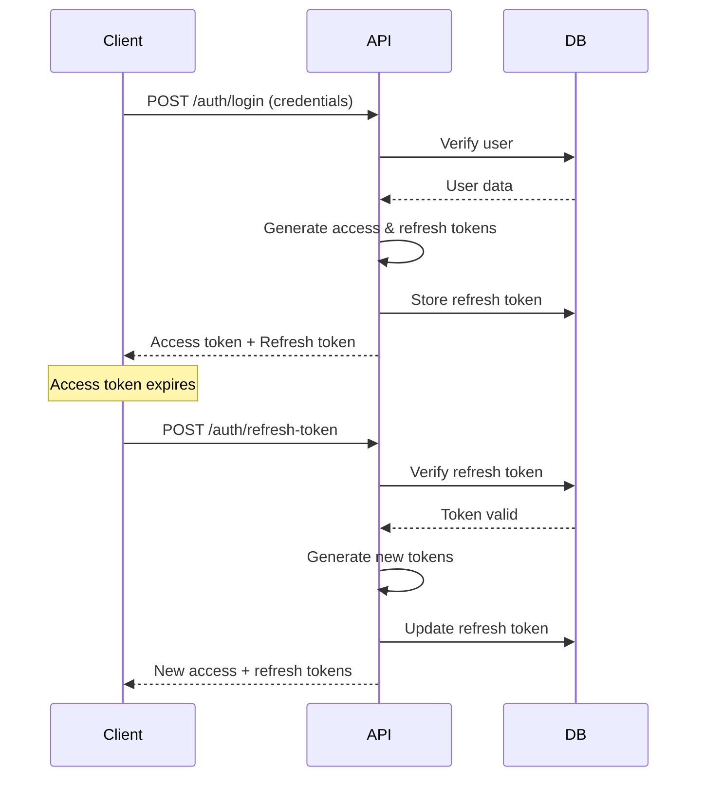

# Building Scalable & Maintainable ASP.NET APIs - Part 4
## Authentication & Authorization

> **Production Example**: E-Commerce Order Management API (Continued)

---

## Table of Contents
1. [JWT Authentication Setup](#jwt-authentication-setup)
2. [User Management](#user-management)
3. [Role-Based Authorization](#role-based-authorization)
4. [Claims-Based Authorization](#claims-based-authorization)
5. [Refresh Tokens](#refresh-tokens)
6. [API Key Authentication](#api-key-authentication)

---

## JWT Authentication Setup

### JWT Configuration

**appsettings.json**
```json
{
  "JwtSettings": {
    "SecretKey": "your-super-secret-key-minimum-32-characters-long-for-production",
    "Issuer": "OrderManagementAPI",
    "Audience": "OrderManagementClient",
    "AccessTokenExpiryMinutes": 60,
    "RefreshTokenExpiryDays": 7
  }
}
```

**OrderManagement.Application/DTOs/Auth/JwtSettings.cs**
```csharp
namespace OrderManagement.Application.DTOs.Auth;

public class JwtSettings
{
    public string SecretKey { get; set; }
    public string Issuer { get; set; }
    public string Audience { get; set; }
    public int AccessTokenExpiryMinutes { get; set; }
    public int RefreshTokenExpiryDays { get; set; }
}
```

### JWT Service Implementation

**OrderManagement.Application/Interfaces/IJwtService.cs**
```csharp
using OrderManagement.Domain.Entities;

namespace OrderManagement.Application.Interfaces;

public interface IJwtService
{
    string GenerateAccessToken(User user, IEnumerable<string> roles);
    string GenerateRefreshToken();
    ClaimsPrincipal GetPrincipalFromExpiredToken(string token);
}
```

**OrderManagement.Infrastructure/Services/JwtService.cs**
```csharp
using Microsoft.Extensions.Options;
using Microsoft.IdentityModel.Tokens;
using OrderManagement.Application.DTOs.Auth;
using OrderManagement.Application.Interfaces;
using OrderManagement.Domain.Entities;
using System.IdentityModel.Tokens.Jwt;
using System.Security.Claims;
using System.Security.Cryptography;
using System.Text;

namespace OrderManagement.Infrastructure.Services;

public class JwtService : IJwtService
{
    private readonly JwtSettings _jwtSettings;
    
    public JwtService(IOptions<JwtSettings> jwtSettings)
    {
        _jwtSettings = jwtSettings.Value;
    }
    
    public string GenerateAccessToken(User user, IEnumerable<string> roles)
    {
        var claims = new List<Claim>
        {
            new Claim(ClaimTypes.NameIdentifier, user.Id.ToString()),
            new Claim(ClaimTypes.Name, user.Username),
            new Claim(ClaimTypes.Email, user.Email),
            new Claim(JwtRegisteredClaimNames.Jti, Guid.NewGuid().ToString()),
            new Claim(JwtRegisteredClaimNames.Iat, DateTime.UtcNow.ToString())
        };
        
        // Add roles
        foreach (var role in roles)
        {
            claims.Add(new Claim(ClaimTypes.Role, role));
        }
        
        // Add custom claims
        if (!string.IsNullOrEmpty(user.Department))
            claims.Add(new Claim("Department", user.Department));
        
        var key = new SymmetricSecurityKey(Encoding.UTF8.GetBytes(_jwtSettings.SecretKey));
        var credentials = new SigningCredentials(key, SecurityAlgorithms.HmacSha256);
        
        var token = new JwtSecurityToken(
            issuer: _jwtSettings.Issuer,
            audience: _jwtSettings.Audience,
            claims: claims,
            expires: DateTime.UtcNow.AddMinutes(_jwtSettings.AccessTokenExpiryMinutes),
            signingCredentials: credentials
        );
        
        return new JwtSecurityTokenHandler().WriteToken(token);
    }
    
    public string GenerateRefreshToken()
    {
        var randomNumber = new byte[64];
        using var rng = RandomNumberGenerator.Create();
        rng.GetBytes(randomNumber);
        return Convert.ToBase64String(randomNumber);
    }
    
    public ClaimsPrincipal GetPrincipalFromExpiredToken(string token)
    {
        var tokenValidationParameters = new TokenValidationParameters
        {
            ValidateAudience = true,
            ValidAudience = _jwtSettings.Audience,
            ValidateIssuer = true,
            ValidIssuer = _jwtSettings.Issuer,
            ValidateIssuerSigningKey = true,
            IssuerSigningKey = new SymmetricSecurityKey(Encoding.UTF8.GetBytes(_jwtSettings.SecretKey)),
            ValidateLifetime = false // Don't validate expiry for refresh
        };
        
        var tokenHandler = new JwtSecurityTokenHandler();
        var principal = tokenHandler.ValidateToken(token, tokenValidationParameters, out var securityToken);
        
        if (securityToken is not JwtSecurityToken jwtSecurityToken ||
            !jwtSecurityToken.Header.Alg.Equals(SecurityAlgorithms.HmacSha256, 
                StringComparison.InvariantCultureIgnoreCase))
        {
            throw new SecurityTokenException("Invalid token");
        }
        
        return principal;
    }
}
```

### Configure JWT in Program.cs

```csharp
using Microsoft.AspNetCore.Authentication.JwtBearer;
using Microsoft.IdentityModel.Tokens;
using System.Text;

// In Program.cs
var jwtSettings = builder.Configuration.GetSection("JwtSettings");
builder.Services.Configure<JwtSettings>(jwtSettings);

var key = Encoding.UTF8.GetBytes(jwtSettings["SecretKey"]);

builder.Services.AddAuthentication(options =>
{
    options.DefaultAuthenticateScheme = JwtBearerDefaults.AuthenticationScheme;
    options.DefaultChallengeScheme = JwtBearerDefaults.AuthenticationScheme;
})
.AddJwtBearer(options =>
{
    options.RequireHttpsMetadata = true;
    options.SaveToken = true;
    options.TokenValidationParameters = new TokenValidationParameters
    {
        ValidateIssuerSigningKey = true,
        IssuerSigningKey = new SymmetricSecurityKey(key),
        ValidateIssuer = true,
        ValidIssuer = jwtSettings["Issuer"],
        ValidateAudience = true,
        ValidAudience = jwtSettings["Audience"],
        ValidateLifetime = true,
        ClockSkew = TimeSpan.Zero // Remove default 5 min tolerance
    };
    
    // Configure events for better error handling
    options.Events = new JwtBearerEvents
    {
        OnAuthenticationFailed = context =>
        {
            if (context.Exception.GetType() == typeof(SecurityTokenExpiredException))
            {
                context.Response.Headers.Add("Token-Expired", "true");
            }
            return Task.CompletedTask;
        },
        OnChallenge = context =>
        {
            context.HandleResponse();
            context.Response.StatusCode = StatusCodes.Status401Unauthorized;
            context.Response.ContentType = "application/json";
            
            var result = JsonSerializer.Serialize(new
            {
                error = "You are not authorized",
                message = context.ErrorDescription
            });
            
            return context.Response.WriteAsync(result);
        }
    };
});
```

---

## User Management

### User Entity

**OrderManagement.Domain/Entities/User.cs**
```csharp
namespace OrderManagement.Domain.Entities;

public class User : BaseEntity
{
    public string Username { get; set; }
    public string Email { get; set; }
    public string PasswordHash { get; set; }
    public string FirstName { get; set; }
    public string LastName { get; set; }
    public string PhoneNumber { get; set; }
    public string Department { get; set; }
    public bool IsActive { get; set; }
    public bool EmailConfirmed { get; set; }
    public DateTime? LastLoginAt { get; set; }
    
    // Refresh token
    public string RefreshToken { get; set; }
    public DateTime? RefreshTokenExpiryTime { get; set; }
    
    // Navigation properties
    public ICollection<UserRole> UserRoles { get; set; } = new List<UserRole>();
    
    public string FullName => $"{FirstName} {LastName}";
}

public class Role : BaseEntity
{
    public string Name { get; set; }
    public string Description { get; set; }
    public ICollection<UserRole> UserRoles { get; set; } = new List<UserRole>();
}

public class UserRole
{
    public int UserId { get; set; }
    public User User { get; set; }
    
    public int RoleId { get; set; }
    public Role Role { get; set; }
}
```

### Entity Configuration

**OrderManagement.Infrastructure/Data/Configuration/UserConfiguration.cs**
```csharp
public class UserConfiguration : IEntityTypeConfiguration<User>
{
    public void Configure(EntityTypeBuilder<User> builder)
    {
        builder.ToTable("Users");
        
        builder.HasKey(u => u.Id);
        
        builder.Property(u => u.Username)
            .IsRequired()
            .HasMaxLength(50);
        
        builder.HasIndex(u => u.Username)
            .IsUnique();
        
        builder.Property(u => u.Email)
            .IsRequired()
            .HasMaxLength(255);
        
        builder.HasIndex(u => u.Email)
            .IsUnique();
        
        builder.Property(u => u.PasswordHash)
            .IsRequired();
        
        builder.Property(u => u.FirstName)
            .HasMaxLength(100);
        
        builder.Property(u => u.LastName)
            .HasMaxLength(100);
        
        builder.HasMany(u => u.UserRoles)
            .WithOne(ur => ur.User)
            .HasForeignKey(ur => ur.UserId);
    }
}

public class RoleConfiguration : IEntityTypeConfiguration<Role>
{
    public void Configure(EntityTypeBuilder<Role> builder)
    {
        builder.ToTable("Roles");
        
        builder.HasKey(r => r.Id);
        
        builder.Property(r => r.Name)
            .IsRequired()
            .HasMaxLength(50);
        
        builder.HasIndex(r => r.Name)
            .IsUnique();
        
        // Seed default roles
        builder.HasData(
            new Role { Id = 1, Name = "Admin", Description = "Administrator role", CreatedAt = DateTime.UtcNow },
            new Role { Id = 2, Name = "Manager", Description = "Manager role", CreatedAt = DateTime.UtcNow },
            new Role { Id = 3, Name = "User", Description = "Standard user role", CreatedAt = DateTime.UtcNow },
            new Role { Id = 4, Name = "Warehouse", Description = "Warehouse staff role", CreatedAt = DateTime.UtcNow }
        );
    }
}

public class UserRoleConfiguration : IEntityTypeConfiguration<UserRole>
{
    public void Configure(EntityTypeBuilder<UserRole> builder)
    {
        builder.ToTable("UserRoles");
        
        builder.HasKey(ur => new { ur.UserId, ur.RoleId });
    }
}
```

### Authentication Service

**OrderManagement.Application/DTOs/Auth/LoginDto.cs**
```csharp
namespace OrderManagement.Application.DTOs.Auth;

public class LoginDto
{
    public string Username { get; set; }
    public string Password { get; set; }
}

public class RegisterDto
{
    public string Username { get; set; }
    public string Email { get; set; }
    public string Password { get; set; }
    public string FirstName { get; set; }
    public string LastName { get; set; }
    public string PhoneNumber { get; set; }
}

public class AuthResponseDto
{
    public string AccessToken { get; set; }
    public string RefreshToken { get; set; }
    public DateTime ExpiresAt { get; set; }
    public UserDto User { get; set; }
}

public class RefreshTokenDto
{
    public string AccessToken { get; set; }
    public string RefreshToken { get; set; }
}
```

**OrderManagement.Application/Interfaces/IAuthService.cs**
```csharp
namespace OrderManagement.Application.Interfaces;

public interface IAuthService
{
    Task<AuthResponseDto> LoginAsync(LoginDto dto);
    Task<AuthResponseDto> RegisterAsync(RegisterDto dto);
    Task<AuthResponseDto> RefreshTokenAsync(RefreshTokenDto dto);
    Task RevokeTokenAsync(string username);
    Task<bool> ChangePasswordAsync(int userId, string currentPassword, string newPassword);
}
```

**OrderManagement.Application/Services/AuthService.cs**
```csharp
using AutoMapper;
using OrderManagement.Application.DTOs.Auth;
using OrderManagement.Application.Exceptions;
using OrderManagement.Application.Interfaces;
using OrderManagement.Domain.Entities;
using OrderManagement.Domain.Interfaces;
using System.Security.Cryptography;
using System.Text;

namespace OrderManagement.Application.Services;

public class AuthService : IAuthService
{
    private readonly IUnitOfWork _unitOfWork;
    private readonly IJwtService _jwtService;
    private readonly IMapper _mapper;
    private readonly JwtSettings _jwtSettings;
    
    public AuthService(
        IUnitOfWork unitOfWork,
        IJwtService jwtService,
        IMapper mapper,
        IOptions<JwtSettings> jwtSettings)
    {
        _unitOfWork = unitOfWork;
        _jwtService = jwtService;
        _mapper = mapper;
        _jwtSettings = jwtSettings.Value;
    }
    
    public async Task<AuthResponseDto> LoginAsync(LoginDto dto)
    {
        var user = await _unitOfWork.Users.GetByUsernameWithRolesAsync(dto.Username);
        
        if (user == null || !VerifyPassword(dto.Password, user.PasswordHash))
            throw new UnauthorizedException("Invalid username or password");
        
        if (!user.IsActive)
            throw new UnauthorizedException("Account is inactive");
        
        var roles = user.UserRoles.Select(ur => ur.Role.Name).ToList();
        var accessToken = _jwtService.GenerateAccessToken(user, roles);
        var refreshToken = _jwtService.GenerateRefreshToken();
        
        // Update user with refresh token
        user.RefreshToken = refreshToken;
        user.RefreshTokenExpiryTime = DateTime.UtcNow.AddDays(_jwtSettings.RefreshTokenExpiryDays);
        user.LastLoginAt = DateTime.UtcNow;
        
        await _unitOfWork.Users.UpdateAsync(user);
        await _unitOfWork.SaveChangesAsync();
        
        return new AuthResponseDto
        {
            AccessToken = accessToken,
            RefreshToken = refreshToken,
            ExpiresAt = DateTime.UtcNow.AddMinutes(_jwtSettings.AccessTokenExpiryMinutes),
            User = _mapper.Map<UserDto>(user)
        };
    }
    
    public async Task<AuthResponseDto> RegisterAsync(RegisterDto dto)
    {
        // Check if username exists
        if (await _unitOfWork.Users.ExistsAsync(u => u.Username == dto.Username))
            throw new BusinessException("Username already exists");
        
        // Check if email exists
        if (await _unitOfWork.Users.ExistsAsync(u => u.Email == dto.Email))
            throw new BusinessException("Email already exists");
        
        var user = new User
        {
            Username = dto.Username,
            Email = dto.Email,
            PasswordHash = HashPassword(dto.Password),
            FirstName = dto.FirstName,
            LastName = dto.LastName,
            PhoneNumber = dto.PhoneNumber,
            IsActive = true,
            EmailConfirmed = false
        };
        
        await _unitOfWork.Users.AddAsync(user);
        
        // Assign default role
        var defaultRole = await _unitOfWork.Roles.FirstOrDefaultAsync(r => r.Name == "User");
        if (defaultRole != null)
        {
            await _unitOfWork.UserRoles.AddAsync(new UserRole
            {
                UserId = user.Id,
                RoleId = defaultRole.Id
            });
        }
        
        await _unitOfWork.SaveChangesAsync();
        
        // Return login response
        return await LoginAsync(new LoginDto
        {
            Username = dto.Username,
            Password = dto.Password
        });
    }
    
    public async Task<AuthResponseDto> RefreshTokenAsync(RefreshTokenDto dto)
    {
        var principal = _jwtService.GetPrincipalFromExpiredToken(dto.AccessToken);
        var username = principal.Identity.Name;
        
        var user = await _unitOfWork.Users.GetByUsernameWithRolesAsync(username);
        
        if (user == null || 
            user.RefreshToken != dto.RefreshToken || 
            user.RefreshTokenExpiryTime <= DateTime.UtcNow)
        {
            throw new UnauthorizedException("Invalid refresh token");
        }
        
        var roles = user.UserRoles.Select(ur => ur.Role.Name).ToList();
        var newAccessToken = _jwtService.GenerateAccessToken(user, roles);
        var newRefreshToken = _jwtService.GenerateRefreshToken();
        
        user.RefreshToken = newRefreshToken;
        user.RefreshTokenExpiryTime = DateTime.UtcNow.AddDays(_jwtSettings.RefreshTokenExpiryDays);
        
        await _unitOfWork.Users.UpdateAsync(user);
        await _unitOfWork.SaveChangesAsync();
        
        return new AuthResponseDto
        {
            AccessToken = newAccessToken,
            RefreshToken = newRefreshToken,
            ExpiresAt = DateTime.UtcNow.AddMinutes(_jwtSettings.AccessTokenExpiryMinutes),
            User = _mapper.Map<UserDto>(user)
        };
    }
    
    public async Task RevokeTokenAsync(string username)
    {
        var user = await _unitOfWork.Users.FirstOrDefaultAsync(u => u.Username == username);
        
        if (user == null)
            throw new NotFoundException("User not found");
        
        user.RefreshToken = null;
        user.RefreshTokenExpiryTime = null;
        
        await _unitOfWork.Users.UpdateAsync(user);
        await _unitOfWork.SaveChangesAsync();
    }
    
    public async Task<bool> ChangePasswordAsync(int userId, string currentPassword, string newPassword)
    {
        var user = await _unitOfWork.Users.GetByIdAsync(userId);
        
        if (user == null)
            throw new NotFoundException("User not found");
        
        if (!VerifyPassword(currentPassword, user.PasswordHash))
            throw new BusinessException("Current password is incorrect");
        
        user.PasswordHash = HashPassword(newPassword);
        
        await _unitOfWork.Users.UpdateAsync(user);
        await _unitOfWork.SaveChangesAsync();
        
        return true;
    }
    
    private string HashPassword(string password)
    {
        using var sha256 = SHA256.Create();
        var hashedBytes = sha256.ComputeHash(Encoding.UTF8.GetBytes(password));
        return Convert.ToBase64String(hashedBytes);
        
        // In production, use BCrypt or ASP.NET Core Identity
        // return BCrypt.Net.BCrypt.HashPassword(password);
    }
    
    private bool VerifyPassword(string password, string passwordHash)
    {
        var hashedPassword = HashPassword(password);
        return hashedPassword == passwordHash;
        
        // With BCrypt:
        // return BCrypt.Net.BCrypt.Verify(password, passwordHash);
    }
}
```

### Authentication Controller

**OrderManagement.API/Controllers/AuthController.cs**
```csharp
using Microsoft.AspNetCore.Authorization;
using Microsoft.AspNetCore.Mvc;
using OrderManagement.Application.DTOs.Auth;
using OrderManagement.Application.Interfaces;

namespace OrderManagement.API.Controllers;

[ApiController]
[Route("api/[controller]")]
public class AuthController : ControllerBase
{
    private readonly IAuthService _authService;
    
    public AuthController(IAuthService authService)
    {
        _authService = authService;
    }
    
    /// <summary>
    /// User login
    /// </summary>
    [HttpPost("login")]
    [ProducesResponseType(typeof(AuthResponseDto), StatusCodes.Status200OK)]
    [ProducesResponseType(StatusCodes.Status401Unauthorized)]
    public async Task<ActionResult<AuthResponseDto>> Login([FromBody] LoginDto dto)
    {
        var response = await _authService.LoginAsync(dto);
        return Ok(response);
    }
    
    /// <summary>
    /// User registration
    /// </summary>
    [HttpPost("register")]
    [ProducesResponseType(typeof(AuthResponseDto), StatusCodes.Status201Created)]
    [ProducesResponseType(StatusCodes.Status400BadRequest)]
    public async Task<ActionResult<AuthResponseDto>> Register([FromBody] RegisterDto dto)
    {
        var response = await _authService.RegisterAsync(dto);
        return CreatedAtAction(nameof(Login), response);
    }
    
    /// <summary>
    /// Refresh access token
    /// </summary>
    [HttpPost("refresh-token")]
    [ProducesResponseType(typeof(AuthResponseDto), StatusCodes.Status200OK)]
    public async Task<ActionResult<AuthResponseDto>> RefreshToken([FromBody] RefreshTokenDto dto)
    {
        var response = await _authService.RefreshTokenAsync(dto);
        return Ok(response);
    }
    
    /// <summary>
    /// Revoke refresh token (logout)
    /// </summary>
    [HttpPost("revoke-token")]
    [Authorize]
    [ProducesResponseType(StatusCodes.Status204NoContent)]
    public async Task<IActionResult> RevokeToken()
    {
        var username = User.Identity.Name;
        await _authService.RevokeTokenAsync(username);
        return NoContent();
    }
    
    /// <summary>
    /// Change password
    /// </summary>
    [HttpPost("change-password")]
    [Authorize]
    [ProducesResponseType(StatusCodes.Status204NoContent)]
    public async Task<IActionResult> ChangePassword([FromBody] ChangePasswordDto dto)
    {
        var userId = int.Parse(User.FindFirst(ClaimTypes.NameIdentifier).Value);
        await _authService.ChangePasswordAsync(userId, dto.CurrentPassword, dto.NewPassword);
        return NoContent();
    }
}
```

---

## Role-Based Authorization

### Using [Authorize] with Roles

```csharp
// Require Admin role
[HttpDelete("{id}")]
[Authorize(Roles = "Admin")]
public async Task<IActionResult> DeleteProduct(int id)
{
    await _productService.DeleteProductAsync(id);
    return NoContent();
}

// Multiple roles (OR condition)
[HttpPost("{id}/ship")]
[Authorize(Roles = "Admin,Warehouse")]
public async Task<ActionResult<OrderDto>> ShipOrder(int id)
{
    var order = await _orderService.MarkAsShippedAsync(id);
    return Ok(order);
}
```

### Custom Authorization Policies

**Program.cs**
```csharp
builder.Services.AddAuthorization(options =>
{
    // Role-based policies
    options.AddPolicy("RequireAdminRole", policy => policy.RequireRole("Admin"));
    options.AddPolicy("RequireManagerRole", policy => policy.RequireRole("Admin", "Manager"));
    
    // Claims-based policies
    options.AddPolicy("DepartmentSales", policy => 
        policy.RequireClaim("Department", "Sales"));
    
    // Complex policies
    options.AddPolicy("SeniorEmployee", policy =>
        policy.RequireAssertion(context =>
            context.User.HasClaim(c => c.Type == "EmploymentDate" &&
                DateTime.Parse(c.Value) < DateTime.Now.AddYears(-5))));
});
```

**Usage in controller:**
```csharp
[HttpGet("reports/revenue")]
[Authorize(Policy = "RequireManagerRole")]
public async Task<ActionResult> GetRevenueReport()
{
    // Only Admin or Manager can access
}
```

---

## Claims-Based Authorization

### Custom Authorization Requirements

**OrderManagement.API/Authorization/MinimumAgeRequirement.cs**
```csharp
using Microsoft.AspNetCore.Authorization;

namespace OrderManagement.API.Authorization;

public class MinimumAgeRequirement : IAuthorizationRequirement
{
    public int MinimumAge { get; }
    
    public MinimumAgeRequirement(int minimumAge)
    {
        MinimumAge = minimumAge;
    }
}

public class MinimumAgeHandler : AuthorizationHandler<MinimumAgeRequirement>
{
    protected override Task HandleRequirementAsync(
        AuthorizationHandlerContext context,
        MinimumAgeRequirement requirement)
    {
        var dateOfBirthClaim = context.User.FindFirst(c => c.Type == "DateOfBirth");
        
        if (dateOfBirthClaim == null)
            return Task.CompletedTask;
        
        var dateOfBirth = DateTime.Parse(dateOfBirthClaim.Value);
        var age = DateTime.Today.Year - dateOfBirth.Year;
        
        if (dateOfBirth.Date > DateTime.Today.AddYears(-age))
            age--;
        
        if (age >= requirement.MinimumAge)
            context.Succeed(requirement);
        
        return Task.CompletedTask;
    }
}
```

**Register in Program.cs:**
```csharp
builder.Services.AddSingleton<IAuthorizationHandler, MinimumAgeHandler>();

builder.Services.AddAuthorization(options =>
{
    options.AddPolicy("AtLeast18", policy =>
        policy.Requirements.Add(new MinimumAgeRequirement(18)));
});
```

---

## Refresh Tokens

Refresh tokens provide long-lived authentication without exposing access tokens.

### Flow Diagram



---

## API Key Authentication

For service-to-service communication or third-party integrations.

**OrderManagement.API/Authentication/ApiKeyAuthenticationHandler.cs**
```csharp
using Microsoft.AspNetCore.Authentication;
using Microsoft.Extensions.Options;
using System.Security.Claims;
using System.Text.Encodings.Web;

namespace OrderManagement.API.Authentication;

public class ApiKeyAuthenticationOptions : AuthenticationSchemeOptions
{
    public const string DefaultScheme = "ApiKey";
    public string Scheme => DefaultScheme;
    public string ApiKeyHeaderName { get; set; } = "X-API-Key";
}

public class ApiKeyAuthenticationHandler : AuthenticationHandler<ApiKeyAuthenticationOptions>
{
    private readonly IApiKeyService _apiKeyService;
    
    public ApiKeyAuthenticationHandler(
        IOptionsMonitor<ApiKeyAuthenticationOptions> options,
        ILoggerFactory logger,
        UrlEncoder encoder,
        ISystemClock clock,
        IApiKeyService apiKeyService)
        : base(options, logger, encoder, clock)
    {
        _apiKeyService = apiKeyService;
    }
    
    protected override async Task<AuthenticateResult> HandleAuthenticateAsync()
    {
        if (!Request.Headers.TryGetValue(Options.ApiKeyHeaderName, out var apiKeyHeaderValues))
        {
            return AuthenticateResult.NoResult();
        }
        
        var providedApiKey = apiKeyHeaderValues.FirstOrDefault();
        
        if (string.IsNullOrWhiteSpace(providedApiKey))
        {
            return AuthenticateResult.NoResult();
        }
        
        var apiKey = await _apiKeyService.ValidateApiKeyAsync(providedApiKey);
        
        if (apiKey == null)
        {
            return AuthenticateResult.Fail("Invalid API Key");
        }
        
        var claims = new[]
        {
            new Claim(ClaimTypes.Name, apiKey.Owner),
            new Claim("ApiKeyId", apiKey.Id.ToString())
        };
        
        var identity = new ClaimsIdentity(claims, Options.Scheme);
        var principal = new ClaimsPrincipal(identity);
        var ticket = new AuthenticationTicket(principal, Options.Scheme);
        
        return AuthenticateResult.Success(ticket);
    }
}
```

**Register in Program.cs:**
```csharp
builder.Services.AddAuthentication(options =>
{
    options.DefaultScheme = "JWT_OR_APIKEY";
})
.AddJwtBearer(/* JWT config */)
.AddScheme<ApiKeyAuthenticationOptions, ApiKeyAuthenticationHandler>(
    ApiKeyAuthenticationOptions.DefaultScheme, 
    options => { })
.AddPolicyScheme("JWT_OR_APIKEY", "JWT_OR_APIKEY", options =>
{
    options.ForwardDefaultSelector = context =>
    {
        if (context.Request.Headers.ContainsKey("X-API-Key"))
            return ApiKeyAuthenticationOptions.DefaultScheme;
        
        return JwtBearerDefaults.AuthenticationScheme;
    };
});
```

---

## Key Takeaways

✅ **JWT** provides stateless authentication  
✅ **Refresh tokens** enable long-lived sessions  
✅ **Role-based authorization** restricts access by user roles  
✅ **Claims-based authorization** provides fine-grained control  
✅ **Custom policies** handle complex authorization logic  
✅ **API keys** support service-to-service authentication  

---

Continue to [Part 5: Middleware, Logging & Error Handling](aspnet-api-guide-part5.md) →
