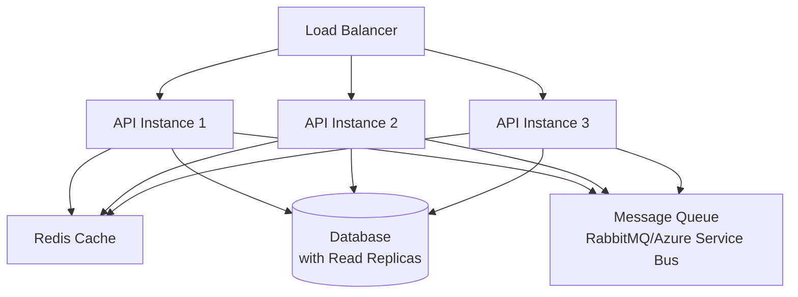

# Building Scalable & Maintainable ASP.NET APIs - Part 6
## Performance, Caching & Scalability

> **Production Example**: E-Commerce Order Management API (Continued)

---

## Table of Contents
1. [Response Caching](#response-caching)
2. [Distributed Caching with Redis](#distributed-caching-with-redis)
3. [Database Query Optimization](#database-query-optimization)
4. [Async/Await Best Practices](#asyncawait-best-practices)
5. [Background Jobs](#background-jobs)
6. [API Rate Limiting & Throttling](#api-rate-limiting--throttling)
7. [Scalability Patterns](#scalability-patterns)

---

## Response Caching

### Response Caching Middleware

**Program.cs**
```csharp
builder.Services.AddResponseCaching();

// In middleware pipeline
app.UseResponseCaching();
```

### Using Response Cache Attribute

```csharp
[HttpGet]
[ResponseCache(Duration = 60, Location = ResponseCacheLocation.Any, VaryByQueryKeys = new[] { "category" })]
public async Task<ActionResult<IEnumerable<ProductDto>>> GetProducts(
    [FromQuery] string category)
{
    var products = await _productService.GetProductsByCategoryAsync(category);
    return Ok(products);
}

// No cache for authenticated endpoints
[HttpGet("profile")]
[ResponseCache(NoStore = true, Location = ResponseCacheLocation.None)]
public async Task<ActionResult<UserDto>> GetProfile()
{
    // Always fetch fresh data
}
```

### Custom Cache Profile

**Program.cs**
```csharp
builder.Services.AddControllers(options =>
{
    options.CacheProfiles.Add("Default30", new CacheProfile
    {
        Duration = 30
    });
    
    options.CacheProfiles.Add("Hourly", new CacheProfile
    {
        Duration = 3600,
        Location = ResponseCacheLocation.Any,
        VaryByHeader = "Accept-Encoding"
    });
    
    options.CacheProfiles.Add("Never", new CacheProfile
    {
        NoStore = true,
        Location = ResponseCacheLocation.None
    });
});
```

**Usage:**
```csharp
[HttpGet]
[ResponseCache(CacheProfileName = "Hourly")]
public async Task<ActionResult<IEnumerable<CategoryDto>>> GetCategories()
{
    return Ok(await _categoryService.GetAllAsync());
}
```

---

## Distributed Caching with Redis

### Install Redis Package

```bash
dotnet add package StackExchange.Redis
dotnet add package Microsoft.Extensions.Caching.StackExchangeRedis
```

### Configure Redis

**Program.cs**
```csharp
builder.Services.AddStackExchangeRedisCache(options =>
{
    options.Configuration = builder.Configuration.GetConnectionString("RedisConnection");
    options.InstanceName = "OrderManagementAPI_";
});
```

### Cache Service Interface

**OrderManagement.Application/Interfaces/ICacheService.cs**
```csharp
namespace OrderManagement.Application.Interfaces;

public interface ICacheService
{
    Task<T> GetAsync<T>(string key);
    Task SetAsync<T>(string key, T value, TimeSpan? expiry = null);
    Task RemoveAsync(string key);
    Task<bool> ExistsAsync(string key);
    Task RemoveByPrefixAsync(string prefix);
}
```

**OrderManagement.Infrastructure/Services/RedisCacheService.cs**
```csharp
using Microsoft.Extensions.Caching.Distributed;
using OrderManagement.Application.Interfaces;
using System.Text.Json;

namespace OrderManagement.Infrastructure.Services;

public class RedisCacheService : ICacheService
{
    private readonly IDistributedCache _cache;
    private readonly ILogger<RedisCacheService> _logger;
    private readonly DistributedCacheEntryOptions _defaultOptions;
    
    public RedisCacheService(
        IDistributedCache cache,
        ILogger<RedisCacheService> logger,
        IConfiguration configuration)
    {
        _cache = cache;
        _logger = logger;
        
        var defaultExpiry = configuration.GetValue<int>("CacheSettings:DefaultExpirationMinutes", 30);
        _defaultOptions = new DistributedCacheEntryOptions
        {
            AbsoluteExpirationRelativeToNow = TimeSpan.FromMinutes(defaultExpiry)
        };
    }
    
    public async Task<T> GetAsync<T>(string key)
    {
        try
        {
            var cachedValue = await _cache.GetStringAsync(key);
            
            if (string.IsNullOrEmpty(cachedValue))
                return default;
            
            return JsonSerializer.Deserialize<T>(cachedValue);
        }
        catch (Exception ex)
        {
            _logger.LogError(ex, "Error retrieving cache for key: {Key}", key);
            return default;
        }
    }
    
    public async Task SetAsync<T>(string key, T value, TimeSpan? expiry = null)
    {
        try
        {
            var serializedValue = JsonSerializer.Serialize(value);
            
            var options = expiry.HasValue
                ? new DistributedCacheEntryOptions { AbsoluteExpirationRelativeToNow = expiry }
                : _defaultOptions;
            
            await _cache.SetStringAsync(key, serializedValue, options);
            
            _logger.LogDebug("Cache set for key: {Key} with expiry: {Expiry}", 
                key, expiry ?? _defaultOptions.AbsoluteExpirationRelativeToNow);
        }
        catch (Exception ex)
        {
            _logger.LogError(ex, "Error setting cache for key: {Key}", key);
        }
    }
    
    public async Task RemoveAsync(string key)
    {
        try
        {
            await _cache.RemoveAsync(key);
            _logger.LogDebug("Cache removed for key: {Key}", key);
        }
        catch (Exception ex)
        {
            _logger.LogError(ex, "Error removing cache for key: {Key}", key);
        }
    }
    
    public async Task<bool> ExistsAsync(string key)
    {
        try
        {
            var value = await _cache.GetStringAsync(key);
            return !string.IsNullOrEmpty(value);
        }
        catch (Exception ex)
        {
            _logger.LogError(ex, "Error checking cache existence for key: {Key}", key);
            return false;
        }
    }
    
    public async Task RemoveByPrefixAsync(string prefix)
    {
        // Note: This requires Redis-specific implementation
        // Using StackExchange.Redis directly
        _logger.LogWarning("RemoveByPrefix not implemented for generic IDistributedCache");
        await Task.CompletedTask;
    }
}
```

### Using Cache in Services

**Caching Pattern: Cache-Aside (Lazy Loading)**
```csharp
public class ProductService : IProductService
{
    private readonly IUnitOfWork _unitOfWork;
    private readonly ICacheService _cache;
    private readonly IMapper _mapper;
    
    public async Task<ProductDto> GetProductByIdAsync(int id)
    {
        var cacheKey = $"product_{id}";
        
        // Try to get from cache
        var cachedProduct = await _cache.GetAsync<ProductDto>(cacheKey);
        if (cachedProduct != null)
        {
            return cachedProduct;
        }
        
        // If not in cache, get from database
        var product = await _unitOfWork.Products.GetByIdAsync(id);
        
        if (product == null)
            throw new NotFoundException($"Product with ID {id} not found");
        
        var productDto = _mapper.Map<ProductDto>(product);
        
        // Store in cache
        await _cache.SetAsync(cacheKey, productDto, TimeSpan.FromMinutes(60));
        
        return productDto;
    }
    
    public async Task<ProductDto> UpdateProductAsync(int id, UpdateProductDto dto)
    {
        var product = await _unitOfWork.Products.GetByIdAsync(id);
        
        if (product == null)
            throw new NotFoundException($"Product with ID {id} not found");
        
        _mapper.Map(dto, product);
        
        await _unitOfWork.Products.UpdateAsync(product);
        await _unitOfWork.SaveChangesAsync();
        
        // Invalidate cache
        await _cache.RemoveAsync($"product_{id}");
        await _cache.RemoveAsync("products_all"); // If you cache list of all products
        
        return _mapper.Map<ProductDto>(product);
    }
}
```

### Cache Decorator Pattern

**OrderManagement.Application/Services/Decorators/CachedProductService.cs**
```csharp
namespace OrderManagement.Application.Services.Decorators;

public class CachedProductService : IProductService
{
    private readonly IProductService _productService;
    private readonly ICacheService _cache;
    private const int CacheExpirationMinutes = 60;
    
    public CachedProductService(IProductService productService, ICacheService cache)
    {
        _productService = productService;
        _cache = cache;
    }
    
    public async Task<ProductDto> GetProductByIdAsync(int id)
    {
        var cacheKey = $"product_{id}";
        var cached = await _cache.GetAsync<ProductDto>(cacheKey);
        
        if (cached != null)
            return cached;
        
        var product = await _productService.GetProductByIdAsync(id);
        await _cache.SetAsync(cacheKey, product, TimeSpan.FromMinutes(CacheExpirationMinutes));
        
        return product;
    }
    
    public async Task<PagedResult<ProductDto>> GetProductsAsync(ProductQueryParameters parameters)
    {
        var cacheKey = $"products_{JsonSerializer.Serialize(parameters)}";
        var cached = await _cache.GetAsync<PagedResult<ProductDto>>(cacheKey);
        
        if (cached != null)
            return cached;
        
        var products = await _productService.GetProductsAsync(parameters);
        await _cache.SetAsync(cacheKey, products, TimeSpan.FromMinutes(5)); // Shorter expiry for lists
        
        return products;
    }
    
    // Write operations invalidate cache
    public async Task<ProductDto> UpdateProductAsync(int id, UpdateProductDto dto)
    {
        var result = await _productService.UpdateProductAsync(id, dto);
        
        // Invalidate cache
        await _cache.RemoveAsync($"product_{id}");
        
        return result;
    }
}
```

---

## Database Query Optimization

### Eager Loading vs Lazy Loading

```csharp
// ❌ BAD: N+1 Query Problem
public async Task<IEnumerable<OrderDto>> GetOrders()
{
    var orders = await _context.Orders.ToListAsync();
    
    // This causes N additional queries!
    foreach (var order in orders)
    {
        var customer = order.Customer; // Lazy load
        var items = order.Items.ToList(); // Lazy load
    }
}

// ✅ GOOD: Eager Loading
public async Task<IEnumerable<OrderDto>> GetOrders()
{
    return await _context.Orders
        .Include(o => o.Customer)
        .Include(o => o.Items)
            .ThenInclude(oi => oi.Product)
        .ToListAsync();
}

// ✅ BETTER: Projection to avoid loading unnecessary data
public async Task<IEnumerable<OrderSummaryDto>> GetOrderSummaries()
{
    return await _context.Orders
        .Select(o => new OrderSummaryDto
        {
            Id = o.Id,
            OrderNumber = o.OrderNumber,
            CustomerName = o.Customer.FirstName + " " + o.Customer.LastName,
            Total = o.Total,
            Status = o.Status.ToString()
        })
        .ToListAsync();
}
```

### Query Splitting for Large Includes

```csharp
// For complex queries with multiple collections
public async Task<Order> GetOrderWithAllDetails(int id)
{
    return await _context.Orders
        .Include(o => o.Customer)
        .Include(o => o.Items)
            .ThenInclude(oi => oi.Product)
        .AsSplitQuery() // Splits into multiple queries to avoid cartesian explosion
        .FirstOrDefaultAsync(o => o.Id == id);
}
```

### Indexed Queries

```csharp
// Add indexes in configuration
public class OrderConfiguration : IEntityTypeConfiguration<Order>
{
    public void Configure(EntityTypeBuilder<Order> builder)
    {
        // Single column index
        builder.HasIndex(o => o.OrderDate);
        builder.HasIndex(o => o.Status);
        
        // Composite index for common query patterns
        builder.HasIndex(o => new { o.CustomerId, o.OrderDate });
        builder.HasIndex(o => new { o.Status, o.OrderDate });
        
        // Filtered index (SQL Server specific)
        builder.HasIndex(o => o.OrderNumber)
            .HasFilter("[IsDeleted] = 0");
    }
}
```

### Bulk Operations

```csharp
// Instead of individual inserts
// ❌ BAD
foreach (var item in items)
{
    await _context.OrderItems.AddAsync(item);
    await _context.SaveChangesAsync();
}

// ✅ GOOD: Bulk insert
await _context.OrderItems.AddRangeAsync(items);
await _context.SaveChangesAsync();

// For large datasets, use EFCore.BulkExtensions
// using EFCore.BulkExtensions;
await _context.BulkInsertAsync(items);
await _context.BulkUpdateAsync(items);
await _context.BulkDeleteAsync(items);
```

---

## Async/Await Best Practices

### Basic Rules

```csharp
// ❌ BAD: Blocking async code
public OrderDto GetOrder(int id)
{
    return _orderService.GetOrderByIdAsync(id).Result; // Deadlock risk!
}

// ✅ GOOD: Async all the way
public async Task<OrderDto> GetOrder(int id)
{
    return await _orderService.GetOrderByIdAsync(id);
}

// ❌ BAD: Unnecessary async
public async Task<int> GetNumber()
{
    return await Task.FromResult(42); // Just return 42!
}

// ✅ GOOD
public int GetNumber()
{
    return 42;
}

// ❌ BAD: Async void (except for event handlers)
public async void ProcessOrder(int id)
{
    await _orderService.ProcessOrderAsync(id);
}

// ✅ GOOD: Return Task
public async Task ProcessOrderAsync(int id)
{
    await _orderService.ProcessOrderAsync(id);
}
```

### Parallel Async Operations

```csharp
// ❌ BAD: Sequential when operations are independent
public async Task<DashboardData> GetDashboardDataAsync()
{
    var orders = await _orderService.GetRecentOrdersAsync();
    var revenue = await _orderService.GetTotalRevenueAsync();
    var customers = await _customerService.GetTopCustomersAsync();
    
    return new DashboardData { Orders = orders, Revenue = revenue, Customers = customers };
}

// ✅ GOOD: Parallel execution
public async Task<DashboardData> GetDashboardDataAsync()
{
    var ordersTask = _orderService.GetRecentOrdersAsync();
    var revenueTask = _orderService.GetTotalRevenueAsync();
    var customersTask = _customerService.GetTopCustomersAsync();
    
    await Task.WhenAll(ordersTask, revenueTask, customersTask);
    
    return new DashboardData 
    { 
        Orders = await ordersTask, 
        Revenue = await revenueTask, 
        Customers = await customersTask 
    };
}
```

### ConfigureAwait Best Practices

```csharp
// In library code (not ASP.NET Core controllers)
public async Task<OrderDto> GetOrderAsync(int id)
{
    var order = await _repository.GetByIdAsync(id).ConfigureAwait(false);
    var dto = _mapper.Map<OrderDto>(order);
    return dto;
}

// Note: In ASP.NET Core, ConfigureAwait(false) is generally not needed
// The framework doesn't use SynchronizationContext
```

---

## Background Jobs

### Using Hosted Services

**OrderManagement.API/HostedServices/OrderCleanupService.cs**
```csharp
namespace OrderManagement.API.HostedServices;

public class OrderCleanupService : BackgroundService
{
    private readonly IServiceProvider _serviceProvider;
    private readonly ILogger<OrderCleanupService> _logger;
    private readonly TimeSpan _interval = TimeSpan.FromHours(24);
    
    public OrderCleanupService(
        IServiceProvider serviceProvider,
        ILogger<OrderCleanupService> logger)
    {
        _serviceProvider = serviceProvider;
        _logger = logger;
    }
    
    protected override async Task ExecuteAsync(CancellationToken stoppingToken)
    {
        _logger.LogInformation("Order Cleanup Service started");
        
        while (!stoppingToken.IsCancellationRequested)
        {
            try
            {
                await CleanupOldOrdersAsync(stoppingToken);
            }
            catch (Exception ex)
            {
                _logger.LogError(ex, "Error occurred during order cleanup");
            }
            
            await Task.Delay(_interval, stoppingToken);
        }
        
        _logger.LogInformation("Order Cleanup Service stopped");
    }
    
    private async Task CleanupOldOrdersAsync(CancellationToken cancellationToken)
    {
        using var scope = _serviceProvider.CreateScope();
        var unitOfWork = scope.ServiceProvider.GetRequiredService<IUnitOfWork>();
        
        var cutoffDate = DateTime.UtcNow.AddMonths(-6);
        var oldOrders = await unitOfWork.Orders
            .FindAsync(o => o.CreatedAt < cutoffDate && o.Status == OrderStatus.Cancelled);
        
        foreach (var order in oldOrders)
        {
            order.IsDeleted = true;
        }
        
        await unitOfWork.SaveChangesAsync(cancellationToken);
        
        _logger.LogInformation("Cleaned up {Count} old cancelled orders", oldOrders.Count());
    }
}
```

**Register in Program.cs:**
```csharp
builder.Services.AddHostedService<OrderCleanupService>();
```

### Using Hangfire for Advanced Job Scheduling

```bash
dotnet add package Hangfire.AspNetCore
dotnet add package Hangfire.SqlServer
```

**Program.cs**
```csharp
using Hangfire;

builder.Services.AddHangfire(config =>
{
    config.UseSqlServerStorage(builder.Configuration.GetConnectionString("DefaultConnection"));
});

builder.Services.AddHangfireServer();

// After app.Build()
app.UseHangfireDashboard("/hangfire", new DashboardOptions
{
    Authorization = new[] { new HangfireAuthorizationFilter() }
});

// Schedule jobs
RecurringJob.AddOrUpdate<IEmailService>(
    "send-daily-report",
    service => service.SendDailyReportAsync(),
    Cron.Daily(9)); // 9 AM daily

// Fire-and-forget job
BackgroundJob.Enqueue<IOrderService>(service => service.ProcessOrderAsync(orderId));

// Delayed job
BackgroundJob.Schedule<IOrderService>(
    service => service.CancelPendingOrderAsync(orderId),
    TimeSpan.FromHours(24));
```

---

## API Rate Limiting & Throttling

### Using AspNetCoreRateLimit

```bash
dotnet add package AspNetCoreRateLimit
```

**appsettings.json**
```json
{
  "IpRateLimiting": {
    "EnableEndpointRateLimiting": true,
    "StackBlockedRequests": false,
    "RealIpHeader": "X-Real-IP",
    "ClientIdHeader": "X-ClientId",
    "HttpStatusCode": 429,
    "GeneralRules": [
      {
        "Endpoint": "*",
        "Period": "1m",
        "Limit": 100
      },
      {
        "Endpoint": "*",
        "Period": "1h",
        "Limit": 1000
      }
    ],
    "EndpointWhitelist": [
      "get:/health"
    ]
  }
}
```

**Program.cs**
```csharp
using AspNetCoreRateLimit;

builder.Services.AddMemoryCache();
builder.Services.Configure<IpRateLimitOptions>(builder.Configuration.GetSection("IpRateLimiting"));
builder.Services.AddSingleton<IIpPolicyStore, MemoryCacheIpPolicyStore>();
builder.Services.AddSingleton<IRateLimitCounterStore, MemoryCacheRateLimitCounterStore>();
builder.Services.AddSingleton<IRateLimitConfiguration, RateLimitConfiguration>();
builder.Services.AddSingleton<IProcessingStrategy, AsyncKeyLockProcessingStrategy>();

// In middleware pipeline
app.UseIpRateLimiting();
```

---

## Scalability Patterns

### Stateless API Design

```csharp
// ✅ GOOD: Stateless - all state in request/database
[HttpGet("{id}")]
public async Task<ActionResult<OrderDto>> GetOrder(int id)
{
    var order = await _orderService.GetOrderByIdAsync(id);
    return Ok(order);
}

// ❌ BAD: Stateful - storing state in memory
private static Dictionary<string, UserSession> _sessions = new();

[HttpPost("login")]
public IActionResult Login(LoginDto dto)
{
    var session = CreateSession(dto.Username);
    _sessions[session.Id] = session; // Won't work with multiple instances!
    return Ok(session);
}
```

### Database Connection Pooling

**Connection string:**
```
Server=localhost;Database=OrderManagementDb;Trusted_Connection=True;Min Pool Size=10;Max Pool Size=100;
```

### Horizontal Scaling Considerations



### CQRS Pattern (Command Query Responsibility Segregation)

```csharp
// Separate read and write models

// Command (Write)
public class CreateOrderCommand
{
    public CreateOrderDto Data { get; set; }
}

public class CreateOrderHandler : IRequestHandler<CreateOrderCommand, OrderDto>
{
    private readonly IUnitOfWork _unitOfWork;
    
    public async Task<OrderDto> Handle(CreateOrderCommand request, CancellationToken cancellationToken)
    {
        // Write to primary database
        var order = await _unitOfWork.Orders.AddAsync(/* ... */);
        await _unitOfWork.SaveChangesAsync();
        return order;
    }
}

// Query (Read)
public class GetOrderQuery
{
    public int Id { get; set; }
}

public class GetOrderHandler : IRequestHandler<GetOrderQuery, OrderDto>
{
    private readonly IReadOnlyContext _readContext; // Read from replica
    
    public async Task<OrderDto> Handle(GetOrderQuery request, CancellationToken cancellationToken)
    {
        // Read from read-only replica database
        return await _readContext.Orders.FindAsync(request.Id);
    }
}
```

---

## Key Takeaways

✅ **Response caching** reduces server load for cacheable endpoints  
✅ **Distributed caching (Redis)** enables stateless scalability  
✅ **Query optimization** prevents performance bottlenecks  
✅ **Async/await** improves throughput and scalability  
✅ **Background jobs** handle long-running tasks  
✅ **Rate limiting** protects against abuse  
✅ **Horizontal scaling** requires stateless design  

---

Continue to [Part 7: Testing & Deployment](aspnet-api-guide-part7.md) →
