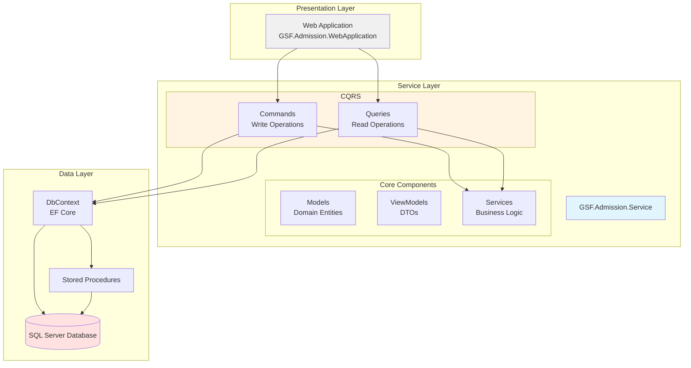
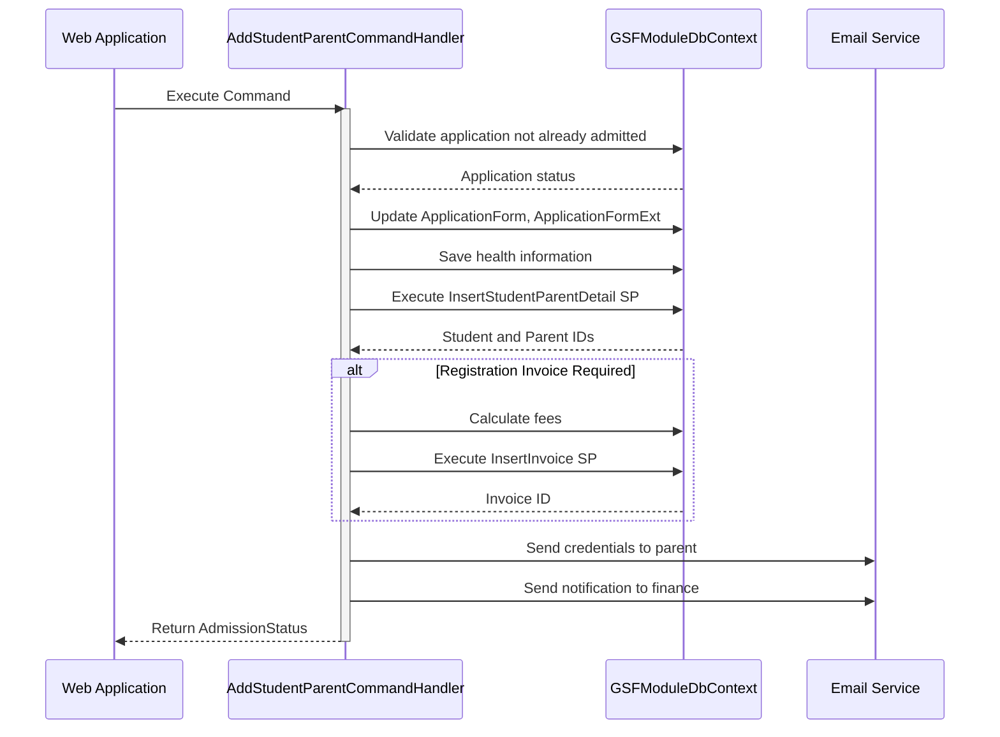
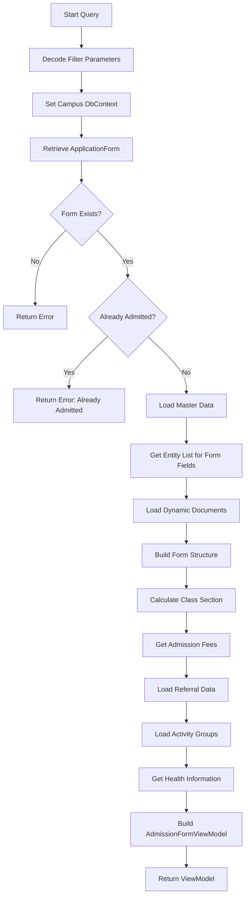
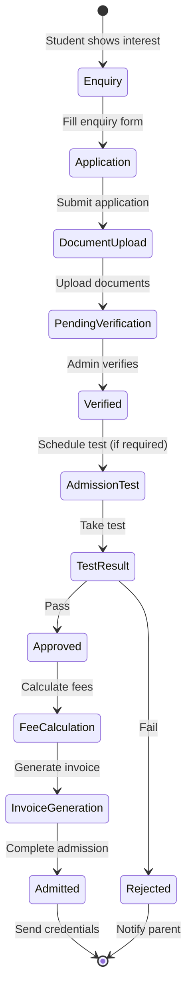
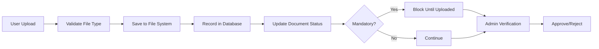
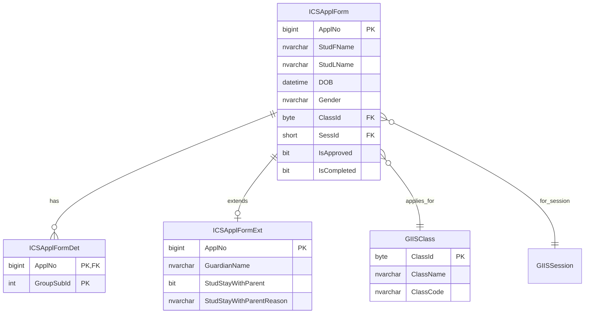

# GSF.Admission.Service - Technical Documentation

> **Version:** 1.0  
> **Target Framework:** .NET Standard 2.0  
> **Last Updated:** November 29, 2025

---

## Table of Contents

1. [Overview](#overview)
2. [Project Architecture](#project-architecture)
3. [Project Structure](#project-structure)
4. [Architectural Patterns](#architectural-patterns)
5. [Key Components](#key-components)
6. [Data Flow & Workflows](#data-flow--workflows)
7. [Database Layer](#database-layer)
8. [Dependencies](#dependencies)
9. [Getting Started](#getting-started)
10. [Code Examples](#code-examples)
11. [Best Practices](#best-practices)

---

## Overview

### Purpose

**GSF.Admission.Service** is a comprehensive service layer for managing student admissions in the Global Schools Foundation (GSF) system. It handles the entire admission lifecycle including:

- Student registration and application processing
- Admission forms management (enquiry to admission)
- Fee calculation and invoice generation
- Document uploads and verification
- Parent and student information management
- Referral programs and promo codes
- Reporting and analytics

### Key Features

- **CQRS Pattern**: Clear separation of read (Queries) and write (Commands) operations
- **Entity Framework Core**: ORM for database operations
- **Stored Procedures**: Integration with existing SQL Server stored procedures
- **Multi-Campus Support**: Dynamic database context switching for different campuses
- **Email Notifications**: Automated email communications for admissions workflow
- **Document Management**: Dynamic document upload and validation
- **Fee Management**: Complex fee calculation with discounts and referral benefits

---

## Project Architecture

### High-Level Architecture



### Technology Stack

| Component | Technology |
|-----------|-----------|
| **Framework** | .NET Standard 2.0 |
| **ORM** | Entity Framework Core 2.2.0 |
| **Database** | SQL Server |
| **Dependency Injection** | ASP.NET Core DI Container |
| **PDF Generation** | iTextSharp 5.5.13.4 |
| **Excel Processing** | EPPlus 7.0.2 |
| **Email** | MailKit 2.9.0 |
| **Serialization** | Newtonsoft.Json 12.0.3 |
| **AWS Integration** | AWSSDK.SimpleNotificationService 3.7.400.86 |

---

## Project Structure

### Directory Layout

```
GSF.Admission.Service/
│
├── Command/                          # Write operations (CQRS Commands)
│   ├── AdmissionFormCommand/         # Student admission commands
│   │   └── AddStudentParentCommand.cs
│   ├── AdmissionDataMappings/        # Data mapping commands
│   ├── CampusConfigurationCommand/   # Campus settings commands
│   ├── Document/                     # Document management commands
│   ├── EditRegistrationFormCommand/  # Registration editing commands
│   ├── PromoCodeMasterCommand/       # Promo code management
│   ├── ReferralApprovalsCommand/     # Referral approval workflow
│   └── StudentPhotoUpload/           # Photo upload commands
│
├── Query/                            # Read operations (CQRS Queries)
│   ├── AdmissionFormQuery/           # Admission form queries
│   │   ├── ViewAdmissionFormQuery.cs
│   │   ├── GetAdmissionFeesQuery.cs
│   │   └── GetAdmissionConfirmationDataQuery.cs
│   ├── AdmissionDataMappings/        # Data mapping queries
│   ├── AdmissionMonthlyReport/       # Reporting queries
│   ├── Document/                     # Document queries
│   ├── ReferralApprovals/            # Referral queries
│   └── StudentReportQuery/           # Student report queries
│
├── Models/                           # Domain entities (Database tables)
│   ├── ApplicationForm.cs            # Main application form entity
│   ├── ApplicationFormExt.cs         # Extended form fields
│   ├── ApplicationFormDet.cs         # Form details (languages, activities)
│   ├── StudentInfo.cs                # Student information
│   ├── Country.cs, Religion.cs, etc. # Master data entities
│   └── StoredProcedures/             # Stored procedure return models
│
├── ViewModels/                       # Data Transfer Objects (DTOs)
│   ├── AdmissionForm/                # Admission form view models
│   │   ├── AdmissionFormViewModel.cs
│   │   └── AdmissionStatusViewModel.cs
│   ├── AdmissionDataMappings/        # Data mapping view models
│   ├── ReferralApprovals/            # Referral view models
│   └── Document/                     # Document view models
│
├── DbContext/                        # Database contexts
│   ├── GSFModuleDbContext.cs         # Campus-specific database context
│   ├── GSFDbContext.cs               # Global database context
│   └── GSGDbContext.cs               # GSG-specific context
│
├── Service/                          # Business logic services
│   ├── CommonFunctionService.cs      # Shared business logic
│   └── ICommonFunctionService.cs     # Service interface
│
├── Common/                           # Shared utilities
│   └── AdmissionFormClassBuilder.cs  # Dynamic class builder
│
├── Constants/                        # Application constants
│   └── AdmissionStatus.cs            # Status enumerations
│
└── Assembly/                         # External dependencies
    └── GSF.Core.dll, GSF.Infrastructure.dll, etc.
```

### Component Statistics

| Component Type | Count | Purpose |
|---------------|-------|---------|
| **Commands** | 20+ | Handle write operations (Create, Update, Delete) |
| **Queries** | 46+ | Handle read operations (View, List, Report) |
| **Models** | 75+ | Represent database tables and entities |
| **ViewModels** | 50+ | Data transfer objects for UI communication |
| **Stored Procedures** | 30+ | Complex database operations |
| **Services** | 2 | Business logic and utilities |

---

## Architectural Patterns

### 1. CQRS (Command Query Responsibility Segregation)

The project implements CQRS pattern to separate read and write responsibilities:

#### Commands (Write Operations)

```csharp
// Command definition
public class AddStudentParentCommand
{
    public LoggedInUser LoginDetails { get; set; }
    public ApplicationFormViewModel FormData { get; set; }
}

// Command handler
public class AddStudentParentCommandHandler : ICommandHandlerAsync<AddStudentParentCommand>
{
    private readonly GSFDbContext _gSFDbContext;
    private GSFModuleDbContext _gSFModuleDbContext;
    private readonly IUtilityService _utilityService;
    
    public async Task HandleAsync(AddStudentParentCommand command)
    {
        // 1. Validate application
        // 2. Update student and parent information
        // 3. Calculate fees
        // 4. Generate invoice
        // 5. Send email notifications
        // 6. Return admission status
    }
}
```

**Key Commands:**
- `AddStudentParentCommand` - Admits a student and creates parent record
- `SaveUpdateAdmissionDataCommand` - Updates admission data mappings
- `AddUpdateDocumentCommand` - Manages document uploads
- `SetReferralApprovalStatusCommand` - Approves/rejects referrals

#### Queries (Read Operations)

```csharp
// Query definition
public class ViewAdmissionFormQuery : IQuery
{
    public LoggedInUser LoginDetails { get; set; }
    public AdmissionFormFilters Filters { get; set; }
}

// Query handler
public class ViewAdmissionFormQueryHandlerAsync : 
    IQueryHandlerAsync<ViewAdmissionFormQuery, AdmissionFormViewModel>
{
    public async Task<AdmissionFormViewModel> HandleAsync(ViewAdmissionFormQuery query)
    {
        // 1. Retrieve application form data
        // 2. Load master data (countries, classes, etc.)
        // 3. Build dynamic form structure
        // 4. Calculate fees
        // 5. Return view model
    }
}
```

**Key Queries:**
- `ViewAdmissionFormQuery` - Retrieves admission form with all master data
- `GetAdmissionFeesQuery` - Calculates admission fees
- `AdmissionMonthlyReportQuery` - Generates monthly reports
- `ReferralMISReportQuery` - Referral management reports

### 2. Repository Pattern (via Entity Framework)

DbContext acts as Unit of Work and Repository:

```csharp
public class GSFModuleDbContext : DbContext
{
    // DbSets act as repositories
    public DbSet<ApplicationForm> ApplicationForms { get; set; }
    public DbSet<StudentInfo> StudentInfos { get; set; }
    public DbSet<ClassSection> ClassSections { get; set; }
    
    // Stored procedure methods
    public async Task<InsertStudentParentReturnViewModel> InsertStudentParentDetail(
        long ApplNO, bool? isbus, int? zone, ...)
    {
        // Execute stored procedure with parameters
    }
}
```

### 3. Multi-Tenancy (Campus-based)

Dynamic database context switching for different campuses:

```csharp
public void SetCampusDbContext(string campusName)
{
    // Fetch campus details from global database
    Campus campus = _gSFDbContext.Campuses
        .FirstOrDefault(c => c.BranchName == campusName);
    
    if (campus == null)
        throw new ArgumentException("Invalid Campus");
    
    // Build new context with campus-specific connection string
    var dbContextBuilder = new DbContextOptionsBuilder<GSFModuleDbContext>();
    dbContextBuilder.UseSqlServer(campus.ConnectionString);
    
    // Create campus-specific context
    _gSFModuleDbContext = new GSFModuleDbContext(dbContextBuilder.Options);
}
```

### 4. Dependency Injection

Services are injected via constructor injection:

```csharp
public class AddStudentParentCommandHandler 
{
    private readonly GSFDbContext _gSFDbContext;
    private readonly IUtilityService _utilityService;
    private readonly ILogger _logger;
    private readonly IConfiguration _config;

    public AddStudentParentCommandHandler(
        GSFDbContext gSFDbContext,
        GSFModuleDbContext gSFModuleDbContext,
        IUtilityService utilityService,
        ILogger<AddStudentParentCommandHandler> logger,
        IConfiguration config)
    {
        _gSFDbContext = gSFDbContext;
        _utilityService = utilityService;
        _logger = logger;
        _config = config;
    }
}
```

---

## Key Components

### 1. Models (Domain Entities)

Models represent database tables and are mapped using Entity Framework conventions.

#### ApplicationForm Model

The core model representing a student application:

```csharp
[Table("ICSApplForm")]
public partial class ApplicationForm
{
    [Key]
    [Column("ApplNo")]
    public long ApplNo { get; set; }  // Application Number (Primary Key)
    
    // Student Information
    [Column("StudFName")]
    public string StudentFirstName { get; set; }
    
    [Column("StudLName")]
    public string StudentLastName { get; set; }
    
    [Column("DOB")]
    public DateTime DOB { get; set; }
    
    [Column("Gender")]
    public string Gender { get; set; }
    
    // Parent Information
    [Column("FthFName")]
    public string FthFName { get; set; }  // Father First Name
    
    [Column("MthFName")]
    public string MthFName { get; set; }  // Mother First Name
    
    // Contact Details
    [Column("FthEmail")]
    public string FthEmail { get; set; }
    
    [Column("FthMobile")]
    public string FthMobile { get; set; }
    
    // Application Status
    [Column("IsApproved")]
    public bool IsApproved { get; set; }
    
    [Column("IsCompleted")]
    public bool IsCompleted { get; set; }
    
    // Over 100+ properties covering all admission data
}
```

**Key Models:**
- `ApplicationForm` (1600+ lines) - Main application entity
- `ApplicationFormExt` - Extended application fields
- `ApplicationFormDet` - Application details (languages, activities)
- `StudentInfo` - Student master record
- `Country`, `Religion`, `Caste`, etc. - Master data tables

### 2. ViewModels (DTOs)

ViewModels structure data for API responses and encapsulate business logic.

#### AdmissionFormViewModel

```csharp
public class AdmissionFormViewModel
{
    // Form structure
    public AdmissionFormMasterData Data { get; set; }
    
    // Filters
    public AdmissionFormFilters Filters { get; set; }
    
    // Fees information
    public AdmissionFeesViewModel Fees { get; set; }
    
    // Status information
    public AdmissionStatusViewModel AdmissionStatus { get; set; }
    
    // Master data
    public List<Zone> Zones { get; set; }
    public List<ActivityGroupViewModel> ActivityGroupList { get; set; }
    public string[] CrossCampuses { get; set; }
    
    // Health information
    public dynamic HealthInfo { get; set; }
    
    // Error handling
    public ErrorViewModel Errors { get; set; }
}
```

### 3. DbContext (Data Access Layer)

#### GSFModuleDbContext

Campus-specific database context with:
- **DbSets**: Entity collections for CRUD operations
- **Stored Procedure Methods**: Async methods calling SQL Server stored procedures
- **Custom Business Logic**: Fee calculations, invoice generation

```csharp
public class GSFModuleDbContext : DbContext
{
    // Entity Sets
    public DbSet<ApplicationForm> ApplicationForms { get; set; }
    public DbSet<StudentInfo> StudentInfos { get; set; }
    public DbSet<StudyClass> Classes { get; set; }
    // ... 50+ DbSets
    
    // Stored Procedure: Insert Student and Parent
    public async Task<InsertStudentParentReturnViewModel> InsertStudentParentDetail(
        long ApplNO, 
        bool? isbus = false,
        int? zone = 0, 
        bool? oneWay = false, 
        DateTime? attendingdate = null,
        DateTime? busstartdate = null,
        int? invoiceperiodtype = null,
        int? paymentperiodtype = null)
    {
        var applNoParam = new SqlParameter { 
            ParameterName = "@ApplNO", 
            SqlDbType = SqlDbType.BigInt, 
            Value = ApplNO 
        };
        // ... more parameters
        
        var procResultData = await InsertStudentParentDetails
            .FromSql("EXEC @procResult = [dbo].[usp_giis_Ballot_InsertStudentParentDetails] ...", 
                     applNoParam, isbusParam, ...)
            .FirstOrDefaultAsync();
            
        return procResultData;
    }
    
    // Stored Procedure: Generate Invoice
    public async Task<InsertInvoiceReturnViewModel> InsertInvoice(
        long SessId, long StudentId, decimal InvAmt, ...)
    {
        // Execute invoice generation stored procedure
    }
}
```

### 4. Commands

Commands handle write operations with complex business logic:

#### AddStudentParentCommand Workflow



### 5. Queries

Queries retrieve and transform data:

#### ViewAdmissionFormQuery Workflow



---

## Data Flow & Workflows

### Admission Process Flow



### Fee Calculation Workflow

**Complex fee calculation with:**
- Student type (Regular, Staff, Scholarship)
- Class and section
- Discounts (Sibling, Referral, Promo code)
- Period type (Monthly, Quarterly, Annual)

```csharp
// Stored Procedure Call
var feesEntityList = await _gSFModuleDbContext.GetAdmissionFeesAmtSetting(
    SessId: sessionId, 
    ClSecId: clsSecId, 
    EntityId: "", 
    StudentTypeId: studentTypeId, 
    ApplNo: applNo
);

// Returns formatted strings:
// strEnt: Fee entities with amounts
// strDisc: Discount details

// Format: "StudentTypeId|FeesGroupId|FeesName|Amount|TaxPercent|FinalAmount|..."
```

### Document Upload Flow



---

## Database Layer

### Database Architecture



### Key Stored Procedures

| Stored Procedure | Purpose |
|-----------------|---------|
| `usp_giis_Ballot_InsertStudentParentDetails` | Creates student and parent records, assigns credentials |
| `usp_GIIS_InsertInvoice` | Generates admission invoice with fees |
| `usp_GIIS_AdmissionFeesList` | Retrieves applicable fees for class and session |
| `usp_GIIS_AdmissionFeesAmtSetting` | Calculates final fee amounts with discounts |
| `usp_giis_AddmissEnq_GetHealthInfoByApplno` | Gets health questionnaire responses |
| `usp_GIIS_GetCountries` | Master data for countries |

---

## Dependencies

### NuGet Packages

```xml
<ItemGroup>
    <!-- AWS Integration -->
    <PackageReference Include="AWSSDK.SimpleNotificationService" Version="3.7.400.86" />
    
    <!-- Security & Cryptography -->
    <PackageReference Include="BouncyCastle.Cryptography" Version="2.0.0" />
    
    <!-- Excel Processing -->
    <PackageReference Include="EPPlus" Version="7.0.2" />
    
    <!-- PDF Generation -->
    <PackageReference Include="iTextSharp" Version="5.5.13.4" />
    
    <!-- Email -->
    <PackageReference Include="MailKit" Version="2.9.0" />
    
    <!-- ASP.NET Core -->
    <PackageReference Include="Microsoft.AspNetCore.Authorization" Version="2.2.0" />
    <PackageReference Include="Microsoft.AspNetCore.Http.Abstractions" Version="2.2.0" />
    
    <!-- Entity Framework Core -->
    <PackageReference Include="Microsoft.EntityFrameworkCore" Version="2.2.0" />
    <PackageReference Include="Microsoft.EntityFrameworkCore.SqlServer" Version="2.2.0" />
    
    <!-- Configuration -->
    <PackageReference Include="Microsoft.Extensions.Configuration.Abstractions" Version="3.1.9" />
    
    <!-- Serialization -->
    <PackageReference Include="Newtonsoft.Json" Version="12.0.3" />
    
    <!-- Data Extensions -->
    <PackageReference Include="System.Data.DataSetExtensions" Version="4.5.0" />
    <PackageReference Include="System.Linq.Dynamic" Version="1.0.8" />
</ItemGroup>
```

### Internal Dependencies (Assembly folder)

```xml
<ItemGroup>
    <Reference Include="GSF.Core">
        <HintPath>Assembly\GSF.Core.dll</HintPath>
    </Reference>
    <Reference Include="GSF.Infrastructure">
        <HintPath>Assembly\GSF.Infrastructure.dll</HintPath>
    </Reference>
    <Reference Include="GSF.Infrastructure.Mvc">
        <HintPath>Assembly\GSF.Infrastructure.Mvc.dll</HintPath>
    </Reference>
    <Reference Include="GSF.Messaging.Service">
        <HintPath>Assembly\GSF.Messaging.Service.dll</HintPath>
    </Reference>
</ItemGroup>
```

---

## Getting Started

### Prerequisites

1. **.NET Core SDK** 2.2 or higher
2. **SQL Server** 2016 or higher
3. **Visual Studio** 2019+ or VS Code
4. **Git** for version control

### Development Setup

#### 1. Clone the Repository

```powershell
git clone <repository-url>
cd AdmissionModule/Service/GSF.Admission.Service
```

#### 2. Configure Database Connections

Update connection strings in the web application's appsettings.json:

```json
{
  "ConnectionStrings": {
    "GSFGlobalDb": "Server=SERVER;Database=MyGIISQT;User Id=USER;Password=PASS;",
    "Campus1": "Server=SERVER;Database=CampusDB1;User Id=USER;Password=PASS;"
  }
}
```

#### 3. Restore NuGet Packages

```powershell
dotnet restore
```

#### 4. Build the Project

```powershell
dotnet build --configuration Debug
```

#### 5. Run Migrations (if applicable)

```powershell
dotnet ef database update
```

### Project Configuration

#### appsettings.json Example

```json
{
  "Smtp": {
    "Host": "smtp.example.com",
    "Username": "notifications@example.com",
    "Password": "your-password"
  },
  "FileUpload": {
    "BasePath": "/AdmissionsEnquiry/Uploads",
    "MaxSizeBytes": 5242880
  },
  "Logging": {
    "LogLevel": {
      "Default": "Information",
      "Microsoft": "Warning"
    }
  }
}
```

---

## Code Examples

### Example 1: Retrieving an Admission Form

```csharp
// Create query
var query = new ViewAdmissionFormQuery
{
    LoginDetails = new LoggedInUser 
    { 
        Campus = "Singapore",
        UserId = 123
    },
    Filters = new AdmissionFormFilters
    {
        ECampusId = "ENCODED_CAMPUS_ID",
        ESessionId = "ENCODED_SESSION_ID",
        EApplNo = "ENCODED_APPLICATION_NUMBER"
    }
};

// Execute query
var queryHandler = new ViewAdmissionFormQueryHandlerAsync(
    gsfDbContext, 
    gsfModuleDbContext, 
    utilityService, 
    logger,
    configuration,
    commonFunctionService
);

AdmissionFormViewModel result = await queryHandler.HandleAsync(query);

// Access data
Console.WriteLine($"Student: {result.Data.Steps[0].Sections[0]...}");
Console.WriteLine($"Total Fees: {result.Fees.EntityList}");
```

### Example 2: Admitting a Student

```csharp
// Create command
var command = new AddStudentParentCommand
{
    LoginDetails = new LoggedInUser 
    { 
        Campus = "Singapore",
        UserId = 123,
        UserFirstName = "Admin",
        UserLastName = "User"
    },
    FormData = new ApplicationFormViewModel
    {
        Filters = new AdmissionFormFilters
        {
            ECampusId = "ENCODED_CAMPUS_ID",
            ESessionId = "ENCODED_SESSION_ID",
            EApplNo = "ENCODED_APPLICATION_NUMBER"
        },
        ApplicationForm = new ApplicationForm { /* filled data */ },
        ApplicationFormExt = new ApplicationFormExt { /* filled data */ },
        Official = new OfficialData
        {
            ActivityGroups = new int[] { 6, 7 },
            Zone = 1,
            DateStartedAttendingSchool = DateTime.Now,
            StudentType = 1,
            MGIdList = new int[] { 1, 2, 3 }
        }
    }
};

// Execute command
var commandHandler = new AddStudentParentCommandHandler(
    gsfDbContext,
    gsfModuleDbContext,
    utilityService,
    logger,
    configuration
);

await commandHandler.HandleAsync(command);

// Check result
if (command.FormData.AdmissionStatus.Status == AdmissionStatuses.Success)
{
    Console.WriteLine($"Student admitted! ID: {command.FormData.AdmissionStatus.EStudentId}");
}
```

### Example 3: Calculating Fees

```csharp
// Get fees for a specific class and session
var feesList = await gsfModuleDbContext.GetAdmissionFeesList(
    SessId: 2024, 
    ClSecId: 145
);

foreach (var fee in feesList)
{
    Console.WriteLine($"{fee.FeesName}: {fee.Amount}");
}

// Get detailed fee calculation with discounts
var feesDetail = await gsfModuleDbContext.GetAdmissionFeesAmtSetting(
    SessId: 2024,
    ClSecId: 145,
    EntityId: "",
    StudentTypeId: 2,  // Staff child
    ApplNo: 12345
);

// Parse entity string (format: "TypeId|GroupId|FeesName|Amount|...")
string[] entities = feesDetail.strEnt.Split(',');
foreach (var entity in entities)
{
    string[] parts = entity.Split('|');
    Console.WriteLine($"{parts[2]}: {parts[3]}");
}
```

---

## Best Practices

### 1. Error Handling

Always use try-catch blocks and log errors:

```csharp
try
{
    SetCampusDbContext(command.LoginDetails.Campus);
}
catch (Exception ex)
{
    _logger.LogError($"Error setting campus context: {ex.Message}");
    _logger.LogError($"StackTrace: {ex.StackTrace}");
    _logger.LogError($"InnerException: {ex.InnerException}");
    
    // Return user-friendly error
    admissionFormViewModel.Errors = new ErrorViewModel 
    { 
        Status = true, 
        Message = "Invalid campus selected" 
    };
}
```

### 2. Parameter Security

Always use parameterized SQL to prevent SQL injection:

```csharp
// GOOD: Parameterized
var applNoParam = new SqlParameter 
{ 
    ParameterName = "@ApplNo", 
    SqlDbType = SqlDbType.BigInt, 
    Value = applNo 
};
var result = await DbContext.ExecuteSqlAsync("EXEC sp_Name @ApplNo", applNoParam);

// BAD: String concatenation
var result = await DbContext.ExecuteSqlAsync($"EXEC sp_Name {applNo}");
```

### 3. Async/Await Patterns

Use async all the way:

```csharp
public async Task<AdmissionFormViewModel> HandleAsync(ViewAdmissionFormQuery query)
{
    var sessions = await _gSFModuleDbContext.GetSessions("ACTIVE", 1);
    var countries = await _gSFModuleDbContext.GetCounties("A", "");
    var healthInfo = await _gSFModuleDbContext.GetHealthInfoByApplNo(applNo);
    
    return viewModel;
}
```

### 4. Dependency Injection

Register services in Startup.cs:

```csharp
public void ConfigureServices(IServiceCollection services)
{
    // DbContext
    services.AddDbContext<GSFDbContext>(options =>
        options.UseSqlServer(Configuration.GetConnectionString("GSFGlobalDb")));
    
    // Commands
    services.AddScoped<ICommandHandlerAsync<AddStudentParentCommand>, 
                       AddStudentParentCommandHandler>();
    
    // Queries
    services.AddScoped<IQueryHandlerAsync<ViewAdmissionFormQuery, AdmissionFormViewModel>, 
                       ViewAdmissionFormQueryHandlerAsync>();
    
    // Services
    services.AddScoped<IUtilityService, UtilityService>();
    services.AddScoped<ICommonFunctionService, CommonFunctionService>();
}
```

---

**Document Version:** 1.0  
**Last Updated:** November 29, 2025  
**Maintained By:** Development Team
