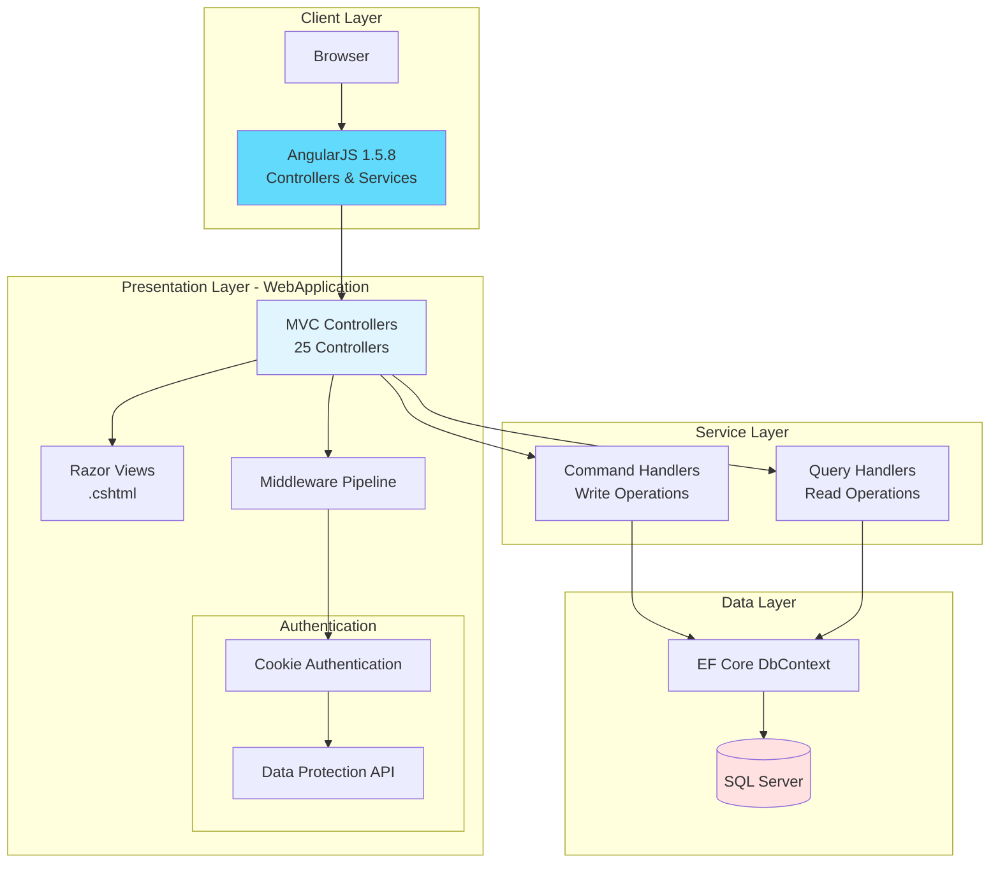
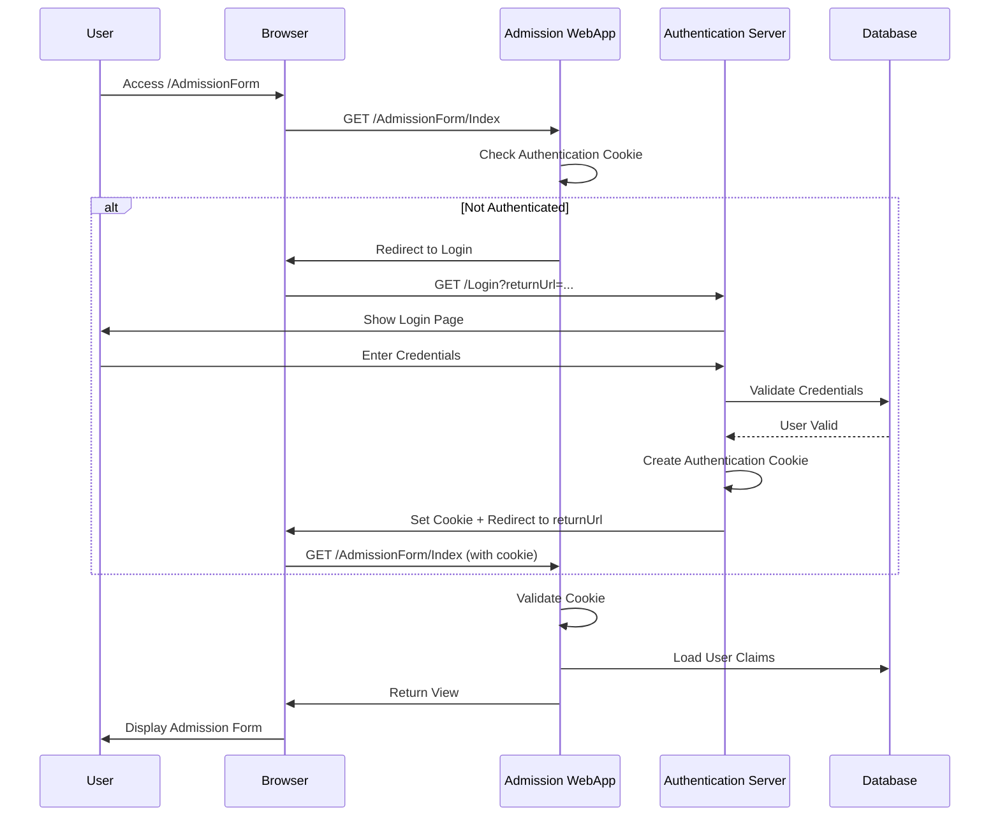
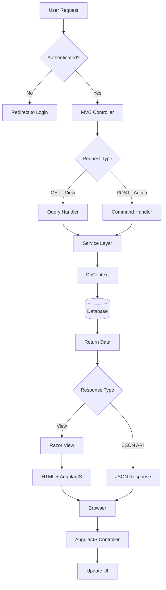
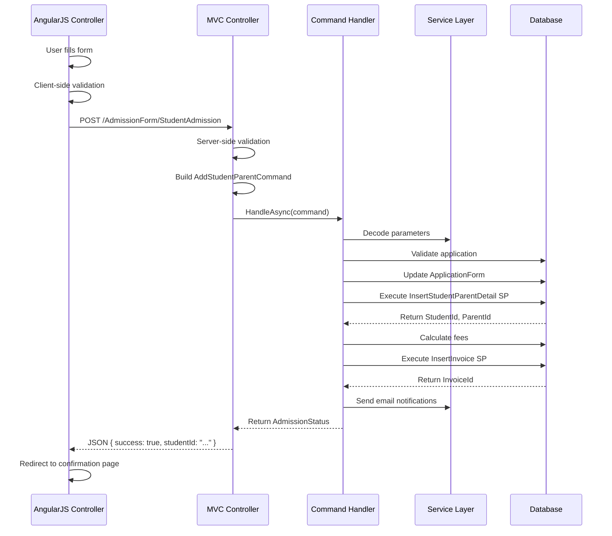

# GSF.Admission.WebApplication - Technical Documentation

> **Version:** 1.0  
> **Target Framework:** ASP.NET Core 2.0  
> **Last Updated:** November 29, 2025

---

## Table of Contents

1. [Overview](#overview)
2. [Application Architecture](#application-architecture)
3. [Project Structure](#project-structure)
4. [Controllers & Routing](#controllers--routing)
5. [Frontend Architecture](#frontend-architecture)
6. [Authentication & Authorization](#authentication--authorization)
7. [Request/Response Flow](#requestresponse-flow)
8. [Configuration](#configuration)
9. [Dependency Injection](#dependency-injection)
10. [Getting Started](#getting-started)
11. [Code Examples](#code-examples)
12. [Best Practices](#best-practices)

---

## Overview

### Purpose

**GSF.Admission.WebApplication** is the presentation layer (web application) for the GSF Admission Module. It provides:

- **MVC Web Application**: ASP.NET Core 2.0 MVC for server-side rendering
- **AngularJS Frontend**: AngularJS 1.5.8 for dynamic client-side interactions
- **RESTful APIs**: Controllers exposing APIs consumed by AngularJS
- **CQRS Integration**: Delegates business logic to the Service layer via Commands/Queries
- **Authentication**: Cookie-based authentication with shared authentication across GSF applications
- **Multi-Campus Support**: Dynamic campus switching with campus-specific content

### Key Features

- **Hybrid Architecture**: Server-side MVC + Client-side AngularJS SPA
- **Dependency Injection**: ASP.NET Core DI container for clean architecture
- **Shared Authentication**: Cross-application cookie sharing via Data Protection API
- **Session Management**: ASP.NET Core Session for state management
- **File Uploads**: Student photos, documents handling
- **Email Integration**: Integration with Messaging Service for notifications
- **PDF Generation**: Admission forms, reports via iTextSharp
- **Excel Export**: Reports via EPPlus
- **Real-time Validation**: Client and server-side validation

---

## Application Architecture

### High-Level Architecture



### Technology Stack

| Component | Technology | Version |
|-----------|-----------|---------|
| **Framework** | ASP.NET Core MVC | 2.0 |
| **Frontend** | AngularJS | 1.5.8 |
| **UI Framework** | Bootstrap | 3.x |
| **Authentication** | Cookie Authentication | ASP.NET Core 2.0 |
| **ORM** | Entity Framework Core | 2.2.0 |
| **Session** | ASP.NET Core Session | 2.0 |
| **PDF** | iTextSharp | 5.5.13.4 |
| **Excel** | EPPlus | 7.0.2 |
| **Email** | MailKit | 2.9.0 |

---

## Project Structure

### Directory Layout

```
GSF.Admission.WebApplication/
│
├── Controllers/                          # MVC Controllers (25 controllers)
│   ├── AdmissionFormController.cs        # Main admission form controller
│   ├── RegisterFormController.cs         # Public registration form
│   ├── EditRegistrationFormController.cs # Edit existing registration
│   ├── ReferralApprovalsController.cs    # Referral approval workflow
│   ├── DocumentController.cs             # Document upload/management
│   ├── PromoCodeMasterController.cs      # Promo code management
│   ├── AdmissionMonthlyReportController.cs # Reporting
│   └── ... (18 more controllers)
│
├── Views/                                # Razor Views (.cshtml)
│   ├── AdmissionForm/                    # Admission form views
│   │   ├── Index.cshtml                  # Main admission view
│   │   ├── AdmissionConfirmation.cshtml  # Confirmation page
│   │   └── AdmissionPrint.cshtml         # Print view
│   ├── RegisterForm/                     # Registration views
│   │   ├── Index.cshtml                  # Public registration form
│   │   └── ThankYouPage.cshtml           # Success page
│   ├── Shared/                           # Shared layouts
│   │   ├── _Layout.cshtml                # Main layout
│   │   └── _ValidationScriptsPartial.cshtml
│   └── ... (22 more view folders)
│
├── wwwroot/                              # Static files
│   ├── angular/                          # AngularJS application
│   │   ├── Controllers/                  # Angular controllers
│   │   │   ├── AdmissionForm/
│   │   │   │   └── AddAdmissionForm.js
│   │   │   ├── EditRegistrationForm/
│   │   │   └── ... (42 more controllers)
│   │   └── Modules/                      # Angular modules
│   │       ├── AdmissionFormIndex.js     # Admission module definition
│   │       └── EditRegistrationFormIndex.js
│   ├── js/                               # JavaScript libraries
│   │   ├── angular1.5.8/                 # AngularJS framework
│   │   ├── bootstrap-select-1.12.2/      # Enhanced select
│   │   └── ...
│   ├── css/                              # Stylesheets
│   │   ├── bootstrap/                    # Bootstrap CSS
│   │   ├── font-awesome-4.6.3/           # Icons
│   │   └── flag-icon/                    # Country flags
│   └── images/                           # Static images
│
├── Constant/                             # Application constants
│   └── ... (3 constant files)
│
├── Assembly/                             # External DLL dependencies
│   ├── GSF.Core.dll
│   ├── GSF.Infrastructure.dll
│   └── ... (10 more DLLs)
│
├── Properties/                           # Build/publish profiles
│
├── Startup.cs                            # Application startup configuration
├── Program.cs                            # Entry point
├── appsettings.json                      # Configuration settings
├── BrandsData.json                       # Multi-brand configuration
└── SessionExtensions.cs                  # Session helper methods
```

### Component Statistics

| Component | Count | Purpose |
|-----------|-------|---------|
| **Controllers** | 25 | Handle HTTP requests and coordinate with Service layer |
| **Views** | 59 | Razor views for UI rendering |
| **Angular Controllers** | 44 | Client-side controllers for dynamic behavior |
| **Angular Modules** | 9 | Modular AngularJS organization |
| **Static Libraries** | 910 | Third-party JavaScript/CSS libraries |

---

## Controllers & Routing

### MVC Controllers

The application uses **25 MVC Controllers** to handle different functional areas:

#### Core Admission Controllers

| Controller | Routes | Purpose |
|-----------|--------|---------|
| `AdmissionFormController` | `/AdmissionForm/*` | Main admission form management |
| `RegisterFormController` | `/RegisterForm/*` | Public-facing registration form |
| `EditRegistrationFormController` | `/EditRegistrationForm/*` | Edit existing applications |
| `AdmissionConfirmationPrintController` | `/AdmissionConfirmationPrint/*` | Print admission letters |

#### Administrative Controllers

| Controller | Routes | Purpose |
|-----------|--------|---------|
| `ReferralApprovalsController` | `/ReferralApprovals/*` | Manage referral program |
| `DocumentController` | `/Document/*` | Document upload and verification |
| `PromoCodeMasterController` | `/PromoCodeMaster/*` | Promotional code management |
| `CampusConfigurationController` | `/CampusConfiguration/*` | Campus-specific settings |
| `GlobalUsersController` | `/GlobalUsers/*` | Multi-campus user management |

#### Reporting Controllers

| Controller | Routes | Purpose |
|-----------|--------|---------|
| `AdmissionMonthlyReportController` | `/AdmissionMonthlyReport/*` | Monthly admission statistics |
| `ReferralMISReportController` | `/ReferralMISReport/*` | Referral program reports |
| `SMCStudentCountController` | `/SMCStudentCount/*` | Student count reports |
| `DynamicReportDetailsController` | `/DynamicReportDetails/*` | Configurable reports |

### Routing Configuration

Default routing is configured in `Startup.cs`:

```csharp
app.UseMvc(routes =>
{
    routes.MapRoute(
        name: "default",
        template: "{controller=CampusConfiguration}/{action=Index}");
});
```

**Default Route**: Application starts at `/CampusConfiguration/Index`

### Controller Example: AdmissionFormController

```csharp
[Authorize]
public class AdmissionFormController : Controller
{
    private readonly IQueryHandlerAsync<ViewAdmissionFormQuery, AdmissionFormViewModel> _queryViewAdmissionFormHandlerAsync;
    private readonly ICommandHandlerAsync<AddStudentParentCommand> _commandAddStudentParentHandlerAsync;
    
    public AdmissionFormController(
        IQueryHandlerAsync<ViewAdmissionFormQuery, AdmissionFormViewModel> queryViewAdmissionFormHandlerAsync,
        ICommandHandlerAsync<AddStudentParentCommand> commandAddStudentParentHandlerAsync)
    {
        _queryViewAdmissionFormHandlerAsync = queryViewAdmissionFormHandlerAsync;
        _commandAddStudentParentHandlerAsync = commandAddStudentParentHandlerAsync;
    }
    
    // GET: /AdmissionForm/Index?encCampusId=...&encSessionId=...&encApplNo=...
    public async Task<IActionResult> Index(string encCampusId, string encSessionId, string encApplNo)
    {
        // Build query with encrypted parameters
        var query = new ViewAdmissionFormQuery
        {
            Filters = new AdmissionFormFilters
            {
                ECampusId = encCampusId,
                ESessionId = encSessionId,
                EApplNo = encApplNo
            }
        };
        
        // Execute query via Service layer
        var viewModel = await _queryViewAdmissionFormHandlerAsync.HandleAsync(query);
        
        return View(viewModel);
    }
    
    // POST: /AdmissionForm/StudentAdmission
    [HttpPost]
    public async Task<IActionResult> StudentAdmission([FromBody] AdmissionFormViewModel model)
    {
        // Build command
        var command = new AddStudentParentCommand
        {
            FormData = model
        };
        
        // Execute command via Service layer
        await _commandAddStudentParentHandlerAsync.HandleAsync(command);
        
        return Json(new { success = true, message = "Student admitted successfully" });
    }
}
```

---

## Frontend Architecture

### AngularJS 1.5.8 Application

The application uses **AngularJS 1.5.8** for client-side interactions with a modular structure.

#### Angular Module Structure

```
wwwroot/angular/
├── Modules/                          # Module definitions
│   ├── AdmissionFormIndex.js         # Main admission module
│   └── EditRegistrationFormIndex.js  # Registration edit module
│
└── Controllers/                      # Angular controllers
    ├── AdmissionForm/
    │   └── AddAdmissionForm.js       # Admission form controller
    └── EditRegistrationForm/
        └── AddAdmissionForm.js       # Edit form controller
```

#### Angular Module Definition Example

```javascript
// AdmissionFormIndex.js
var admissionApp = angular.module('admissionApp', ['ngSanitize', 'ngMessages']);

admissionApp.config(function($locationProvider) {
    $locationProvider.html5Mode(true);
});
```

#### Angular Controller Example

```javascript
// AddAdmissionForm.js
admissionApp.controller('AdmissionFormController', function($scope, $http) {
    
    // Form data model
    $scope.formData = {
        applicationForm: {},
        applicationFormExt: {},
        official: {}
    };
    
    // Load master data
    $scope.loadMasterData = function() {
        $http.get('/AdmissionForm/GetMasterData')
            .then(function(response) {
                $scope.countries = response.data.countries;
                $scope.classes = response.data.classes;
            });
    };
    
    // Submit admission
    $scope.submitAdmission = function() {
        $http.post('/AdmissionForm/StudentAdmission', $scope.formData)
            .then(function(response) {
                if (response.data.success) {
                    window.location.href = '/AdmissionForm/AdmissionConfirm';
                }
            });
    };
    
    // Initialize
    $scope.loadMasterData();
});
```

### View Integration

Razor views load AngularJS controllers:

```html
<!-- AdmissionForm/Index.cshtml -->
@model AdmissionFormViewModel

<!DOCTYPE html>
<html ng-app="admissionApp">
<head>
    <title>Admission Form</title>
    <link href="~/css/bootstrap/css/bootstrap.min.css" rel="stylesheet" />
</head>
<body ng-controller="AdmissionFormController">
    <div class="container">
        <h1>Student Admission Form</h1>
        
        <!-- Student Information -->
        <div class="panel panel-default">
            <div class="panel-heading">Student Information</div>
            <div class="panel-body">
                <div class="form-group">
                    <label>First Name</label>
                    <input type="text" class="form-control" 
                           ng-model="formData.applicationForm.studentFirstName" />
                </div>
                <!-- More fields -->
            </div>
        </div>
        
        <!-- Submit Button -->
        <button class="btn btn-primary" ng-click="submitAdmission()">
            Submit Admission
        </button>
    </div>
    
    <script src="~/js/angular1.5.8/angular.min.js"></script>
    <script src="~/angular/Modules/AdmissionFormIndex.js"></script>
    <script src="~/angular/Controllers/AdmissionForm/AddAdmissionForm.js"></script>
</body>
</html>
```

---

## Authentication & Authorization

### Cookie-Based Authentication

The application uses **ASP.NET Core Cookie Authentication** with cross-application cookie sharing.

#### Authentication Configuration (Startup.cs)

```csharp
// Add Data Protection for shared cookies
services.AddDataProtection()
    .PersistKeysToDbContext<GSFKeysDbContext>()
    .SetApplicationName(GSFApplicationConstants.GSFWebApplicationName);

// Configure Cookie Authentication
services.AddAuthentication(options =>
{
    options.DefaultAuthenticateScheme = GSFApplicationConstants.GSFWebApplicationAuthenticationScheme;
    options.DefaultChallengeScheme = GSFApplicationConstants.GSFWebApplicationAuthenticationScheme;
})
.AddCookie(GSFApplicationConstants.GSFWebApplicationAuthenticationScheme, options =>
{
    options.Cookie.Name = GSFApplicationConstants.GSFWebAppCookieName;
    options.Cookie.Path = "/";
    options.Events = new CookieAuthenticationEvents()
    {
        OnRedirectToLogin = (context) =>
        {
            var returnUrl = $"{context.HttpContext.Request.sche}://
                            {context.HttpContext.Request.Host}
                            {context.HttpContext.Request.Path}";
            var loginUrl = $"{_configuration["LoginUrl"]}?returnUrl={returnUrl}";
            context.HttpContext.Response.Redirect(loginUrl);
            return Task.CompletedTask;
        }
    };
});
```

### Authorization Flow



### Controller Authorization

```csharp
// Require authentication for entire controller
[Authorize]
public class AdmissionFormController : Controller
{
    // All actions require authentication
}

// Specific policy authorization
[Authorize(Policy = PolicyConstants.GSFAuthorizeIdentityHeaderConstant)]
public class AdminController : Controller
{
    // Requires specific policy
}

// Allow anonymous access
[AllowAnonymous]
public class RegisterFormController : Controller
{
    // Public registration - no authentication required
}
```

---

## Request/Response Flow

### Complete Request Flow



### Example: Admission Form Submission



---

## Configuration

### appsettings.json Structure

```json
{
  "ConnectionStrings": {
    "GSFDbContext": "Server=...;Database=MyGIIS;...",
    "GSFModuleDbContext": "Server=...;Database=MYGIISQT;..."
  },
  
  "Brand": {
    "GIIS": "Connection string for GIIS brand",
    "OWIS": "Connection string for OWIS brand",
    "VIKAASA": "Connection string for Vikaasa brand"
  },
  
  "SelectBrands": ["VIKAASA", "GIIS"],
  "EnquiryBrands": ["VIKAASA", "OWIS", "GIIS"],
  
  "Smtp": {
    "Host": "smtp.server.com",
    "Port": 25,
    "Username": "email@domain.com",
    "Password": "password"
  },
  
  "DocumentUploadPath": "D:\\Uploads",
  "StudentImageUploadPath": "D:\\Images",
  
  "CaptchaSiteKey": "6LdK1PAq...",
  "CaptchaSiteSecretKey": "6LdK1PAq...",
  
  "UnitTestUsers": {
    "staff": "EDGEK|sanjeev|6|Sanjeev|Dubey|Heritage|1"
  }
}
```

### Multi-Brand Configuration

The application supports multiple brands (GIIS, OWIS, Vikaasa) with brand-specific:
- Database connections
- UI branding
- Business rules
- Campus configurations

```csharp
// BrandsData.json provides brand-specific configuration
services.Configure<BrandsDataViewModel>(_configuration);
```

---

## Dependency Injection

### Service Registration (Startup.cs)

The application uses **ASP.NET Core DI Container** to register services:

```csharp
public void ConfigureServices(IServiceCollection services)
{
    // DbContexts
    services.AddDbContext<GSFDbContext>(options => 
        options.UseSqlServer(gsfDbContextConnectionString));
    services.AddDbContext<GSFModuleDbContext>(options => 
        options.UseSqlServer(gsfModuleDbContextConnectionString));
    services.AddDbContext<MessagingDbContext>(options => 
        options.UseSqlServer(gsfModuleDbContextConnectionString));
    
    // Core Services
    services.AddScoped<IUtilityService, UtilityService>();
    services.AddScoped<ICommonFunctionService, CommonFunctionService>();
    services.AddScoped<ICipherService, CipherService>();
    services.AddScoped<INotifierService, NotifierService>();
    
    // Query Handlers
    services.AddScoped<IQueryHandlerAsync<ViewAdmissionFormQuery, AdmissionFormViewModel>, 
                       ViewAdmissionFormQueryHandlerAsync>();
    services.AddScoped<IQueryHandlerAsync<GetAdmissionFeesQuery, AdmissionFeesViewModel>, 
                       GetAdmissionFeesQueryHandlerAsync>();
    
    // Command Handlers
    services.AddScoped<ICommandHandlerAsync<AddStudentParentCommand>, 
                       AddStudentParentCommandHandler>();
    services.AddScoped<ICommandHandlerAsync<EditStudentRegistrationFormCommand>, 
                       EditStudentRegistrationFormCommandHandler>();
    
    // Session and Cookies
    services.AddSession();
    services.AddSingleton<IHttpContextAccessor, HttpContextAccessor>();
    
    // MVC Configuration
    services.AddMvc()
        .AddSessionStateTempDataProvider()
        .AddJsonOptions(options => {
            options.SerializerSettings.ContractResolver = 
                new CamelCasePropertyNamesContractResolver();
        });
}
```

### Middleware Pipeline (Startup.cs - Configure)

```csharp
public void Configure(IApplicationBuilder app, IHostingEnvironment env)
{
    if (env.IsDevelopment())
    {
        app.UseDeveloperExceptionPage();
        app.UseGSFUnitTestAuthentication(); // Unit test bypass
    }
    
    if (env.IsProduction())
    {
        app.UseRewriter(new RewriteOptions().AddRedirectToHttps());
    }
    
    app.UseStaticFiles();      // Serve wwwroot
    app.UseAuthentication();   // Cookie authentication
    app.UseSession();          // Session management
    app.UseMvc(routes => {     // MVC routing
        routes.MapRoute(
            name: "default",
            template: "{controller=CampusConfiguration}/{action=Index}");
    });
}
```

---

## Getting Started

### Prerequisites

1. **.NET Core SDK** 2.0 or higher
2. **Visual Studio** 2019+ or VS Code
3. **SQL Server** 2016 or higher
4. **IIS** or **Kestrel** for hosting
5. **Node.js** (optional, for frontend tooling)

### Development Setup

#### 1. Clone the Repository

```powershell
cd AdmissionModule/WebApplication/GSF.Admission.WebApplication
```

#### 2. Configure Database Connections

Update `appsettings.json`:

```json
{
  "ConnectionStrings": {
    "GSFDbContext": "Server=YOUR_SERVER;Database=MyGIIS;User Id=USER;Password=PASS;",
    "GSFModuleDbContext": "Server=YOUR_SERVER;Database=MYGIISQT;User Id=USER;Password=PASS;"
  }
}
```

#### 3. Configure File Upload Paths

```json
{
  "DocumentUploadPath": "C:\\Uploads\\Documents",
  "StudentImageUploadPath": "C:\\Uploads\\Images"
}
```

Create these directories if they don't exist.

#### 4. Restore Dependencies

```powershell
dotnet restore
```

#### 5. Build the Application

```powershell
dotnet build --configuration Debug
```

#### 6. Run the Application

```powershell
dotnet run
```

Application will start at `http://localhost:5000` (or configured port).

#### 7. Access the Application

Navigate to: `http://localhost:5000/CampusConfiguration/Index`

### Unit Testing Mode

For development, enable unit test mode in `appsettings.json`:

```json
{
  "isUnitTest": "true",
  "ActiveUnitTestUserType": "staff",
  "UnitTestUsers": {
    "staff": "EDGEK|sanjeev|6|Sanjeev|Dubey|Heritage|1"
  }
}
```

This bypasses authentication for local development.

---

## Code Examples

### Example 1: Creating a New Controller

```csharp
using GSF.Admission.Service.Query.MyFeature;
using GSF.Admission.Service.ViewModels.MyFeature;
using GSF.Infrastructure.Query;
using Microsoft.AspNetCore.Authorization;
using Microsoft.AspNetCore.Mvc;
using System.Threading.Tasks;

namespace GSF.Admission.WebApplication.Controllers
{
    [Authorize]
    public class MyFeatureController : Controller
    {
        private readonly IQueryHandlerAsync<MyFeatureQuery, MyFeatureViewModel> _queryHandler;
        
        public MyFeatureController(
            IQueryHandlerAsync<MyFeatureQuery, MyFeatureViewModel> queryHandler)
        {
            _queryHandler = queryHandler;
        }
        
        // GET: /MyFeature/Index
        public async Task<IActionResult> Index(string encCampusId)
        {
            var query = new MyFeatureQuery
            {
                EncryptedCampusId = encCampusId
            };
            
            var viewModel = await _queryHandler.HandleAsync(query);
            return View(viewModel);
        }
        
        // POST: /MyFeature/Save
        [HttpPost]
        public async Task<IActionResult> Save([FromBody] MyFeatureViewModel model)
        {
            // Validation
            if (!ModelState.IsValid)
            {
                return BadRequest(ModelState);
            }
            
            // Build command and execute
            // ...
            
            return Json(new { success = true });
        }
    }
}
```

### Example 2: Adding a New Angular Controller

```javascript
// wwwroot/angular/Controllers/MyFeature/MyFeatureController.js
admissionApp.controller('MyFeatureController', function($scope, $http) {
    
    // Initialize data
    $scope.data = {
        items: []
    };
    
    // Load data from server
    $scope.loadData = function() {
        $http.get('/MyFeature/GetData')
            .then(function(response) {
                $scope.data.items = response.data;
            })
            .catch(function(error) {
                console.error('Error loading data:', error);
            });
    };
    
    // Save data
    $scope.save = function() {
        $http.post('/MyFeature/Save', $scope.data)
            .then(function(response) {
                if (response.data.success) {
                    alert('Saved successfully!');
                }
            });
    };
    
    // Initialize
    $scope.loadData();
});
```

### Example 3: Creating a Razor View with AngularJS

```html
@*  Views/MyFeature/Index.cshtml *@
@model MyFeatureViewModel

<!DOCTYPE html>
<html ng-app="admissionApp">
<head>
    <title>@Model.PageTitle</title>
    <link href="~/css/bootstrap/css/bootstrap.min.css" rel="stylesheet" />
</head>
<body ng-controller="MyFeatureController">
    <div class="container">
        <h1>@Model.PageTitle</h1>
        
        <div class="row">
            <div class="col-md-12">
                <table class="table table-striped">
                    <thead>
                        <tr>
                            <th>Column 1</th>
                            <th>Column 2</th>
                            <th>Actions</th>
                        </tr>
                    </thead>
                    <tbody>
                        <tr ng-repeat="item in data.items">
                            <td>{{item.property1}}</td>
                            <td>{{item.property2}}</td>
                            <td>
                                <button class="btn btn-sm btn-primary" 
                                        ng-click="edit(item)">
                                    Edit
                                </button>
                            </td>
                        </tr>
                    </tbody>
                </table>
            </div>
        </div>
        
        <button class="btn btn-success" ng-click="save()">
            Save Changes
        </button>
    </div>
    
    <script src="~/js/angular1.5.8/angular.min.js"></script>
    <script src="~/angular/Modules/AdmissionFormIndex.js"></script>
    <script src="~/angular/Controllers/MyFeature/MyFeatureController.js"></script>
</body>
</html>
```

---

## Best Practices

### 1. Controller Best Practices

**Keep Controllers Thin**: Controllers should only coordinate, not contain business logic.

```csharp
// GOOD: Delegate to Service layer
public async Task<IActionResult> Admit([FromBody] AdmissionFormViewModel model)
{
    var command = new AddStudentParentCommand { FormData = model };
    await _commandHandler.HandleAsync(command);
    return Json(new { success = true });
}

// BAD: Business logic in controller
public async Task<IActionResult> Admit([FromBody] AdmissionFormViewModel model)
{
    // Validate
    if (model.ApplicationForm.DOB > DateTime.Now) { /* ... */ }
    
    // Calculate fees
    var totalFees = CalculateAdmissionFees(model);
    
    // Insert to database
    _dbContext.ApplicationForms.Add(model.ApplicationForm);
    await _dbContext.SaveChangesAsync();
    
    // This is BAD - too much logic in controller
}
```

### 2. Async/Await Patterns

Always use async methods for I/O operations:

```csharp
// GOOD: Async all the way
public async Task<IActionResult> Index()
{
    var data = await _queryHandler.HandleAsync(query);
    return View(data);
}

// BAD: Blocking async call
public IActionResult Index()
{
    var data = _queryHandler.HandleAsync(query).Result; // Blocks thread
    return View(data);
}
```

### 3. Model Validation

Use Data Annotations and validate on both client and server:

```csharp
// ViewModel with validation
public class RegistrationViewModel
{
    [Required(ErrorMessage = "First name is required")]
    [StringLength(50)]
    public string FirstName { get; set; }
    
    [Required]
    [EmailAddress]
    public string Email { get; set; }
}

// Controller validation
[HttpPost]
public async Task<IActionResult> Register([FromBody] RegistrationViewModel model)
{
    if (!ModelState.IsValid)
    {
        return BadRequest(ModelState);
    }
    
    // Process...
}
```

### 4. Error Handling

Implement global error handling:

```csharp
// In Startup.cs
if (env.IsDevelopment())
{
    app.UseDeveloperExceptionPage();
}
else
{
    app.UseExceptionHandler("/Error");
    app.UseHsts();
}

// In Controllers
try
{
    await _commandHandler.HandleAsync(command);
    return Json(new { success = true });
}
catch (Exception ex)
{
    _logger.LogError(ex, "Error processing admission");
    return StatusCode(500, new { error = "An error occurred" });
}
```

### 5. Security Headers

Add security headers for production:

```csharp
// In Startup.cs - Configure
app.Use(async (context, next) =>
{
    context.Response.Headers.Add("X-Content-Type-Options", "nosniff");
    context.Response.Headers.Add("X-Frame-Options", "DENY");
    context.Response.Headers.Add("X-XSS-Protection", "1; mode=block");
    await next();
});
```

### 6. Dependency Injection

Always use constructor injection:

```csharp
// GOOD: Constructor injection
public class MyController : Controller
{
    private readonly IMyService _service;
    
    public MyController(IMyService service)
    {
        _service = service;
    }
}

// BAD: Service locator pattern
public class MyController : Controller
{
    public IActionResult Index()
    {
        var service = HttpContext.RequestServices.GetService<IMyService>();
        // ...
    }
}
```

---

## Appendix

### Common Workflows

#### Admission Form Workflow

1. **User accesses registration form** (`/RegisterForm/Index`)
2. **Fills in student and parent details**
3. **Submits form** (creates `ApplicationForm` record)
4. **System sends confirmation email**
5. **Admin reviews application** (`/AdmissionForm/Index`)
6. **Admin admits student** (creates `StudentInfo`, `Invoice`)
7. **System sends admission confirmation**

#### Document Upload Workflow

1. **User navigates to document section**
2. **Selects document type from configured list**
3. **Uploads file** (saved to `DocumentUploadPath`)
4. **System validates** file type and size
5. **Admin verifies document** (`/Document/Index`)
6. **Admin approves/rejects**

### Troubleshooting

| Issue | Solution |
|-------|----------|
| **Cannot connect to database** | Check connection strings in `appsettings.json` |
| **Authentication not working** | Ensure Data Protection keys are configured correctly |
| **File upload fails** | Verify `DocumentUploadPath` exists and has write permissions |
| **AngularJS not loading** | Check browser console for script errors, ensure paths are correct |

---

**Document Version:** 1.0  
**Last Updated:** November 29, 2025  
**Maintained By:** Development Team
