# Application Security Fundamentals Guide - Part 1
## Security Fundamentals & Basic Concepts

> [!NOTE]
> This is Part 1 of a comprehensive 7-part guide on application security. This section covers the foundational concepts you need to understand before diving into specific vulnerabilities and attacks.

---

## Table of Contents
1. [What is Application Security?](#what-is-application-security)
2. [The CIA Triad](#the-cia-triad)
3. [Security Principles](#security-principles)
4. [The Security Lifecycle](#the-security-lifecycle)
5. [Threat Modeling Basics](#threat-modeling-basics)
6. [Common Security Terms Explained](#common-security-terms-explained)

---

## What is Application Security?

**Application Security (AppSec)** refers to the measures taken to improve the security of an application throughout its entire lifecycle - from design to deployment and maintenance.

### Why Application Security Matters

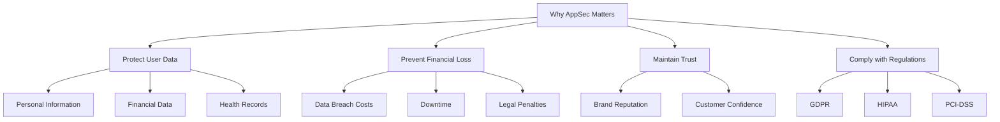

### Real-World Impact

| Breach Example | Cost | Impact |
|---------------|------|--------|
| Data Breach | $4.45M average | Customer data exposed |
| Ransomware Attack | $1.85M average | Operations halted |
| DDoS Attack | $120K-$2M | Service unavailable |

---

## The CIA Triad

The **CIA Triad** is the foundation of information security. Every security measure aims to protect one or more of these three principles.

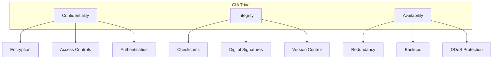

### 1. Confidentiality

**Definition:** Ensuring that information is accessible only to those authorized to access it.

**In Simple Terms:** Keeping secrets secret.

**Examples:**
- **Good:** Only the account owner can view their bank balance
- **Bad:** A bug allows anyone to view any user's private messages

**How to Achieve:**
- **Encryption:** Converting data into unreadable format
- **Access Controls:** Restricting who can access what
- **Authentication:** Verifying user identity
- **Authorization:** Determining what authenticated users can do

**Code Example - Bad vs Good:**

```csharp
// ❌ BAD: Exposing sensitive data
public class UserController : ControllerBase
{
    [HttpGet("user/{id}")]
    public IActionResult GetUser(int id)
    {
        var user = _db.Users.Find(id);
        return Ok(user); // Returns password hash, email, etc. to anyone
    }
}

// ✅ GOOD: Protecting confidentiality
public class UserController : ControllerBase
{
    [HttpGet("user/{id}")]
    [Authorize] // Must be authenticated
    public IActionResult GetUser(int id)
    {
        var currentUserId = GetCurrentUserId();
        
        // Only allow users to view their own data
        if (currentUserId != id && !User.IsInRole("Admin"))
        {
            return Forbid();
        }
        
        var user = _db.Users.Find(id);
        var userDto = new UserPublicDto
        {
            Id = user.Id,
            Username = user.Username,
            // Don't expose password, email unless authorized
        };
        
        return Ok(userDto);
    }
}
```

### 2. Integrity

**Definition:** Ensuring that information is accurate, complete, and has not been tampered with.

**In Simple Terms:** Making sure data hasn't been changed by unauthorized parties.

**Examples:**
- **Good:** A digital signature verifies a software download is authentic
- **Bad:** An attacker modifies your account balance in the database

**How to Achieve:**
- **Hashing:** Creating a unique fingerprint of data
- **Digital Signatures:** Cryptographically verifying authenticity
- **Checksums:** Verifying data hasn't been corrupted
- **Input Validation:** Ensuring only valid data enters the system

**Code Example:**

```csharp
// ✅ Ensuring Integrity with Hashing
public class FileIntegrityService
{
    // Generate hash of original file
    public string GenerateFileHash(byte[] fileData)
    {
        using (var sha256 = SHA256.Create())
        {
            byte[] hashBytes = sha256.ComputeHash(fileData);
            return Convert.ToBase64String(hashBytes);
        }
    }
    
    // Verify file hasn't been tampered with
    public bool VerifyFileIntegrity(byte[] fileData, string originalHash)
    {
        string currentHash = GenerateFileHash(fileData);
        return currentHash == originalHash;
    }
}

// Usage
var file = await DownloadFile("important-document.pdf");
var originalHash = "stored-hash-from-database";

if (!_integrityService.VerifyFileIntegrity(file, originalHash))
{
    throw new SecurityException("File has been tampered with!");
}
```

### 3. Availability

**Definition:** Ensuring that authorized users have reliable and timely access to information and resources.

**In Simple Terms:** Making sure the system is up and running when users need it.

**Examples:**
- **Good:** Website has 99.9% uptime with automatic failover
- **Bad:** DDoS attack takes down your service for hours

**How to Achieve:**
- **Redundancy:** Multiple servers, databases
- **Load Balancing:** Distributing traffic across servers
- **Backups:** Regular data backups
- **DDoS Protection:** Filtering malicious traffic
- **Monitoring:** Detecting and responding to issues quickly

**Architecture Example:**

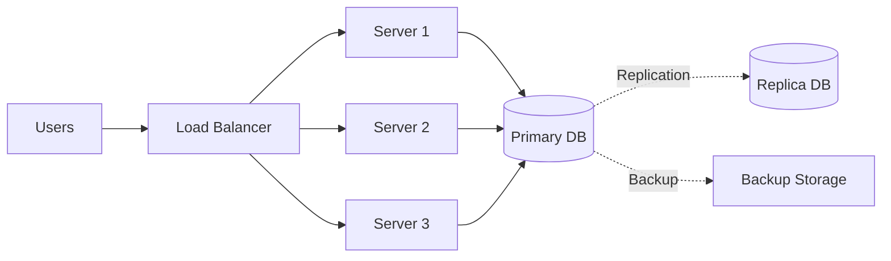

---

## Security Principles

These are fundamental rules that guide security design and implementation.

### 1. Principle of Least Privilege

**Definition:** Give users/processes only the minimum permissions they need to do their job.

**Why:** Limits damage if an account is compromised.

```csharp
// ❌ BAD: Giving too many permissions
public class OrderService
{
    private readonly string _connectionString = "Server=...;User=sa;..."; // SA has full control!
}

// ✅ GOOD: Limited permissions
public class OrderService
{
    // This user can only read/write to Orders table
    private readonly string _connectionString = "Server=...;User=OrderServiceUser;...";
}
```

### 2. Defense in Depth

**Definition:** Use multiple layers of security controls.

**Why:** If one layer fails, others still protect.

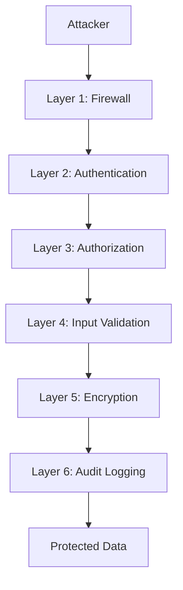

**Example Layers:**
1. **Network Layer:** Firewall, VPN
2. **Application Layer:** Authentication, authorization
3. **Data Layer:** Encryption at rest
4. **Physical Layer:** Secure data centers

### 3. Fail Securely

**Definition:** When something goes wrong, the system should default to a secure state.

```csharp
// ❌ BAD: Fails open (insecure)
public bool CheckPermission(User user, Resource resource)
{
    try
    {
        return _permissionService.HasAccess(user, resource);
    }
    catch
    {
        return true; // Dangerous! Grants access on error
    }
}

// ✅ GOOD: Fails closed (secure)
public bool CheckPermission(User user, Resource resource)
{
    try
    {
        return _permissionService.HasAccess(user, resource);
    }
    catch (Exception ex)
    {
        _logger.LogError(ex, "Permission check failed");
        return false; // Safe default: deny access
    }
}
```

### 4. Don't Trust User Input

**Definition:** Always validate and sanitize input from users.

**Why:** Users (or attackers) can send malicious data.

```csharp
// ❌ BAD: Trusting user input
public IActionResult CreateUser(string username)
{
    _db.Execute($"INSERT INTO Users (Username) VALUES ('{username}')");
    // SQL Injection vulnerability!
}

// ✅ GOOD: Validating and using parameters
public IActionResult CreateUser(string username)
{
    // Validate
    if (string.IsNullOrWhiteSpace(username) || username.Length > 50)
    {
        return BadRequest("Invalid username");
    }
    
    // Use parameterized queries
    _db.Execute("INSERT INTO Users (Username) VALUES (@username)", 
                new { username });
}
```

### 5. Security Through Obscurity is NOT Security

**Definition:** Hiding implementation details doesn't make it secure.

**Why:** Attackers will eventually figure it out.

```csharp
// ❌ BAD: Relying on obscurity
public class AuthService
{
    // Thinking attacker won't guess the "secret" header
    public bool Authenticate(HttpRequest request)
    {
        return request.Headers["X-Secret-Key"] == "MySecret123";
    }
}

// ✅ GOOD: Real security mechanisms
public class AuthService
{
    public bool Authenticate(HttpRequest request)
    {
        var token = request.Headers["Authorization"]?.ToString();
        return _jwtService.ValidateToken(token); // Proper crypto
    }
}
```

### 6. Keep It Simple

**Definition:** Complex security schemes are hard to implement correctly.

**Why:** Complexity leads to mistakes and vulnerabilities.

> [!TIP]
> Use established libraries and frameworks instead of rolling your own crypto or authentication.

---

## The Security Lifecycle

Security is not a one-time activity but a continuous process.

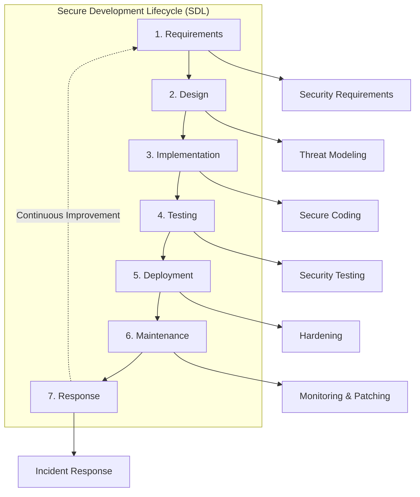

### Phase Breakdown

| Phase | Security Activities | Deliverables |
|-------|-------------------|--------------|
| **Requirements** | Identify security requirements, compliance needs | Security requirements document |
| **Design** | Threat modeling, architecture review | Threat model, security architecture |
| **Implementation** | Secure coding, code reviews | Secure code, review notes |
| **Testing** | Penetration testing, vulnerability scanning | Test reports, vulnerability list |
| **Deployment** | Configuration hardening, secure deployment | Deployment checklist |
| **Maintenance** | Monitoring, patching, updates | Patch logs, monitoring alerts |
| **Response** | Incident handling, post-mortems | Incident reports, improvements |

---

## Threat Modeling Basics

**Threat Modeling** is the process of identifying potential security threats and vulnerabilities.

### STRIDE Framework

STRIDE is a popular threat modeling methodology:

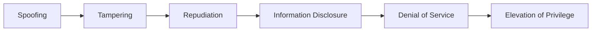

| Threat | What It Means | Example | Mitigation |
|--------|---------------|---------|------------|
| **Spoofing** | Pretending to be someone else | Fake login as admin | Strong authentication (MFA) |
| **Tampering** | Modifying data or code | Changing price in cart | Input validation, integrity checks |
| **Repudiation** | Denying an action | "I never made that purchase" | Audit logging, digital signatures |
| **Information Disclosure** | Exposing sensitive data | Database leak | Encryption, access controls |
| **Denial of Service** | Making service unavailable | DDoS attack | Rate limiting, scaling |
| **Elevation of Privilege** | Gaining unauthorized access | Regular user becomes admin | Least privilege, authorization |

### Simple Threat Modeling Process

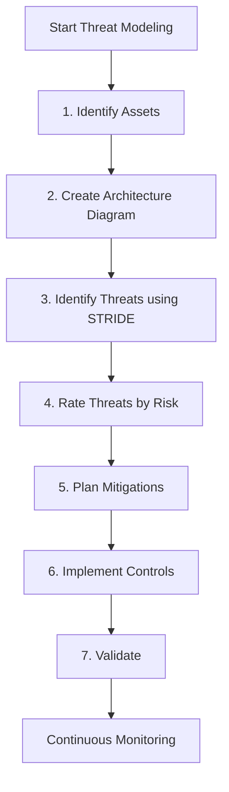

**Example - E-commerce Checkout:**

1. **Assets:** Payment data, user credentials, order information
2. **Threats:**
   - Spoofing: Attacker pretends to be legitimate user
   - Tampering: Modifying order total
   - Information Disclosure: Credit card data leaked
3. **Mitigations:**
   - Use HTTPS for all communications
   - Implement strong authentication
   - Validate all input server-side
   - Use PCI-compliant payment processor

---

## Common Security Terms Explained

### Authentication vs Authorization

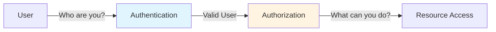

#### Authentication
**What:** Verifying WHO you are  
**Example:** Logging in with username/password  
**Mechanisms:** Passwords, biometrics, tokens, certificates

#### Authorization
**What:** Determining WHAT you can do  
**Example:** Admin can delete users, regular users cannot  
**Mechanisms:** Roles, permissions, ACLs (Access Control Lists)

```csharp
// Example showing both
[Authorize] // Authentication: Must be logged in
[Permission("users.delete")] // Authorization: Must have permission
public IActionResult DeleteUser(int id)
{
    // Implementation
}
```

### Encoding vs Encryption vs Hashing

These are often confused but serve different purposes:

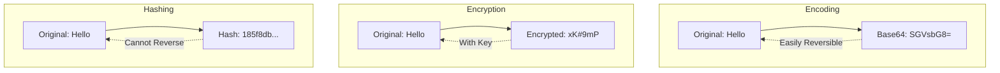

| Aspect | Encoding | Encryption | Hashing |
|--------|----------|-----------|---------|
| **Purpose** | Data format conversion | Confidentiality | Data integrity, passwords |
| **Reversible?** | Yes, easily | Yes, with key | No |
| **Key Required?** | No | Yes | No |
| **Example** | Base64, URL encoding | AES, RSA | SHA-256, bcrypt |
| **Use Case** | Transmit binary data | Protect sensitive data | Store passwords |

**Code Examples:**

```csharp
// ENCODING - Reversible without key
string original = "Hello World";
string encoded = Convert.ToBase64String(Encoding.UTF8.GetBytes(original));
// Result: SGVsbG8gV29ybGQ=
string decoded = Encoding.UTF8.GetString(Convert.FromBase64String(encoded));
// Result: Hello World

// ENCRYPTION - Reversible with key
public class EncryptionService
{
    private readonly byte[] _key;
    
    public string Encrypt(string plaintext)
    {
        using (var aes = Aes.Create())
        {
            aes.Key = _key;
            // ... encryption logic
            return Convert.ToBase64String(encrypted);
        }
    }
    
    public string Decrypt(string ciphertext)
    {
        using (var aes = Aes.Create())
        {
            aes.Key = _key; // Same key needed!
            // ... decryption logic
            return plaintext;
        }
    }
}

// HASHING - NOT reversible
public class PasswordService
{
    public string HashPassword(string password)
    {
        // Generate salt and hash
        string hashed = BCrypt.Net.BCrypt.HashPassword(password);
        // Result: $2a$11$N9qo8uLO... (cannot get back to original)
        return hashed;
    }
    
    public bool VerifyPassword(string password, string hash)
    {
        // Can only verify, not decrypt
        return BCrypt.Net.BCrypt.Verify(password, hash);
    }
}
```

### Tokens Explained

**What:** A piece of data that represents something else (like authentication status)

**Types:**

#### 1. Session Tokens
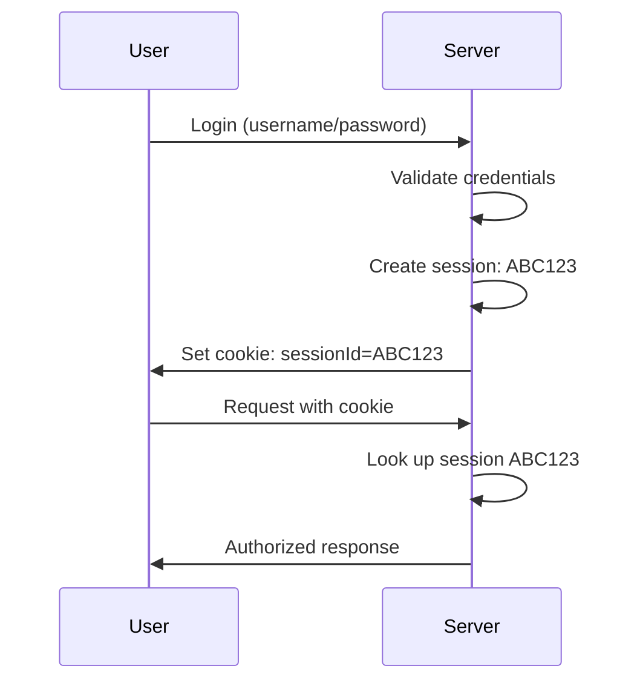

#### 2. JWT (JSON Web Tokens)
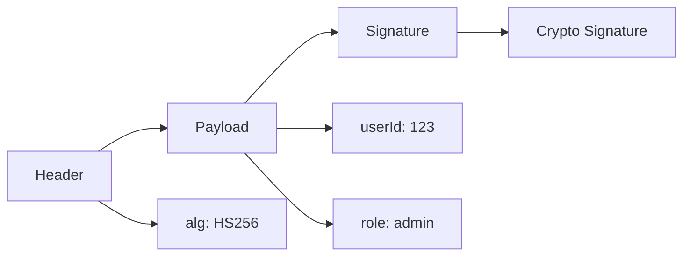

**JWT Structure:**
```
eyJhbGciOiJIUzI1NiIsInR5cCI6IkpXVCJ9.eyJ1c2VySWQiOiIxMjMiLCJyb2xlIjoiYWRtaW4ifQ.signature
|__________ Header __________|.|________ Payload __________|.|_Signature_|
```

```csharp
// Creating a JWT
public string GenerateJwt(User user)
{
    var tokenHandler = new JwtSecurityTokenHandler();
    var key = Encoding.ASCII.GetBytes(_secretKey);
    
    var tokenDescriptor = new SecurityTokenDescriptor
    {
        Subject = new ClaimsIdentity(new[]
        {
            new Claim("userId", user.Id.ToString()),
            new Claim("role", user.Role)
        }),
        Expires = DateTime.UtcNow.AddHours(1),
        SigningCredentials = new SigningCredentials(
            new SymmetricSecurityKey(key),
            SecurityAlgorithms.HmacSha256Signature)
    };
    
    var token = tokenHandler.CreateToken(tokenDescriptor);
    return tokenHandler.WriteToken(token);
}
```

### SSL/TLS Explained

**What:** Protocols for secure communication over networks

**Simple Analogy:** It's like having a conversation in a language only you and your friend understand, while others hear gibberish.

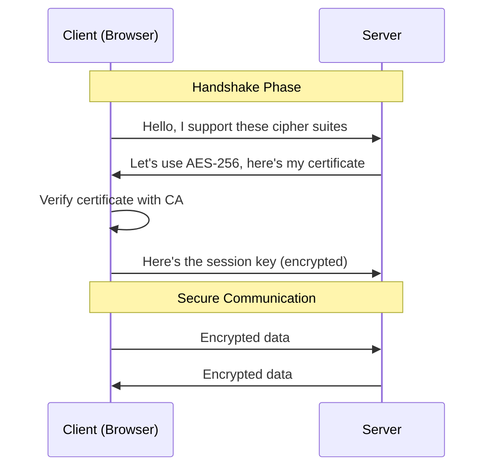

**What SSL/TLS Provides:**
1. **Encryption:** Data is unreadable to eavesdroppers
2. **Authentication:** Verify you're talking to the real server
3. **Integrity:** Detect if data was tampered with

**Visual Indicator:**
- 🔒 HTTPS in browser = SSL/TLS active
- ❌ HTTP = No encryption (dangerous for sensitive data)

---

## Key Takeaways

> [!IMPORTANT]
> **Remember These Core Concepts:**
> 
> 1. **CIA Triad** - Every security control protects Confidentiality, Integrity, or Availability
> 2. **Least Privilege** - Give minimum permissions needed
> 3. **Defense in Depth** - Use multiple security layers
> 4. **Never Trust Input** - Always validate user data
> 5. **Security is Continuous** - Not a one-time thing

### Quick Reference

| Term | Simple Explanation |
|------|-------------------|
| **Authentication** | Proving who you are |
| **Authorization** | What you're allowed to do |
| **Encryption** | Scrambling data so only authorized parties can read it |
| **Hashing** | One-way transformation (for passwords) |
| **Token** | Proof of authentication |
| **SSL/TLS** | Secure communication protocol |
| **Vulnerability** | A weakness that can be exploited |
| **Exploit** | Taking advantage of a vulnerability |
| **Threat** | Potential for harm |
| **Risk** | Likelihood × Impact of a threat |

---

## Next Steps

Now that you understand the fundamentals, you're ready to dive into specific vulnerabilities:

📚 **Continue to [Part 2: OWASP Top 10 Vulnerabilities (Part 1)](Part2-OWASP-Top10-Part1.md)**

This next section covers:
- Injection attacks (SQL, XSS, Command Injection)
- Broken authentication
- Sensitive data exposure
- XML external entities (XXE)
- Broken access control

---

*Guide created: December 2025*  
*Part 1 of 7 - Application Security Fundamentals*
