# Application Security Fundamentals Guide - Part 3
## OWASP Top 10 Vulnerabilities (Part 2)

> [!NOTE]
> This is Part 3 of a comprehensive 7-part guide on application security. This section covers the remaining OWASP Top 10 vulnerabilities.

---

## Table of Contents
1. [A06: Vulnerable and Outdated Components](#a06-vulnerable-and-outdated-components)
2. [A07: Identification and Authentication Failures](#a07-identification-and-authentication-failures)
3. [A08: Software and Data Integrity Failures](#a08-software-and-data-integrity-failures)
4. [A09: Security Logging and Monitoring Failures](#a09-security-logging-and-monitoring-failures)
5. [A10: Server-Side Request Forgery (SSRF)](#a10-server-side-request-forgery-ssrf)

---

## A06: Vulnerable and Outdated Components

### What Is It?

**Simple Explanation:** Using libraries, frameworks, or components with known security vulnerabilities.

**Technical:** Running software with known vulnerabilities that attackers can exploit.

### Why It's Dangerous


### Real-World Examples

**Log4Shell (CVE-2021-44228):**
- Vulnerability in Log4j library
- Allowed remote code execution
- Affected millions of applications worldwide

**Equifax Breach (2017):**
- Unpatched Apache Struts vulnerability
- 147 million people's data exposed
- Cost: $575+ million

### Common Scenarios

#### 1. Using Outdated NuGet/NPM Packages

```xml
<!-- ❌ Using old, vulnerable versions -->
<PackageReference Include="Newtonsoft.Json" Version="9.0.1" />
<!-- This version has known vulnerabilities! -->
```

```json
// ❌ package.json with vulnerable dependencies
{
  "dependencies": {
    "express": "3.0.0",  // Very old, many vulnerabilities
    "lodash": "4.17.15"  // Has prototype pollution vulnerability
  }
}
```

**Fix:**

```bash
# Check for vulnerabilities
dotnet list package --vulnerable
npm audit

# Update packages
dotnet add package Newtonsoft.Json --version 13.0.3
npm update
npm audit fix
```

```xml
<!-- ✅ Use latest stable versions -->
<PackageReference Include="Newtonsoft.Json" Version="13.0.3" />
```

#### 2. Abandoned Libraries

```csharp
// ❌ Using unmaintained library
using OldLibrary; // Last updated: 2015, no security patches

// What if a vulnerability is found? No one will fix it!
```

**Fix:**

```csharp
// ✅ Use actively maintained alternatives
using ModernLibrary; // Regular updates, active community

// Or: Vendor the code and maintain it yourself
// Or: Replace with different solution
```

### Prevention Strategy


**Tools:**

| Language/Platform | Tools |
|------------------|-------|
| **.NET** | `dotnet list package --vulnerable`, Dependabot, Snyk |
| **Node.js** | `npm audit`, `yarn audit`, Snyk, WhiteSource|
| **Python** | Safety, pip-audit, Bandit |
| **Java** | OWASP Dependency-Check, Snyk |
| **Docker** | Trivy, Clair, Snyk Container |

**Implementation:**

```yaml
# Example: GitHub Actions workflow for dependency scanning
name: Security Scan

on: [push, pull_request]

jobs:
  security:
    runs-on: ubuntu-latest
    steps:
      - uses: actions/checkout@v3
      
      # .NET vulnerability scan
      - name: Check for vulnerable packages
        run: dotnet list package --vulnerable --include-transitive
      
      # npm audit
      - name: npm audit
        run: npm audit --audit-level=moderate
      
      # Snyk scan
      - name: Run Snyk
        uses: snyk/actions/dotnet@master
        env:
          SNYK_TOKEN: ${{ secrets.SNYK_TOKEN }}
```

### Prevention Checklist

- [ ] Maintain inventory of all components and versions
- [ ] Only use components from trusted sources
- [ ] Monitor for security advisories (CVEs)
- [ ] Remove unused dependencies
- [ ] Use automated vulnerability scanning
- [ ] Keep dependencies updated
- [ ] Have a patch management process
- [ ] Subscribe to security mailing lists

---

## A07: Identification and Authentication Failures

### What Is It?

**Simple Explanation:** Flaws in how the application verifies user identity and maintains sessions.

**Technical:** Weaknesses in authentication mechanisms allowing attackers to compromise passwords, keys, sessions, or exploit implementation flaws.

### Common Authentication Failures

#### 1. Weak Password Policies

```csharp
// ❌ BAD: Accepting weak passwords
public IActionResult Register(string password)
{
    // No password requirements!
    if (password.Length >= 3)
    {
        // Accepted: "abc", "123", "aaa"
        CreateUser(password);
    }
}
```

**Fix:**

```csharp
// ✅ GOOD: Strong password policy
public class PasswordValidator
{
    public ValidationResult Validate(string password)
    {
        var errors = new List<string>();
        
        if (password.Length < 12)
            errors.Add("Password must be at least 12 characters");
        
        if (!Regex.IsMatch(password, @"[A-Z]"))
            errors.Add("Password must contain uppercase letter");
        
        if (!Regex.IsMatch(password, @"[a-z]"))
            errors.Add("Password must contain lowercase letter");
        
        if (!Regex.IsMatch(password, @"[0-9]"))
            errors.Add("Password must contain number");
        
        if (!Regex.IsMatch(password, @"[!@#$%^&*(),.?\"":{}|<>]"))
            errors.Add("Password must contain special character");
        
        // Check against common passwords
        if (_commonPasswords.Contains(password.ToLower()))
            errors.Add("Password is too common");
        
        return new ValidationResult 
        { 
            IsValid = errors.Count == 0, 
            Errors = errors 
        };
    }
}

// Using ASP.NET Core Identity
services.Configure<IdentityOptions>(options =>
{
    options.Password.RequireDigit = true;
    options.Password.RequireLowercase = true;
    options.Password.RequireUppercase = true;
    options.Password.RequireNonAlphanumeric = true;
    options.Password.RequiredLength = 12;
});
```

#### 2. Credential Stuffing (No Rate Limiting)

**Attack:** Using leaked credentials from other breaches


**Fix:**

```csharp
// ✅ Rate limiting with AspNetCoreRateLimit
public void ConfigureServices(IServiceCollection services)
{
    services.AddMemoryCache();
    services.Configure<IpRateLimitOptions>(options =>
    {
        options.GeneralRules = new List<RateLimitRule>
        {
            new RateLimitRule
            {
                Endpoint = "POST:/api/auth/login",
                Limit = 5,
                Period = "15m" // 5 attempts per 15 minutes
            }
        };
    });
    services.AddInMemoryRateLimiting();
}

// ✅ Or custom implementation
public class LoginRateLimiter
{
    private readonly IMemoryCache _cache;
    
    public bool IsAllowed(string identifier)
    {
        var key = $"login_attempts_{identifier}";
        var attempts = _cache.GetOrCreate(key, entry =>
        {
            entry.AbsoluteExpirationRelativeToNow = TimeSpan.FromMinutes(15);
            return 0;
        });
        
        if (attempts >= 5)
        {
            return false; // Too many attempts
        }
        
        _cache.Set(key, attempts + 1);
        return true;
    }
}
```

#### 3. Predictable Session IDs

```csharp
// ❌ TERRIBLE: Predictable session IDs
public string CreateSession(User user)
{
    var sessionId = user.Id.ToString(); // Session ID = user ID!
    // Attacker can guess: try IDs 1, 2, 3, 4...
    return sessionId;
}
```

**Fix:**

```csharp
// ✅ GOOD: Cryptographically random session IDs
public string CreateSession(User user)
{
    var sessionId = Convert.ToBase64String(RandomNumberGenerator.GetBytes(32));
    // Result: "K7gNU3sdo+OL0wNhqoVWhr3g6s1xYv72ol/pe/Unols="
    
    _sessionStore.Create(sessionId, new SessionData
    {
        UserId = user.Id,
        CreatedAt = DateTime.UtcNow,
        ExpiresAt = DateTime.UtcNow.AddHours(1)
    });
    
    return sessionId;
}
```

#### 4. Insecure "Remember Me"

```csharp
// ❌ BAD: Permanent session with no security
public IActionResult Login(string username, string password, bool rememberMe)
{
    if (ValidateCredentials(username, password))
    {
        var token = username; // Just the username!
        
        if (rememberMe)
        {
            Response.Cookies.Append("auth", token, new CookieOptions
            {
                Expires = DateTimeOffset.MaxValue, // Never expires!
                HttpOnly = false, // Accessible from JavaScript!
                Secure = false // Works over HTTP!
            });
        }
    }
}
```

**Fix:**

```csharp
// ✅ GOOD: Secure remember me token
public IActionResult Login(string username, string password, bool rememberMe)
{
    if (ValidateCredentials(username, password))
    {
        var user = GetUser(username);
        
        if (rememberMe)
        {
            // Generate secure random token
            var token = GenerateSecureToken();
            
            // Store hashed token in database
            _db.RememberTokens.Add(new RememberToken
            {
                UserId = user.Id,
                TokenHash = BCrypt.HashPassword(token),
                ExpiresAt = DateTime.UtcNow.AddDays(30)
            });
            _db.SaveChanges();
            
            // Set secure cookie
            Response.Cookies.Append("remember_token", token, new CookieOptions
            {
                Expires = DateTimeOffset.UtcNow.AddDays(30),
                HttpOnly = true, // Not accessible from JavaScript
                Secure = true, // HTTPS only
                SameSite = SameSiteMode.Strict
            });
        }
    }
}
```

#### 5. No Multi-Factor Authentication (MFA)

**Problem:** Password alone is not enough

```mermaid
graph TB
    subgraph "Without MFA"
        P1[Password Stolen] --> A1[✅ Attacker Logs In<br/>Complete Access]
    end
    
    subgraph "With MFA"
        P2[Password Stolen] --> M[MFA Required]
        M --> T[Need: Phone/App/Key]
        T --> A2[❌ Attacker Blocked]
    end
    
    style A1 fill:#ff6b6b
    style A2 fill:#51cf66
```



**Implementation:**

```csharp
// ✅ Implementing TOTP (Time-based One-Time Password)
public class MfaService
{
    // Generate secret for user
    public string GenerateMfaSecret()
    {
        return Convert.ToBase64String(RandomNumberGenerator.GetBytes(20));
    }
    
    // Generate QR code for authenticator app
    public string GetQrCodeUrl(string userEmail, string secret)
    {
        var encodedSecret = Base32Encode(Convert.FromBase64String(secret));
        return $"otpauth://totp/MyApp:{userEmail}?secret={encodedSecret}&issuer=MyApp";
    }
    
    // Verify TOTP code
    public bool VerifyCode(string secret, string userCode)
    {
        var totp = new Totp(Convert.FromBase64String(secret));
        return totp.VerifyTotp(userCode, out long timeStepMatched, 
            new VerificationWindow(2, 2)); // Allow 2 steps in each direction
    }
}

// Login flow with MFA
[HttpPost("login")]
public async Task<IActionResult> Login(LoginRequest request)
{
    var user = await ValidateCredentials(request.Username, request.Password);
    if (user == null)
        return Unauthorized();
    
    // If user has MFA enabled
    if (user.MfaEnabled)
    {
        // Create temporary token
        var tempToken = GenerateTemporaryToken(user.Id);
        return Ok(new { requiresMfa = true, tempToken });
    }
    
    return Ok(new { token = GenerateAuthToken(user) });
}

[HttpPost("verify-mfa")]
public async Task<IActionResult> VerifyMfa(string tempToken, string code)
{
    var userId = ValidateTemporaryToken(tempToken);
    var user = await GetUser(userId);
    
    if (!_mfaService.VerifyCode(user.MfaSecret, code))
    {
        return Unauthorized("Invalid MFA code");
    }
    
    return Ok(new { token = GenerateAuthToken(user) });
}
```

### Prevention Checklist

- [ ] Implement strong password policies
- [ ] Use multi-factor authentication
- [ ] Implement rate limiting on login attempts
- [ ] Use secure session management
- [ ] Implement account lockout mechanisms
- [ ] Never log credentials
- [ ] Use HTTPS for authentication
- [ ] Implement secure password recovery
- [ ] Hash passwords with bcrypt/scrypt/Argon2
- [ ] Check passwords against breach databases

---

## A08: Software and Data Integrity Failures

### What Is It?

**Simple Explanation:** Code and infrastructure that doesn't verify integrity, allowing malicious code or data.

**Technical:** Failures related to code and infrastructure that does not protect against integrity violations.

### Examples

#### 1. Insecure CI/CD Pipeline

```yaml
# ❌ INSECURE: No security checks
name: Deploy
on: [push]
jobs:
  deploy:
    steps:
      - uses: actions/checkout@v3
      - run: npm install # No verification of packages!
      - run: npm run build
      - run: deploy-to-production # Deploy without any checks!
```

**Problems:**
- No dependency verification
- No security scanning
- No code review requirement
- Anyone can merge to main

**Fix:**

```yaml
# ✅ SECURE: Security gates
name: Deploy
on: 
  pull_request:
    branches: [main]

jobs:
  security-checks:
    steps:
      - uses: actions/checkout@v3
      
      # Verify package integrity
      - name: Verify package-lock.json
        run: npm ci # Uses exact versions from lock file
      
      # Security scanning
      - name: Run npm audit
        run: npm audit --audit-level=high
      
      # SAST (Static Application Security Testing)
      - name: Run CodeQL
        uses: github/codeql-action/analyze@v2
      
      # Secret scanning
      - name: TruffleHog Secret Scan
        uses: trufflesecurity/trufflehog@main
      
      # Only deploy if all checks pass
      - name: Deploy
        if: success()
        run: deploy-to-production
        
  code-review:
    steps:
      # Require code review approval
      - name: Check Reviews
        run: |
          if [ "$(gh pr review --json state -q '.[] | select(.state=="APPROVED") | .state')" != "APPROVED" ]; then
            echo "PR must be approved before deployment"
            exit 1
          fi
```

#### 2. Accepting Unsigned Updates

```csharp
// ❌ VULNERABLE: No signature verification
public async Task<bool> InstallUpdate(string updateUrl)
{
    var updateFile = await DownloadFile(updateUrl);
    // Just execute whatever was downloaded!
    ExecuteInstaller(updateFile);
}
```

**Fix:**

```csharp
// ✅ SECURE: Verify digital signature
public async Task<bool> InstallUpdate(string updateUrl, string signatureUrl)
{
    var updateFile = await DownloadFile(updateUrl);
    var signature = await DownloadFile(signatureUrl);
    
    // Verify signature with publisher's public key
    if (!VerifySignature(updateFile, signature, _publisherPublicKey))
    {
        throw new SecurityException("Update signature verification failed!");
    }
    
    // Verify hash matches expected
    var actualHash = ComputeHash(updateFile);
    var expectedHash = await GetExpectedHash(updateUrl);
    if (actualHash != expectedHash)
    {
        throw new SecurityException("Update hash mismatch!");
    }
    
    ExecuteInstaller(updateFile);
}

private bool VerifySignature(byte[] data, byte[] signature, RSA publicKey)
{
    using (var sha256 = SHA256.Create())
    {
        var hash = sha256.ComputeHash(data);
        return publicKey.VerifyHash(hash, signature, 
            HashAlgorithmName.SHA256, RSASignaturePadding.Pkcs1);
    }
}
```

#### 3. Deserialization of Untrusted Data

```csharp
// ❌ EXTREMELY DANGEROUS
[HttpPost("api/process")]
public IActionResult ProcessData(string serializedData)
{
    // Deserializing untrusted data!
    var formatter = new BinaryFormatter();
    var data = formatter.Deserialize(new MemoryStream(
        Convert.FromBase64String(serializedData)));
    
    // Attacker can execute arbitrary code!
}
```

**Fix:**

```csharp
// ✅ SECURE: Use safe serialization
[HttpPost("api/process")]
public IActionResult ProcessData([FromBody] MyDataDto data)
{
    // ASP.NET Core uses JSON serialization by default - much safer
    // Only deserializes to expected type
    
    // Validate the data
    if (!ModelState.IsValid)
        return BadRequest(ModelState);
    
    ProcessSafeData(data);
}

// If you MUST deserialize untrusted data:
public class SafeDeserializer
{
    private static readonly JsonSerializerSettings Settings = new JsonSerializerSettings
    {
        TypeNameHandling = TypeNameHandling.None, // Critical!
        MaxDepth = 32, // Prevent stack overflow
    };
    
    public T Deserialize<T>(string json) where T : class
    {
        return JsonConvert.DeserializeObject<T>(json, Settings);
    }
}
```

**Real-World Impact:**


### Prevention Checklist

- [ ] Use digital signatures for software updates
- [ ] Implement integrity checks (checksums/hashes)
- [ ] Use secure CI/CD pipelines with approval gates
- [ ] Avoid deserialization of untrusted data
- [ ] Use Software Bill of Materials (SBOM)
- [ ] Implement code signing
- [ ] Verify third-party library integrity
- [ ] Use dependency lock files

---

## A09: Security Logging and Monitoring Failures

### What Is It?

**Simple Explanation:** Not logging security events or not monitoring logs, so attacks go undetected.

**Technical:** Insufficient logging, monitoring, and alerting allow attackers to persist undetected.

### The Problem

```mermaid
graph LR
    A[Attacker Activity] --> B{Logged?}
    B -->|No| C[❌ Nothing Recorded]
    B -->|Yes| D{Monitored?}
    D -->|No| E[❌ Nobody Notices]
    D -->|Yes| F{Alerted?}
    F -->|No| G[❌ Too Late]
    F -->|Yes| H[✅ Incident Response]
    
    style C fill:#ff6b6b
    style E fill:#ff6b6b
    style G fill:#ff6b6b
    style H fill:#51cf66
```



### What to Log

```csharp
// ❌ BAD: No logging
[HttpPost("login")]
public IActionResult Login(string username, string password)
{
    if (ValidateCredentials(username, password))
    {
        return Ok(GenerateToken());
    }
    return Unauthorized();
}

// ✅ GOOD: Comprehensive logging
[HttpPost("login")]
public IActionResult Login(string username, string password)
{
    var ip = HttpContext.Connection.RemoteIpAddress;
    var userAgent = Request.Headers["User-Agent"].ToString();
    
    try
    {
        if (ValidateCredentials(username, password))
        {
            _logger.LogInformation(
                "Successful login: User={Username}, IP={IP}, UserAgent={UserAgent}",
                username, ip, userAgent);
            
            return Ok(GenerateToken());
        }
        
        _logger.LogWarning(
            "Failed login attempt: User={Username}, IP={IP}, UserAgent={UserAgent}",
            username, ip, userAgent);
        
        // Alert on repeated failures
        var failureCount = _loginAttemptService.RecordFailure(username, ip);
        if (failureCount >= 5)
        {
            _logger.LogError(
                "Multiple failed login attempts detected: User={Username}, IP={IP}, Count={Count}",
                username, ip, failureCount);
            
            _alertService.SendSecurityAlert(
                $"Possible brute force attack on account: {username}");
        }
        
        return Unauthorized();
    }
    catch (Exception ex)
    {
        _logger.LogError(ex,
            "Login error: User={Username}, IP={IP}",
            username, ip);
        throw;
    }
}
```

### Security Events to Log

| Event Type | What to Log | Example |
|------------|-------------|---------|
| **Authentication** | Logins (success/fail), logouts, password changes | User 'admin' logged in from 192.168.1.1 |
| **Authorization** | Access denials, privilege escalations | User 'john' denied access to /admin |
| **Input Validation** | SQL injection attempts, XSS attempts | Invalid input detected: `<script>...</script>` |
| **Data Access** | Sensitive data viewed/modified | User 'alice' viewed SSN for user 'bob' |
| **Configuration** | Settings changes, user role changes | User 'admin' promoted 'john' to Admin role |
| **High-Risk Actions** | Data deletion, exports, backups | User 'admin' deleted 1,000 user records |

### Structured Logging

```csharp
// ✅ Use structured logging (not string concatenation)
public class AuditLogger
{
    private readonly ILogger _logger;
    
    public void LogDataAccess(int userId, string resourceType, int resourceId, string action)
    {
        _logger.LogInformation(
            "Data access: User={UserId}, Resource={ResourceType}, ResourceId={ResourceId}, Action={Action}",
            userId, resourceType, resourceId, action);
        
        // This allows querying: "Find all DELETE actions by userId=123"
    }
}

// Configuration in appsettings.json
{
  "Serilog": {
    "WriteTo": [
      {
        "Name": "Console"
      },
      {
        "Name": "File",
        "Args": {
          "path": "logs/security-.log",
          "rollingInterval": "Day",
          "restrictedToMinimumLevel": "Warning"
        }
      },
      {
        "Name": "Seq",
        "Args": {
          "serverUrl": "http://seq-server:5341"
        }
      }
    ]
  }
}
```

### What NOT to Log

> [!CAUTION]
> **Never log sensitive data:**

```csharp
// ❌ TERRIBLE - Logging sensitive data
_logger.LogInformation(
    "User login: username={Username}, password={Password}, ssn={SSN}",
    username, password, user.SSN);
// Passwords and PII in logs!

// ❌ BAD - Logging full request body
_logger.LogInformation("Request: {Request}", JsonConvert.SerializeObject(request));
// Might contain credit cards, passwords, etc.

// ✅ GOOD - Log only necessary info
_logger.LogInformation(
    "User login: username={Username}, outcome={Outcome}",
    username, success ? "success" : "failure");
```

### Monitoring and Alerting

```csharp
// ✅ Implement alerting for security events
public class SecurityMonitor
{
    public async Task MonitorSecurityEvents()
    {
        // Check for patterns indicating attacks
        
        // 1. Brute force detection
        var recentFailures = await _logService.GetRecentLoginFailures(TimeSpan.FromMinutes(5));
        var groupedByIp = recentFailures.GroupBy(f => f.IpAddress);
        
        foreach (var group in groupedByIp)
        {
            if (group.Count() >= 10)
            {
                await _alertService.RaiseAlert(new SecurityAlert
                {
                    Type = "BruteForce",
                    Severity = "High",
                    Message = $"Possible brute force from IP: {group.Key}",
                    IpAddress = group.Key
                });
                
                // Automatically block IP
                await _firewallService.BlockIp(group.Key, TimeSpan.FromHours(1));
            }
        }
        
        // 2. Data exfiltration detection
        var largeExports = await _logService.GetLargeDataExports(TimeSpan.FromHours(1));
        foreach (var export in largeExports.Where(e => e.RecordCount > 10000))
        {
            await _alertService.RaiseAlert(new SecurityAlert
            {
                Type = "DataExfiltration",
                Severity = "Critical",
                Message = $"Large data export: {export.RecordCount} records by user {export.UserId}"
            });
        }
        
        // 3. After-hours access
        var afterHoursAccess = await _logService.GetAccessLogsOutsideBusinessHours();
        // Alert on sensitive resource access
    }
}
```

### Prevention Checklist

- [ ] Log all authentication events
- [ ] Log authorization failures
- [ ] Log input validation failures
- [ ] Log high-value transactions
- [ ] Use structured logging
- [ ] Protect log integrity (append-only, separate server)
- [ ] Implement real-time monitoring
- [ ] Set up security alerts
- [ ] Regular log review
- [ ] Retain logs appropriately (compliance requirements)

---

## A10: Server-Side Request Forgery (SSRF)

### What Is It?

**Simple Explanation:** Tricking the server into making requests to unintended locations.

**Technical:** Web application fetches a remote resource without validating the user-supplied URL.

### How It Works


### Vulnerable Code

```csharp
// ❌ EXTREMELY VULNERABLE
[HttpGet("fetch-image")]
public async Task<IActionResult> FetchImage(string url)
{
    // User provides ANY URL!
    using var client = new HttpClient();
    var response = await client.GetAsync(url);
    var content = await response.Content.ReadAsByteArrayAsync();
    
    return File(content, "image/jpeg");
}
```

**Attacks:**

```bash
# 1. Access internal services
GET /fetch-image?url=http://localhost:6379/
# Access internal Redis server

# 2. Access cloud metadata (AWS, Azure, GCP)
GET /fetch-image?url=http://169.254.169.254/latest/meta-data/iam/security-credentials/
# Get AWS credentials!

# 3. Port scanning
GET /fetch-image?url=http://internal-server:22
GET /fetch-image?url=http://internal-server:80
# Determine which ports are open

# 4. Read local files (if file:// allowed)
GET /fetch-image?url=file:///etc/passwd
# Read server files
```

### Real-World Impact

**Capital One Breach (2019):**
- SSRF vulnerability exploited
- Accessed AWS metadata service
- Obtained IAM credentials
- 100 million customer records exposed

### Fix: Whitelist Approach

```csharp
// ✅ SECURE: Whitelist allowed domains
public class SecureUrlFetcher
{
    private static readonly HashSet<string> AllowedDomains = new HashSet<string>
    {
        "images.example.com",
        "cdn.example.com"
    };
    
    private static readonly HashSet<string> BlockedIpRanges = new HashSet<string>
    {
        "127.0.0.0/8",      // Localhost
        "169.254.0.0/16",   // Link-local (AWS metadata)
        "10.0.0.0/8",       // Private network
        "172.16.0.0/12",    // Private network
        "192.168.0.0/16"    // Private network
    };
    
    public async Task<byte[]> FetchImage(string url)
    {
        // 1. Validate URL format
        if (!Uri.TryCreate(url, UriKind.Absolute, out var uri))
        {
            throw new ArgumentException("Invalid URL");
        }
        
        // 2. Only allow HTTP/HTTPS
        if (uri.Scheme != Uri.UriSchemeHttp && uri.Scheme != Uri.UriSchemeHttps)
        {
            throw new SecurityException("Only HTTP/HTTPS allowed");
        }
        
        // 3. Check domain whitelist
        if (!AllowedDomains.Contains(uri.Host))
        {
            throw new SecurityException("Domain not in whitelist");
        }
        
        // 4. Resolve IP and check against blocked ranges
        var ipAddresses = await Dns.GetHostAddressesAsync(uri.Host);
        foreach (var ip in ipAddresses)
        {
            if (IsIpBlocked(ip))
            {
                throw new SecurityException("IP address blocked");
            }
        }
        
        // 5. Make request with timeout
        using var client = new HttpClient
        {
            Timeout = TimeSpan.FromSeconds(5)
        };
        
        var response = await client.GetAsync(uri);
        return await response.Content.ReadAsByteArrayAsync();
    }
    
    private bool IsIpBlocked(IPAddress ip)
    {
        // Check if IP is in any blocked range
        return IsPrivateIp(ip) || IsLinkLocal(ip);
    }
    
    private bool IsPrivateIp(IPAddress ip)
    {
        var bytes = ip.GetAddressBytes();
        return bytes[0] == 10 ||
               (bytes[0] == 172 && bytes[1] >= 16 && bytes[1] <= 31) ||
               (bytes[0] == 192 && bytes[1] == 168) ||
               (bytes[0] == 127); // Localhost
    }
    
    private bool IsLinkLocal(IPAddress ip)
    {
        var bytes = ip.GetAddressBytes();
        return bytes[0] == 169 && bytes[1] == 254;
    }
}
```

### Defense in Depth for SSRF

```csharp
// ✅ Additional protections
public class SsrfProtectedFetcher
{
    public async Task<byte[]> FetchUrl(string url)
    {
        // 1. Validation (from previous example)
        ValidateUrl(url);
        
        // 2. Use restricted HTTP client
        var handler = new HttpClientHandler
        {
            // Don't follow redirects (redirect could go to internal)
            AllowAutoRedirect = false,
            
            // Don't use proxy
            UseProxy = false
        };
        
        using var client = new HttpClient(handler)
        {
            Timeout = TimeSpan.FromSeconds(5)
        };
        
        // 3. Limit response size
        var response = await client.GetAsync(url, HttpCompletionOption.ResponseHeadersRead);
        
        if (response.Content.Headers.ContentLength > 10_000_000) // 10MB max
        {
            throw new InvalidOperationException("Response too large");
        }
        
        return await response.Content.ReadAsByteArrayAsync();
    }
}

// ✅ Network-level protection
// Use firewall rules to prevent web server from accessing internal services
// Example: Web server should not be able to connect to database directly
```

### Prevention Checklist

- [ ] Whitelist allowed URL schemes (http/https only)
- [ ] Whitelist allowed domains/hosts
- [ ] Blacklist private IP ranges (RFC1918)
- [ ] Block cloud metadata endpoints (169.254.169.254)
- [ ] Disable HTTP redirects or validate redirect targets
- [ ] Implement network segmentation
- [ ] Use DNS resolution checks before requests
- [ ] Set request timeouts
- [ ] Limit response sizes
- [ ] Log all outbound requests

---

## OWASP Top 10 Summary


### Quick Reference

| Vulnerability | Key Prevention |
|--------------|----------------|
| **Broken Access Control** | Always verify user authorization |
| **Cryptographic Failures** | Use HTTPS, hash passwords with bcrypt |
| **Injection** | Use parameterized queries, encode output |
| **Insecure Design** | Threat modeling, security requirements |
| **Misconfiguration** | Harden settings, disable unnecessary features |
| **Vulnerable Components** | Keep dependencies updated, scan for CVEs |
| **Authentication Failures** | MFA, rate limiting, strong passwords |
| **Integrity Failures** | Verify signatures, secure CI/CD |
| **Logging Failures** | Log security events, monitor, alert |
| **SSRF** | Whitelist URLs, validate and block private IPs |

---

## Next Steps

📚 **Continue to [Part 4: Authentication & Authorization Deep Dive](Part4-Authentication-Authorization.md)**

This next section covers:
- Authentication mechanisms (JWT, OAuth, SAML)
- Session management best practices
- Authorization models (RBAC, ABAC)
- Single Sign-On (SSO)
- Password management

---

*Part 3 of 7 - OWASP Top 10 Vulnerabilities (Part 2)*
