# Application Security Fundamentals Guide - Part 4
## Authentication & Authorization Deep Dive

> [!NOTE]
> This is Part 4 of a comprehensive 7-part guide on application security. This section provides detailed coverage of authentication and authorization mechanisms.

---

## Table of Contents
1. [Authentication Mechanisms](#authentication-mechanisms)
2. [Session Management](#session-management)
3. [Token-Based Authentication](#token-based-authentication)
4. [OAuth 2.0 & OpenID Connect](#oauth-20--openid-connect)
5. [Authorization Models](#authorization-models)
6. [Password Security](#password-security)

---

## Authentication Mechanisms

### Types of Authentication


### Multi-Factor Authentication (MFA)

**Combining factors:**

```mermaid
sequenceDiagram
    participant U as User
    participant S as Server
    participant A as Auth App
    
    U->>S: 1. Username + Password (Something you know)
    S->>U: ✅ Password correct
    S->>U: Enter MFA code
    A->>U: Generates time-based code
    U->>S: 2. TOTP Code (Something you have)
    S->>S: Verifies code
    S->>U: ✅ Fully authenticated
```



**Implementing TOTP MFA:**

```csharp
public class MfaManager
{
    // Enable MFA for user
    public MfaSetupResult SetupMfa(User user)
    {
        // Generate secret
        var secret = KeyGeneration.GenerateRandomKey(20);
        var secretBase32 = Base32Encoding.ToString(secret);
        
        // Store hashed secret (not plain!)
        user.MfaSecret = BCrypt.HashPassword(secretBase32);
        user.MfaEnabled = false; // Not enabled until verified
        _db.SaveChanges();
        
        // Generate QR code URL for authenticator apps
        var qrCodeUrl = $"otpauth://totp/MyApp:{user.Email}?secret={secretBase32}&issuer=MyApp";
        
        // Generate backup codes
        var backupCodes = GenerateBackupCodes();
        
        return new MfaSetupResult
        {
            Secret = secretBase32,
            QrCodeUrl = qrCodeUrl,
            BackupCodes = backupCodes // Show once, store hashed
        };
    }
    
    // Verify and enable MFA
    public bool VerifyAndEnableMfa(User user, string code)
    {
        if (!VerifyTotp(user.MfaSecret, code))
            return false;
        
        user.MfaEnabled = true;
        user.MfaEnabledAt = DateTime.UtcNow;
        _db.SaveChanges();
        
        _auditLog.Log($"MFA enabled for user {user.Id}");
        return true;
    }
    
    // Verify TOTP code
    private bool VerifyTotp(string secretHash, string userCode)
    {
        var totp = new Totp(secret);
        
        // Allow 30 second window before/after for clock drift
        return totp.VerifyTotp(userCode, out _, new VerificationWindow(1, 1));
    }
    
    // Generate one-time backup codes
    private List<string> GenerateBackupCodes()
    {
        var codes = new List<string>();
        for (int i = 0; i < 10; i++)
        {
            var code = RandomNumberGenerator.GetInt32(100000, 999999).ToString();
            codes.Add(code);
            
            // Store hashed
            _db.BackupCodes.Add(new BackupCode
            {
                CodeHash = BCrypt.HashPassword(code),
                Used = false
            });
        }
        return codes;
    }
}
```

---

## Session Management

### Secure Session Implementation

```csharp
public class SecureSessionManager
{
    public async Task<string> CreateSession(User user, HttpContext context)
    {
        // 1. Generate cryptographically random session ID
        var sessionId = Convert.ToBase64String(RandomNumberGenerator.GetBytes(32));
        
        // 2. Store session data
        var session = new Session
        {
            Id = sessionId,
            UserId = user.Id,
            CreatedAt = DateTime.UtcNow,
            ExpiresAt = DateTime.UtcNow.AddHours(2), // Short-lived
            IpAddress = context.Connection.RemoteIpAddress.ToString(),
            UserAgent = context.Request.Headers["User-Agent"].ToString(),
            IsActive = true
        };
        
        await _db.Sessions.AddAsync(session);
        await _db.SaveChangesAsync();
        
        // 3. Set secure cookie
        context.Response.Cookies.Append("session_id", sessionId, new CookieOptions
        {
            HttpOnly = true,      // Not accessible from JavaScript (XSS protection)
            Secure = true,        // HTTPS only
            SameSite = SameSiteMode.Strict, // CSRF protection
            Expires = session.ExpiresAt,
            Path = "/",
            Domain = ".myapp.com"
        });
        
        _auditLog.Log($"Session created for user {user.Id}");
        return sessionId;
    }
    
    public async Task<User> ValidateSession(HttpContext context)
    {
        // 1. Get session ID from cookie
        if (!context.Request.Cookies.TryGetValue("session_id", out var sessionId))
            return null;
        
        // 2. Retrieve session
        var session = await _db.Sessions
            .Include(s => s.User)
            .FirstOrDefaultAsync(s => s.Id == sessionId && s.IsActive);
        
        if (session == null)
            return null;
        
        // 3. Check expiration
        if (session.ExpiresAt < DateTime.UtcNow)
        {
            await InvalidateSession(sessionId);
            return null;
        }
        
        // 4. Security checks
        var currentIp = context.Connection.RemoteIpAddress.ToString();
        if (session.IpAddress != currentIp) // Optional: may cause issues with mobile users
        {
            _logger.LogWarning($"IP mismatch for session {sessionId}");
            // Consider invalidating or requiring re-authentication
        }
        
        // 5. Sliding expiration
        session.ExpiresAt = DateTime.UtcNow.AddHours(2);
        session.LastActivityAt = DateTime.UtcNow;
        await _db.SaveChangesAsync();
        
        return session.User;
    }
    
    public async Task InvalidateSession(string sessionId)
    {
        var session = await _db.Sessions.FindAsync(sessionId);
        if (session != null)
        {
            session.IsActive = false;
            await _db.SaveChangesAsync();
            _auditLog.Log($"Session {sessionId} invalidated");
        }
    }
    
    // Invalidate all sessions for a user (e.g., password change)
    public async Task InvalidateAllUserSessions(int userId)
    {
        var sessions = await _db.Sessions
            .Where(s => s.UserId == userId && s.IsActive)
            .ToListAsync();
        
        foreach (var session in sessions)
        {
            session.IsActive = false;
        }
        
        await _db.SaveChangesAsync();
        _auditLog.Log($"All sessions invalidated for user {userId}");
    }
}
```

### Session Fixation Prevention

```csharp
// ❌ VULNERABLE: session ID doesn't change after login
public async Task<IActionResult> Login(string username, string password)
{
    var user = await ValidateCredentials(username, password);
    if (user != null)
    {
        // Reuses pre-login session ID - vulnerable to session fixation!
        HttpContext.Session.SetString("user_id", user.Id.ToString());
        return Ok();
    }
}

// ✅ SECURE: regenerate session ID after authentication
public async Task<IActionResult> Login(string username, string password)
{
    var user = await ValidateCredentials(username, password);
    if (user != null)
    {
        // Invalidate any existing session
        if (Request.Cookies.TryGetValue("session_id", out var oldSessionId))
        {
            await _sessionManager.InvalidateSession(oldSessionId);
        }
        
        // Create new session with new ID
        var newSessionId = await _sessionManager.CreateSession(user, HttpContext);
        
        return Ok();
    }
    return Unauthorized();
}
```

---

## Token-Based Authentication

### JWT (JSON Web Tokens)

**Structure:**

```
Header.Payload.Signature
eyJhbGc...  .  eyJ1c2Vy...  .  SflKxwR...
```

**Implementation:**

```csharp
public class JwtService
{
    private readonly string _secretKey;
    private readonly string _issuer;
    
    public JwtService(IConfiguration config)
    {
        _secretKey = config["Jwt:SecretKey"]; // Store securely!
        _issuer = config["Jwt:Issuer"];
    }
    
    public string GenerateToken(User user)
    {
        var tokenHandler = new JwtSecurityTokenHandler();
        var key = Encoding.ASCII.GetBytes(_secretKey);
        
        var tokenDescriptor = new SecurityTokenDescriptor
        {
            Subject = new ClaimsIdentity(new[]
            {
                new Claim(ClaimTypes.NameIdentifier, user.Id.ToString()),
                new Claim(ClaimTypes.Email, user.Email),
                new Claim(ClaimTypes.Role, user.Role),
                new Claim("mfa_verified", user.MfaEnabled.ToString()),
                new Claim(JwtRegisteredClaimNames.Jti, Guid.NewGuid().ToString()) // Unique ID
            }),
            Expires = DateTime.UtcNow.AddHours(1), // Short-lived
            Issuer = _issuer,
            Audience = _issuer,
            SigningCredentials = new SigningCredentials(
                new SymmetricSecurityKey(key),
                SecurityAlgorithms.HmacSha256Signature)
        };
        
        var token = tokenHandler.CreateToken(tokenDescriptor);
        return tokenHandler.WriteToken(token);
    }
    
    public ClaimsPrincipal ValidateToken(string token)
    {
        var tokenHandler = new JwtSecurityTokenHandler();
        var key = Encoding.ASCII.GetBytes(_secretKey);
        
        try
        {
            var principal = tokenHandler.ValidateToken(token, new TokenValidationParameters
            {
                ValidateIssuerSigningKey = true,
                IssuerSigningKey = new SymmetricSecurityKey(key),
                ValidateIssuer = true,
                ValidIssuer = _issuer,
                ValidateAudience = true,
                ValidAudience = _issuer,
                ValidateLifetime = true,
                ClockSkew = TimeSpan.Zero // Exact expiration
            }, out _);
            
            return principal;
        }
        catch
        {
            return null;
        }
    }
}

// Usage in controller
[HttpPost("login")]
public async Task<IActionResult> Login(LoginRequest request)
{
    var user = await ValidateCredentials(request.Username, request.Password);
    if (user == null)
        return Unauthorized();
    
    var accessToken = _jwtService.GenerateToken(user);
    var refreshToken = GenerateRefreshToken();
    
    // Store refresh token
    await _db.RefreshTokens.AddAsync(new RefreshToken
    {
        Token = refreshToken,
        UserId = user.Id,
        ExpiresAt = DateTime.UtcNow.AddDays(7)
    });
    await _db.SaveChangesAsync();
    
    return Ok(new
    {
        access_token = accessToken,      // Short-lived (1 hour)
        refresh_token = refreshToken,    // Long-lived (7 days)
        expires_in = 3600
    });
}
```

### Refresh Tokens

```csharp
[HttpPost("refresh")]
public async Task<IActionResult> RefreshToken(string refreshToken)
{
    // 1. Validate refresh token
    var storedToken = await _db.RefreshTokens
        .Include(rt => rt.User)
        .FirstOrDefaultAsync(rt => rt.Token == refreshToken && 
                                   rt.ExpiresAt > DateTime.UtcNow &&
                                   !rt.Revoked);
    
    if (storedToken == null)
        return Unauthorized("Invalid refresh token");
    
    // 2. Generate new access token
    var newAccessToken = _jwtService.GenerateToken(storedToken.User);
    
    // 3. Optional: Rotate refresh token
    storedToken.Revoked = true;
    var newRefreshToken = GenerateRefreshToken();
    await _db.RefreshTokens.AddAsync(new RefreshToken
    {
        Token = newRefreshToken,
        UserId = storedToken.UserId,
        ExpiresAt = DateTime.UtcNow.AddDays(7)
    });
    await _db.SaveChangesAsync();
    
    return Ok(new
    {
        access_token = newAccessToken,
        refresh_token = newRefreshToken,
        expires_in = 3600
    });
}

private string GenerateRefreshToken()
{
    return Convert.ToBase64String(RandomNumberGenerator.GetBytes(64));
}
```

---

## OAuth 2.0 & OpenID Connect

### OAuth 2.0 Flow


**Implementation:**

```csharp
// Configure OAuth in ASP.NET Core
public void ConfigureServices(IServiceCollection services)
{
    services.AddAuthentication(options =>
    {
        options.DefaultScheme = CookieAuthenticationDefaults.AuthenticationScheme;
        options.DefaultChallengeScheme = "Google";
    })
    .AddCookie()
    .AddGoogle("Google", options =>
    {
        options.ClientId = Configuration["Google:ClientId"];
        options.ClientSecret = Configuration["Google:ClientSecret"];
        options.CallbackPath = "/signin-google";
        
        // Request additional scopes
        options.Scope.Add("profile");
        options.Scope.Add("email");
        
        // Handle events
        options.Events.OnCreatingTicket = async context =>
        {
            // Get user info from Google
            var email = context.Principal.FindFirst(ClaimTypes.Email)?.Value;
            
            // Create or update user in database
            var user = await _userService.GetOrCreateOAuthUser(email, "Google");
            
            // Add custom claims
            context.Identity.AddClaim(new Claim("user_id", user.Id.ToString()));
        };
    });
}

// Controller
[HttpGet("login-google")]
public IActionResult LoginGoogle()
{
    var properties = new AuthenticationProperties
    {
        RedirectUri = "/auth/callback"
    };
    return Challenge(properties, "Google");
}
```

### OpenID Connect (OIDC)

**OIDC = OAuth 2.0 + Identity Layer**

```csharp
services.AddAuthentication(options =>
{
    options.DefaultScheme = CookieAuthenticationDefaults.AuthenticationScheme;
    options.DefaultChallengeScheme = OpenIdConnectDefaults.AuthenticationScheme;
})
.AddCookie()
.AddOpenIdConnect(options =>
{
    options.Authority = "https://accounts.example.com";
    options.ClientId = "your-client-id";
    options.ClientSecret = "your-client-secret";
    options.ResponseType = "code";
    options.SaveTokens = true;
    
    options.Scope.Add("openid");
    options.Scope.Add("profile");
    options.Scope.Add("email");
    
    options.GetClaimsFromUserInfoEndpoint = true;
});
```

---

## Authorization Models

### 1. Role-Based Access Control (RBAC)

**Concept:** Users have roles, roles have permissions

```csharp
// Define roles
public enum UserRole
{
    User,
    Moderator,
    Admin,
    SuperAdmin
}

// Use in authorization
[Authorize(Roles = "Admin,SuperAdmin")]
public IActionResult DeleteUser(int id)
{
    // Only admins can access
}

// Custom authorization handler
public class RoleAuthorizationHandler : AuthorizationHandler<RoleRequirement>
{
    protected override Task HandleRequirementAsync(
        AuthorizationHandlerContext context,
        RoleRequirement requirement)
    {
        var userRole = context.User.FindFirst(ClaimTypes.Role)?.Value;
        
        if (Enum.TryParse<UserRole>(userRole, out var role) &&
            requirement.AllowedRoles.Contains(role))
        {
            context.Succeed(requirement);
        }
        
        return Task.CompletedTask;
    }
}
```

### 2. Attribute-Based Access Control (ABAC)

**Concept:** Access based on attributes (user, resource, environment)

```csharp
public class AbacAuthorizationHandler : AuthorizationHandler<ResourceRequirement, Document>
{
    protected override Task HandleRequirementAsync(
        AuthorizationHandlerContext context,
        ResourceRequirement requirement,
        Document resource)
    {
        var userId = int.Parse(context.User.FindFirst(ClaimTypes.NameIdentifier).Value);
        var userDepartment = context.User.FindFirst("department")?.Value;
        var currentTime = DateTime.UtcNow.Hour;
        
        // Complex authorization logic
        var canAccess =
            // User owns the document
            resource.OwnerId == userId ||
            // Same department and document is not confidential
            (resource.Department == userDepartment && !resource.IsConfidential) ||
            // Admin override
            context.User.IsInRole("Admin") ||
            // During business hours, managers can access
            (context.User.IsInRole("Manager") && currentTime >= 9 && currentTime <= 17);
        
        if (canAccess)
        {
            context.Succeed(requirement);
        }
        
        return Task.CompletedTask;
    }
}

// Usage
[HttpGet("documents/{id}")]
public async Task<IActionResult> GetDocument(int id)
{
    var document = await _db.Documents.FindAsync(id);
    
    var authResult = await _authService.AuthorizeAsync(
        User, document, "ViewDocument");
    
    if (!authResult.Succeeded)
        return Forbid();
    
    return Ok(document);
}
```

### 3. Permission-Based

```csharp
public class PermissionService
{
    // Check if user has specific permission
    public async Task<bool> HasPermission(int userId, string permission)
    {
        // Get user's roles
        var userRoles = await _db.UserRoles
            .Where(ur => ur.UserId == userId)
            .Select(ur => ur.RoleId)
            .ToListAsync();
        
        // Check if any role has this permission
        return await _db.RolePermissions
            .AnyAsync(rp => userRoles.Contains(rp.RoleId) &&
                           rp.Permission == permission);
    }
}

// Custom policy
services.AddAuthorization(options =>
{
    options.AddPolicy("CanDeleteUsers", policy =>
        policy.RequireAssertion(context =>
            _permissionService.HasPermission(
                GetUserId(context.User), 
                "users.delete")));
});

// Usage
[Authorize(Policy = "CanDeleteUsers")]
public IActionResult DeleteUser(int id) { }
```

---

## Password Security

### Password Hashing

```csharp
// ✅ Use bcrypt for password hashing
public class PasswordHasher
{
    public string HashPassword(string password)
    {
        // Work factor of 12 = 2^12 iterations
        // Higher = more secure but slower
        return BCrypt.Net.BCrypt.HashPassword(password, workFactor: 12);
    }
    
    public bool VerifyPassword(string password, string hash)
    {
        return BCrypt.Net.BCrypt.Verify(password, hash);
    }
}

// Upgrading hash algorithm
public async Task<bool> LoginAndUpgradeHash(string username, string password)
{
    var user = await _db.Users.FirstOrDefaultAsync(u => u.Username == username);
    if (user == null)
        return false;
    
    // Verify with current hash
    if (!VerifyPasswordHash(password, user.PasswordHash))
        return false;
    
    // Check if using old algorithm (e.g., MD5)
    if (user.PasswordHash.StartsWith("MD5:"))
    {
        // Re-hash with bcrypt
        user.PasswordHash = BCrypt.Net.BCrypt.HashPassword(password);
        await _db.SaveChangesAsync();
        
        _logger.LogInformation($"Upgraded password hash for user {user.Id}");
    }
    
    return true;
}
```

### Password Reset Security

```csharp
public class PasswordResetService
{
    public async Task<string> InitiatePasswordReset(string email)
    {
        var user = await _db.Users.FirstOrDefaultAsync(u => u.Email == email);
        
        // Don't reveal if email exists
        if (user == null)
            return "If that email exists, a reset link was sent.";
        
        // Generate secure token
        var token = Convert.ToBase64String(RandomNumberGenerator.GetBytes(32));
        var tokenHash = BCrypt.HashPassword(token);
        
        // Store with expiration
        var resetToken = new PasswordResetToken
        {
            UserId = user.Id,
            TokenHash = tokenHash,
            ExpiresAt = DateTime.UtcNow.AddHours(1), // Short expiration
            Used = false
        };
        
        await _db.PasswordResetTokens.AddAsync(resetToken);
        await _db.SaveChangesAsync();
        
        // Send email with token
        var resetLink = $"https://myapp.com/reset-password?token={token}&user={user.Id}";
        await _emailService.SendPasswordResetEmail(user.Email, resetLink);
        
        return "If that email exists, a reset link was sent.";
    }
    
    public async Task<bool> ResetPassword(int userId, string token, string newPassword)
    {
        // Find valid token
        var resetToken = await _db.PasswordResetTokens
            .FirstOrDefaultAsync(rt => rt.UserId == userId &&
                                      !rt.Used &&
                                      rt.ExpiresAt > DateTime.UtcNow);
        
        if (resetToken == null)
            return false;
        
        // Verify token
        if (!BCrypt.Verify(token, resetToken.TokenHash))
            return false;
        
        // Validate new password
        if (!IsPasswordStrong(newPassword))
            throw new ValidationException("Password does not meet requirements");
        
        // Update password
        var user = await _db.Users.FindAsync(userId);
        user.PasswordHash = BCrypt.HashPassword(newPassword);
        
        // Invalidate token
        resetToken.Used = true;
        
        // Invalidate all sessions
        await _sessionManager.InvalidateAllUserSessions(userId);
        
        await _db.SaveChangesAsync();
        
        _auditLog.Log($"Password reset for user {userId}");
        return true;
    }
}
```

---

## Quick Reference

### Authentication Best Practices

- [ ] Use MFA for sensitive accounts
- [ ] Implement account lockout after failed attempts
- [ ] Use bcrypt/scrypt/Argon2 for passwords
- [ ] Enforce strong password policies
- [ ] Implement secure password reset flow
- [ ] Use HTTPS for authentication
- [ ] Regenerate session ID after login
- [ ] Implement CSRF protection
- [ ] Set secure cookie flags (HttpOnly, Secure, SameSite)
- [ ] Use short-lived tokens with refresh mechanism

### Authorization Best Practices

- [ ] Always verify authorization server-side
- [ ] Use least privilege principle
- [ ] Implement proper RBAC/ABAC
- [ ] Don't rely on client-side checks
- [ ] Log authorization failures
- [ ] Deny by default
- [ ] Use framework authorization features

---

## Next Steps

📚 **Continue to [Part 5: Encryption & Cryptography](Part5-Encryption-Cryptography.md)**

Covers:
- Symmetric vs asymmetric encryption
- Encryption at rest and in transit
- Key management
- Hashing algorithms
- Digital signatures

---

*Part 4 of 7 - Authentication & Authorization*
