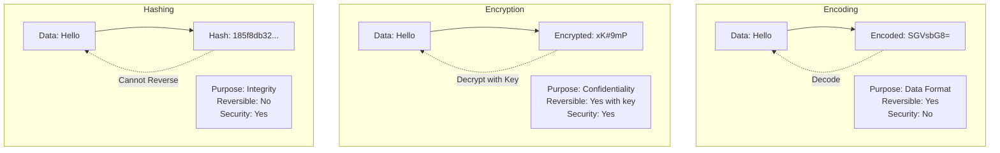
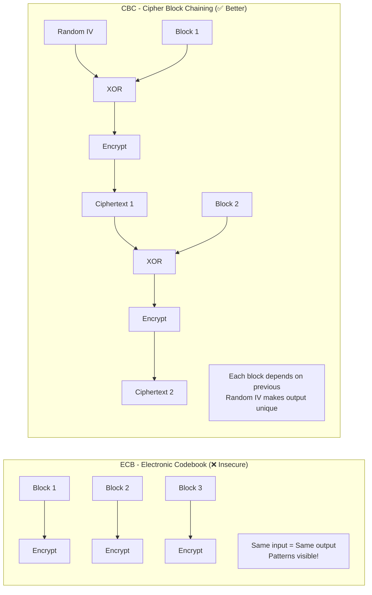
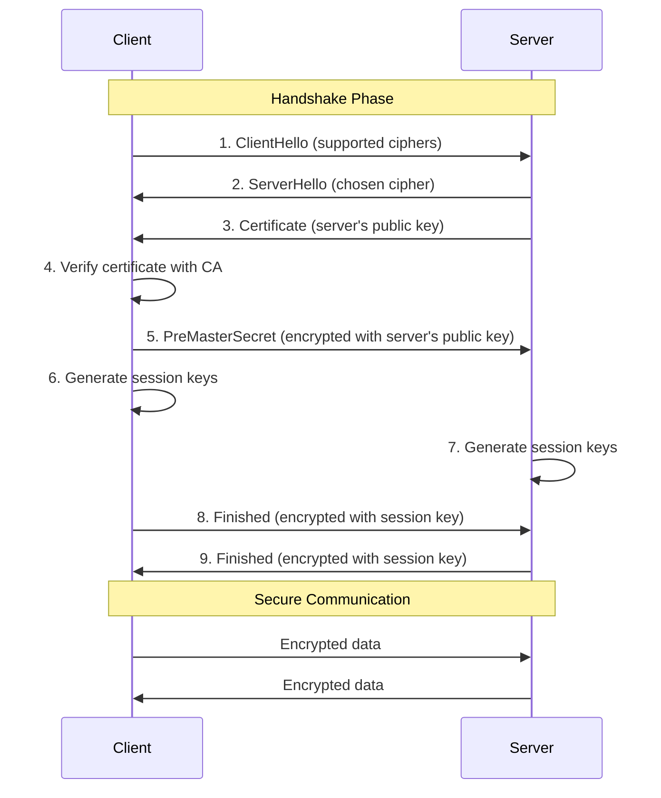

# Application Security Fundamentals Guide - Part 5
## Encryption & Cryptography

> [!NOTE]
> This is Part 5 of a comprehensive 7-part guide on application security. This section covers encryption, cryptography fundamentals, and key management.

---

## Table of Contents
1. [Encryption Fundamentals](#encryption-fundamentals)
2. [Symmetric Encryption](#symmetric-encryption)
3. [Asymmetric Encryption](#asymmetric-encryption)
4. [Hashing & Message Integrity](#hashing--message-integrity)
5. [Key Management](#key-management)
6. [TLS/SSL Deep Dive](#tlsssl-deep-dive)

---

## Encryption Fundamentals

### Encryption vs Encoding vs Hashing



---

## Symmetric Encryption

**Definition:** Same key for encryption and decryption

### AES (Advanced Encryption Standard)

**Most widely used symmetric algorithm**

```csharp
public class AesEncryption
{
    private readonly byte[] _key;
    
    public AesEncryption(string base64Key)
    {
        _key = Convert.FromBase64String(base64Key);
        
        // AES key sizes: 128, 192, or 256 bits
        if (_key.Length != 32) // 256 bits = 32 bytes
            throw new ArgumentException("Key must be 256 bits (32 bytes)");
    }
    
    public string Encrypt(string plaintext)
    {
        using (var aes = Aes.Create())
        {
            aes.Key = _key;
            aes.Mode = CipherMode.CBC; // Cipher Block Chaining
            aes.Padding = PaddingMode.PKCS7;
            
            // Generate random IV (Initialization Vector)
            aes.GenerateIV();
            var iv = aes.IV;
            
            using (var encryptor = aes.CreateEncryptor())
            using (var ms = new MemoryStream())
            {
                // Write IV first (needed for decryption)
                ms.Write(iv, 0, iv.Length);
                
                using (var cs = new CryptoStream(ms, encryptor, CryptoStreamMode.Write))
                using (var writer = new StreamWriter(cs))
                {
                    writer.Write(plaintext);
                }
                
                return Convert.ToBase64String(ms.ToArray());
            }
        }
    }
    
    public string Decrypt(string ciphertext)
    {
        var fullCipher = Convert.FromBase64String(ciphertext);
        
        using (var aes = Aes.Create())
        {
            aes.Key = _key;
            aes.Mode = CipherMode.CBC;
            aes.Padding = PaddingMode.PKCS7;
            
            // Extract IV from beginning of ciphertext
            var iv = new byte[aes.BlockSize / 8];
            Array.Copy(fullCipher, 0, iv, 0, iv.Length);
            aes.IV = iv;
            
            using (var decryptor = aes.CreateDecryptor())
            using (var ms = new MemoryStream(fullCipher, iv.Length, fullCipher.Length - iv.Length))
            using (var cs = new CryptoStream(ms, decryptor, CryptoStreamMode.Read))
            using (var reader = new StreamReader(cs))
            {
                return reader.ReadToEnd();
            }
        }
    }
    
    // Generate a new AES key
    public static string GenerateKey()
    {
        using (var aes = Aes.Create())
        {
            aes.KeySize = 256;
            aes.GenerateKey();
            return Convert.ToBase64String(aes.Key);
        }
    }
}

// Usage
var key = AesEncryption.GenerateKey();
var aes = new AesEncryption(key);

var encrypted = aes.Encrypt("Sensitive data");
// Result: "rE3K5L... (different each time due to random IV)"

var decrypted = aes.Decrypt(encrypted);
// Result: "Sensitive data"
```

### Encryption Modes



---

## Asymmetric Encryption

**Definition:** Different keys for encryption (public) and decryption (private)

### RSA

```csharp
public class RsaEncryption
{
    private readonly RSA _rsa;
    
    public RsaEncryption()
    {
        _rsa = RSA.Create(2048); // 2048-bit key
    }
    
    // Generate key pair
    public (string publicKey, string privateKey) GenerateKeyPair()
    {
        var publicKey = _rsa.ExportRSAPublicKeyPem();
        var privateKey = _rsa.ExportRSAPrivateKeyPem();
        
        return (publicKey, privateKey);
    }
    
    // Encrypt with public key
    public string Encrypt(string plaintext, string publicKeyPem)
    {
        using (var rsa = RSA.Create())
        {
            rsa.ImportFromPem(publicKeyPem);
            
            var data = Encoding.UTF8.GetBytes(plaintext);
            var encrypted = rsa.Encrypt(data, RSAEncryptionPadding.OaepSHA256);
            
            return Convert.ToBase64String(encrypted);
        }
    }
    
    // Decrypt with private key
    public string Decrypt(string ciphertext, string privateKeyPem)
    {
        using (var rsa = RSA.Create())
        {
            rsa.ImportFromPem(privateKeyPem);
            
            var data = Convert.FromBase64String(ciphertext);
            var decrypted = rsa.Decrypt(data, RSAEncryptionPadding.OaepSHA256);
            
            return Encoding.UTF8.GetString(decrypted);
        }
    }
    
    // Digital signature
    public string Sign(string message, string privateKeyPem)
    {
        using (var rsa = RSA.Create())
        {
            rsa.ImportFromPem(privateKeyPem);
            
            var data = Encoding.UTF8.GetBytes(message);
            var signature = rsa.SignData(data, HashAlgorithmName.SHA256, 
                RSASignaturePadding.Pkcs1);
            
            return Convert.ToBase64String(signature);
        }
    }
    
    // Verify signature
    public bool VerifySignature(string message, string signature, string publicKeyPem)
    {
        using (var rsa = RSA.Create())
        {
            rsa.ImportFromPem(publicKeyPem);
            
            var data = Encoding.UTF8.GetBytes(message);
            var signatureBytes = Convert.FromBase64String(signature);
            
            return rsa.VerifyData(data, signatureBytes, HashAlgorithmName.SHA256,
                RSASignaturePadding.Pkcs1);
        }
    }
}

// Usage
var rsa = new RsaEncryption();
var (publicKey, privateKey) = rsa.GenerateKeyPair();

// Alice encrypts with Bob's public key
var encrypted = rsa.Encrypt("Secret message", publicKey);

// Only Bob can decrypt with his private key
var decrypted = rsa.Decrypt(encrypted, privateKey);
```

### Symmetric vs Asymmetric

| Aspect | Symmetric (AES) | Asymmetric (RSA) |
|--------|----------------|------------------|
| **Keys** | Same key for encrypt/decrypt | Public key (encrypt), Private key (decrypt) |
| **Speed** | Very fast | Slow (100-1000x slower) |
| **Key Size** | 128-256 bits | 2048-4096 bits |
| **Use Case** | Bulk data encryption | Key exchange, digital signatures |
| **Key Distribution** | Difficult (must share secretly) | Easy (public key can be shared openly) |

### Hybrid Encryption (Best of Both)

```csharp
public class HybridEncryption
{
    // Combine speed of AES with convenience of RSA
    public string Encrypt(string plaintext, string recipientPublicKey)
    {
        // 1. Generate random AES key
        var aesKey = AesEncryption.GenerateKey();
        
        // 2. Encrypt data with AES (fast!)
        var aes = new AesEncryption(aesKey);
        var encryptedData = aes.Encrypt(plaintext);
        
        // 3. Encrypt AES key with RSA public key
        var rsa = new RsaEncryption();
        var encryptedKey = rsa.Encrypt(aesKey, recipientPublicKey);
        
        // 4. Combine encrypted key + encrypted data
        return $"{encryptedKey}:{encryptedData}";
    }
    
    public string Decrypt(string ciphertext, string privateKey)
    {
        var parts = ciphertext.Split(':');
        var encryptedKey = parts[0];
        var encryptedData = parts[1];
        
        // 1. Decrypt AES key with RSA private key
        var rsa = new RsaEncryption();
        var aesKey = rsa.Decrypt(encryptedKey, privateKey);
        
        // 2. Decrypt data with AES key
        var aes = new AesEncryption(aesKey);
        return aes.Decrypt(encryptedData);
    }
}
```

---

## Hashing & Message Integrity

### Cryptographic Hash Functions

**Properties:**
1. **Deterministic:** Same input → same output
2. **One-way:** Cannot reverse
3. **Avalanche effect:** Small change → completely different hash
4. **Collision resistant:** Hard to find two inputs with same hash

```csharp
public class HashingService
{
    // SHA-256
    public string ComputeSha256(string input)
    {
        using (var sha256 = SHA256.Create())
        {
            var bytes = Encoding.UTF8.GetBytes(input);
            var hash = sha256.ComputeHash(bytes);
            return Convert.ToHexString(hash).ToLower();
        }
    }
    
    // SHA-512 (more secure, larger output)
    public string ComputeSha512(string input)
    {
        using (var sha512 = SHA512.Create())
        {
            var bytes = Encoding.UTF8.GetBytes(input);
            var hash = sha512.ComputeHash(bytes);
            return Convert.ToHexString(hash).ToLower();
        }
    }
    
    // File integrity check
    public string ComputeFileHash(string filePath)
    {
        using (var sha256 = SHA256.Create())
        using (var stream = File.OpenRead(filePath))
        {
            var hash = sha256.ComputeHash(stream);
            return Convert.ToHexString(hash).ToLower();
        }
    }
}

// Usage
var hasher = new HashingService();

var hash1 = hasher.ComputeSha256("Hello");
// 185f8db32271fe25f561a6fc938b2e264306ec304eda518007d1764826381969

var hash2 = hasher.ComputeSha256("Hello!");
// 334d016f755cd6dc58c53a86e183882f8ec14f52fb05345887c8a5edd42c87b7
// Completely different!
```

### HMAC (Hash-based Message Authentication Code)

**Purpose:** Verify integrity AND authenticity

```csharp
public class HmacService
{
    private readonly byte[] _secret;
    
    public HmacService(string secretKey)
    {
        _secret = Encoding.UTF8.GetBytes(secretKey);
    }
    
    public string GenerateHmac(string message)
    {
        using (var hmac = new HMACSHA256(_secret))
        {
            var bytes = Encoding.UTF8.GetBytes(message);
            var hash = hmac.ComputeHash(bytes);
            return Convert.ToBase64String(hash);
        }
    }
    
    public bool VerifyHmac(string message, string providedHmac)
    {
        var computedHmac = GenerateHmac(message);
        
        // Use constant-time comparison to prevent timing attacks
        return CryptographicOperations.FixedTimeEquals(
            Convert.FromBase64String(computedHmac),
            Convert.FromBase64String(providedHmac));
    }
}

// Usage: Verify API webhook authenticity
[HttpPost("webhook")]
public IActionResult HandleWebhook([FromBody] WebhookData data)
{
    var signature = Request.Headers["X-Signature"].ToString();
    var payload = JsonSerializer.Serialize(data);
    
    if (!_hmacService.VerifyHmac(payload, signature))
    {
        return Unauthorized("Invalid signature");
    }
    
    // Process webhook
    return Ok();
}
```

### Password Hashing (Special Case)

```csharp
// ❌ NEVER use regular hash functions for passwords!
var badHash = SHA256("password123");
// Vulnerable to:
// - Rainbow tables (pre-computed hashes)
// - Brute force (very fast to compute)

// ✅ Use password-specific algorithms
public class PasswordHasher
{
    // bcrypt (recommended)
    public string HashPassword(string password)
    {
        // Work factor = 12 means 2^12 iterations
        // Adjustable to stay ahead of hardware improvements
        return BCrypt.Net.BCrypt.HashPassword(password, workFactor: 12);
    }
    
    public bool VerifyPassword(string password, string hash)
    {
        return BCrypt.Net.BCrypt.Verify(password, hash);
    }
    
    // Argon2 (newer, recommended for new projects)
    public string HashPasswordArgon2(string password)
    {
        var argon2 = new Argon2id(Encoding.UTF8.GetBytes(password))
        {
            DegreeOfParallelism = 8,
            MemorySize = 65536, // 64 MB
            Iterations = 4
        };
        
        var hash = argon2.GetBytes(32);
        return Convert.ToBase64String(hash);
    }
}
```

---

## Key Management

### Key Storage - What NOT to Do

```csharp
// ❌ TERRIBLE - Hardcoded key
public class BadEncryption
{
    private const string Key = "MySecretKey12345"; // In source code!
}

// ❌ BAD - In config file committed to git
{
  "EncryptionKey": "SuperSecretKey123",
  "Database": "Server=...;Password=admin123;"
}
```

### Secure Key Management

```csharp
// ✅ GOOD - Environment variables
public class SecureKeyManager
{
    private readonly string _encryptionKey;
    
    public SecureKeyManager()
    {
        // Load from environment variable
        _encryptionKey = Environment.GetEnvironmentVariable("ENCRYPTION_KEY")
            ?? throw new InvalidOperationException("ENCRYPTION_KEY not set");
    }
}

// ✅ BETTER - Azure Key Vault / AWS KMS
public class CloudKeyManager
{
    private readonly SecretClient _keyVaultClient;
    
    public CloudKeyManager(IConfiguration config)
    {
        var vaultUri = new Uri(config["KeyVault:Uri"]);
        _keyVaultClient = new SecretClient(vaultUri, new DefaultAzureCredential());
    }
    
    public async Task<string> GetEncryptionKey()
    {
        var secret = await _keyVaultClient.GetSecretAsync("encryption-key");
        return secret.Value.Value;
    }
    
    public async Task<string> EncryptData(string plaintext)
    {
        var key = await GetEncryptionKey();
        var aes = new AesEncryption(key);
        return aes.Encrypt(plaintext);
    }
}

// ✅ BEST - Hardware Security Module (HSM) for very high security
// Keys never leave the hardware device
```

### Key Rotation

```csharp
public class KeyRotationService
{
    private readonly IKeyVaultService _keyVault;
    
    public async Task RotateEncryptionKey()
    {
        // 1. Generate new key
        var newKey = AesEncryption.GenerateKey();
        var newKeyVersion = $"encryption-key-v{DateTime.UtcNow:yyyyMMdd}";
        
        // 2. Store new key
        await _keyVault.StoreKey(newKeyVersion, newKey);
        
        // 3. Re-encrypt all data with new key
        var oldKey = await _keyVault.GetKey("encryption-key-current");
        await ReEncryptAllData(oldKey, newKey);
        
        // 4. Update current key reference
        await _keyVault.SetCurrentKey(newKeyVersion);
        
        // 5. Keep old key for some time (for data encrypted with it)
        _logger.LogInformation($"Key rotated to {newKeyVersion}");
    }
    
    private async Task ReEncryptAllData(string oldKey, string newKey)
    {
        var oldAes = new AesEncryption(oldKey);
        var newAes = new AesEncryption(newKey);
        
        // Process in batches
        var encryptedRecords = await _db.EncryptedData.ToListAsync();
        
        foreach (var record in encryptedRecords)
        {
            // Decrypt with old key
            var plaintext = oldAes.Decrypt(record.CipherText);
            
            // Encrypt with new key
            record.CipherText = newAes.Encrypt(plaintext);
            record.KeyVersion = newKey;
        }
        
        await _db.SaveChangesAsync();
    }
}
```

---

## TLS/SSL Deep Dive

### How TLS Works



### Certificate Validation

```csharp
public class CertificateValidator
{
    public bool ValidateCertificate(X509Certificate2 certificate, string hostname)
    {
        // 1. Check expiration
        if (DateTime.Now < certificate.NotBefore || 
            DateTime.Now > certificate.NotAfter)
        {
            return false;
        }
        
        // 2. Verify certificate chain
        using (var chain = new X509Chain())
        {
            chain.ChainPolicy.RevocationMode = X509RevocationMode.Online;
            chain.ChainPolicy.RevocationFlag = X509RevocationFlag.ExcludeRoot;
            
            if (!chain.Build(certificate))
            {
                return false; // Invalid chain
            }
        }
        
        // 3. Verify hostname matches
        if (!certificate.MatchesHostname(hostname))
        {
            return false;
        }
        
        // 4. Check if revoked (OCSP)
        if (IsCertificateRevoked(certificate))
        {
            return false;
        }
        
        return true;
    }
    
    private bool IsCertificateRevoked(X509Certificate2 cert)
    {
        // Check certificate revocation list (CRL) or OCSP
        // Implementation varies by platform
        return false;
    }
}
```

### Enforcing TLS in ASP.NET Core

```csharp
public class Startup
{
    public void ConfigureServices(IServiceCollection services)
    {
        // Enforce HTTPS
        services.AddHttpsRedirection(options =>
        {
            options.RedirectStatusCode = StatusCodes.Status308PermanentRedirect;
            options.HttpsPort = 443;
        });
        
        // HSTS (HTTP Strict Transport Security)
        services.AddHsts(options =>
        {
            options.Preload = true;
            options.IncludeSubDomains = true;
            options.MaxAge = TimeSpan.FromDays(365);
        });
        
        // Configure Kestrel for TLS 1.2+
        services.Configure<KestrelServerOptions>(options =>
        {
            options.ConfigureHttpsDefaults(httpsOptions =>
            {
                httpsOptions.SslProtocols = SslProtocols.Tls12 | SslProtocols.Tls13;
            });
        });
    }
    
    public void Configure(IApplicationBuilder app,IWebHostEnvironment env)
    {
        if (!env.IsDevelopment())
        {
            app.UseHsts();
        }
        
        app.UseHttpsRedirection();
    }
}
```

---

## Best Practices Summary

### Encryption Checklist

- [ ] Use AES-256 for symmetric encryption
- [ ] Use RSA-2048+ for asymmetric encryption
- [ ] Always use random IVs (Initialization Vectors)
- [ ] Use authenticated encryption (GCM mode)
- [ ] Never reuse IVs with the same key

### Hashing Checklist

- [ ] Use SHA-256 or SHA-512 for integrity
- [ ] Use bcrypt/scrypt/Argon2 for passwords
- [ ] Never use MD5 or SHA-1 (broken)
- [ ] Add salt to password hashes
- [ ] Use HMAC for message authentication

### Key Management Checklist

- [ ] Never hardcode keys in source code
- [ ] Store keys in secure vault (Azure Key Vault, AWS KMS)
- [ ] Implement key rotation
- [ ] Use environment-specific keys
- [ ] Audit key access
- [ ] Have key recovery procedures

### TLS/SSL Checklist

- [ ] Use TLS 1.2 or 1.3 only
- [ ] Enforce HTTPS everywhere
- [ ] Implement HSTS
- [ ] Use strong cipher suites
- [ ] Validate certificates properly
- [ ] Monitor certificate expiration

---

## Next Steps

📚 **Continue to [Part 6: Common Attack Vectors & Defense](Part6-Attack-Vectors-Defense.md)**

Covers:
- CSRF (Cross-Site Request Forgery)
- Clickjacking
- Man-in-the-Middle attacks
- Phishing
- Social engineering
- DDoS protection

---

*Part 5 of 7 - Encryption & Cryptography*
