# Application Security Fundamentals Guide - Part 6
## Attack Vectors & Defense Mechanisms

> [!NOTE]
> This is Part 6 of a comprehensive 7-part guide on application security. This section covers common attack vectors and how to defend against them.

---

## Table of Contents
1. [CSRF - Cross-Site Request Forgery](#csrf---cross-site-request-forgery)
2. [Clickjacking](#clickjacking)
3. [Man-in-the-Middle (MITM) Attacks](#man-in-the-middle-mitm-attacks)
4. [DDoS Protection](#ddos-protection)
5. [Social Engineering & Phishing](#social-engineering--phishing)
6. [Supply Chain Attacks](#supply-chain-attacks)

---

## CSRF - Cross-Site Request Forgery

### What Is It?

**Simple:** Tricking users into performing actions they didn't intend to

```mermaid
sequenceDiagram
    participant U as User (Logged In)
    participant M as Malicious Site
    participant B as Bank Website
    
    Note over U,B: User is authenticated to Bank
    U->>M: Visits malicious website
    M->>M: Hidden form:<br/>POST /transfer?to=attacker&amount=1000
    M->>B: Auto-submits form with user's cookies
    B->>B: User is authenticated! ✅
    B->>B: Transfers money
    Note over U,B: User never intended this!
```



### Vulnerable Code

```csharp
// ❌ VULNERABLE: No CSRF protection
[HttpPost("transfer")]
public IActionResult Transfer(string toAccount, decimal amount)
{
    var currentUser = GetCurrentUser();
    _bankService.Transfer(currentUser.AccountId, toAccount, amount);
    return Ok();
}
```

**Attack:**

```html
<!-- Attacker's website -->
<html>
<body onload="document.forms[0].submit()">
    <form action="https://bank.com/transfer" method="POST">
        <input type="hidden" name="toAccount" value="attacker123">
        <input type="hidden" name="amount" value="1000">
    </form>
</body>
</html>
```

### Defense: Anti-CSRF Tokens

```csharp
// ✅ SECURE: Using ASP.NET Core's built-in CSRF protection
public class Startup
{
    public void ConfigureServices(IServiceCollection services)
    {
        services.AddControllersWithViews(options =>
        {
            // Global CSRF filter
            options.Filters.Add(new AutoValidateAntiforgeryTokenAttribute());
        });
    }
}

// Controller
[HttpPost("transfer")]
[ValidateAntiForgeryToken] // Validates CSRF token
public IActionResult Transfer(TransferRequest request)
{
    var currentUser = GetCurrentUser();
    _bankService.Transfer(currentUser.AccountId, request.ToAccount, request.Amount);
    return Ok();
}

// In Razor view
<form method="post" action="/transfer">
    @Html.AntiForgeryToken() <!-- Generates CSRF token -->
    <input name="toAccount" />
    <input name="amount" />
    <button type="submit">Transfer</button>
</form>
```

**How it works:**

```mermaid
sequenceDiagram
    participant U as User
    participant S as Server
    
    U->>S: GET /transfer-page
    S->>S: Generate random token
    S->>S: Store in session
    S->>U: Form + Token in hidden field
    U->>U: Fills form
    U->>S: POST /transfer + Token
    S->>S: Verify token matches session
    alt Token valid
        S->>U: Process transfer ✅
    else Token invalid/missing
        S->>U: Reject (403 Forbidden) ❌
    end
```



**For APIs (SPA/Mobile):**

```csharp
// Use SameSite cookies
Response.Cookies.Append("session", sessionId, new CookieOptions
{
    HttpOnly = true,
    Secure = true,
    SameSite = SameSiteMode.Strict // or Lax
});

// OR use custom header
[HttpPost("transfer")]
public IActionResult Transfer([FromHeader(Name = "X-CSRF-TOKEN")] string csrfToken,
                              TransferRequest request)
{
    if (!ValidateCsrfToken(csrfToken))
        return Forbid();
    
    // Process
}
```

---

## Clickjacking

### What Is It?

**Simple:** Tricking users into clicking on hidden elements


**Attack Code:**

```html
<!-- Attacker's page -->
<html>
<body>
    <h1>Click to see cute cats!</h1>
    <button style="position: relative; z-index: 1;">Play Video</button>
    
    <!-- Hidden iframe -->
    <iframe src="https://bank.com/transfer?to=attacker&amount=1000"
            style="position: absolute; top: 0; left: 0; opacity: 0; z-index: 2;">
    </iframe>
</body>
</html>
```

### Defense: X-Frame-Options & CSP

```csharp
// ✅ Prevent framing
public void Configure(IApplicationBuilder app)
{
    app.Use(async (context, next) =>
    {
        // Method 1: X-Frame-Options
        context.Response.Headers.Add("X-Frame-Options", "DENY");
        // Or: "SAMEORIGIN" to allow same-domain framing
        
        // Method 2: Content Security Policy (more modern)
        context.Response.Headers.Add("Content-Security-Policy", "frame-ancestors 'none'");
        
        await next();
    });
}

// In ASP.NET Core
public void ConfigureServices(IServiceCollection services)
{
    services.AddAntiforgery(options => 
    {
        options.SuppressXFrameOptionsHeader = false;
    });
}
```

**Client-side detection:**

```javascript
// Detect if page is in a frame
if (window !== window.top) {
    // We're in a frame!
    window.top.location = window.location; // Break out
    // Or show warning
    alert("This page cannot be displayed in a frame");
}
```

---

## Man-in-the-Middle (MITM) Attacks

### What Is It?


### Defense Mechanisms

#### 1. Use HTTPS Everywhere

```csharp
// Force HTTPS
public void ConfigureServices(IServiceCollection services)
{
    services.AddHttpsRedirection(options =>
    {
        options.RedirectStatusCode = StatusCodes.Status308PermanentRedirect;
        options.HttpsPort = 443;
    });
    
    // HSTS: Tell browsers to always use HTTPS
    services.AddHsts(options =>
    {
        options.Preload = true;
        options.IncludeSubDomains = true;
        options.MaxAge = TimeSpan.FromDays(365);
    });
}
```

#### 2. Certificate Pinning (Mobile Apps)

```csharp
// Pin specific certificate
public class PinnedCertificateHandler : HttpClientHandler
{
    private readonly string _expectedThumbprint;
    
    public PinnedCertificateHandler(string thumbprint)
    {
        _expectedThumbprint = thumbprint;
        ServerCertificateCustomValidationCallback = ValidateCertificate;
    }
    
    private bool ValidateCertificate(
        HttpRequestMessage request,
        X509Certificate2 cert,
        X509Chain chain,
        SslPolicyErrors errors)
    {
        // Check certificate thumbprint
        return cert.Thumbprint.Equals(_expectedThumbprint, 
            StringComparison.OrdinalIgnoreCase);
    }
}

// Usage
var handler = new PinnedCertificateHandler("ABCD1234..."); // Your cert thumbprint
var client = new HttpClient(handler);
```

#### 3. Verify SSL/TLS

```csharp
// Ensure TLS 1.2+
ServicePointManager.SecurityProtocol = 
    SecurityProtocolType.Tls12 | 
    SecurityProtocolType.Tls13;

// Validate certificates
public static bool ValidateCertificate(object sender, 
    X509Certificate certificate,
    X509Chain chain,
    SslPolicyErrors sslPolicyErrors)
{
    // Don't allow self-signed in production
    if (sslPolicyErrors == SslPolicyErrors.None)
        return true;
    
    if (IsProduction)
        return false;
    
    // Only allow self-signed in development
    return sslPolicyErrors == SslPolicyErrors.RemoteCertificateChainErrors;
}
```

---

## DDoS Protection

### What Is DDoS?

**Distributed Denial of Service:** Overwhelming a service with traffic


### Types of DDoS

| Type | Target | Example |
|------|--------|---------|
| **Volumetric** | Network bandwidth | UDP flood, DNS amplification |
| **Protocol** | Server resources | SYN flood, Ping of Death |
| **Application Layer** | Application logic | HTTP flood, Slowloris |

### Defense Strategies

#### 1. Rate Limiting

```csharp
// Install: AspNetCoreRateLimit
public void ConfigureServices(IServiceCollection services)
{
    services.AddMemoryCache();
    
    services.Configure<IpRateLimitOptions>(options =>
    {
        options.GeneralRules = new List<RateLimitRule>
        {
            new RateLimitRule
            {
                Endpoint = "*",
                Limit = 100,
                Period = "1m" // 100 requests per minute per IP
            },
            new RateLimitRule
            {
                Endpoint = "*",
                Limit = 1000,
                Period = "1h" // 1000 requests per hour per IP
            },
            new RateLimitRule
            {
                Endpoint = "POST:/api/login",
                Limit = 5,
                Period = "15m" // Only 5 login attempts per 15 min
            }
        };
    });
    
    services.AddInMemoryRateLimiting();
    services.AddSingleton<IRateLimitConfiguration, RateLimitConfiguration>();
}

public void Configure(IApplicationBuilder app)
{
    app.UseIpRateLimiting();
}
```

#### 2. CAPTCHA for Sensitive Operations

```csharp
[HttpPost("register")]
public async Task<IActionResult> Register(RegisterRequest request)
{
    // Verify reCAPTCHA
    var isHuman = await _captchaService.Verify(request.CaptchaToken);
    if (!isHuman)
    {
        return BadRequest("CAPTCHA verification failed");
    }
    
    // Process registration
    return Ok();
}

public class RecaptchaService
{
    private readonly string _secretKey;
    private readonly HttpClient _httpClient;
    
    public async Task<bool> Verify(string token)
    {
        var response = await _httpClient.PostAsync(
            "https://www.google.com/recaptcha/api/siteverify",
            new FormUrlEncodedContent(new Dictionary<string, string>
            {
                ["secret"] = _secretKey,
                ["response"] = token
            }));
        
        var result = await response.Content.ReadFromJsonAsync<RecaptchaResponse>();
        return result.Success && result.Score > 0.5; // reCAPTCHA v3
    }
}
```

#### 3. Load Balancing & Auto-Scaling

```yaml
# Example: Kubernetes auto-scaling
apiVersion: autoscaling/v2
kind: HorizontalPodAutoscaler
metadata:
  name: my-app
spec:
  scaleTargetRef:
    apiVersion: apps/v1
    kind: Deployment
    name: my-app
  minReplicas: 3
  maxReplicas: 50
  metrics:
  - type: Resource
    resource:
      name: cpu
      target:
        type: Utilization
        averageUtilization: 70
```

#### 4. CDN & WAF


**Cloudflare DDoS Protection:**
- Automatic DDoS mitigation
- Rate limiting rules
- Bot detection
- Caching reduces server load

---

## Social Engineering & Phishing

### Common Attacks

#### 1. Phishing Email

```
From: security@paypa1.com  (Notice the "1" instead of "l")
Subject: Urgent: Your account has been suspended!

Your PayPal account has been locked due to suspicious activity.
Click here to verify your identity: http://paypal-secure.phishing.com

[Verify Account Button]
```

**Red flags:**
- Sender email is suspicious
- Creates urgency
- Asks for sensitive information
- Contains typos
- Link doesn't match legitimate domain

#### 2. Spear Phishing

**Targeted attack with personalized information**

```
From: ceo@company.com (Spoofed)
To: finance@company.com
Subject: Urgent Wire Transfer

Hi Sarah,

I'm in a meeting with potential investors and need you to wire $50,000
to this account immediately for the deal:

Account: 123456789
Bank: XYZ Bank

Please confirm once done.

- John (CEO)
```

### Defense for Organizations

```csharp
// 1. Email security headers (SPF, DKIM, DMARC)
// SPF: Sender Policy Framework
// Add to DNS:
// v=spf1 include:_spf.google.com ~all

// DMARC: Domain-based Message Authentication
// v=DMARC1; p=reject; rua=mailto:dmarc@company.com

// 2. Security awareness training
public class SecurityTrainingService
{
    public async Task SendPhishingTest(Employee employee)
    {
        // Send simulated phishing email
        await _emailService.Send(new Email
        {
            To = employee.Email,
            Subject = "Urgent: Password Reset Required",
            Body = GetPhishingTestTemplate(),
            IsTest = true
        });
        
        // Track if they click the link
        var clicked = await WaitForClick(employee.Id, TimeSpan.FromDays(7));
        
        if (clicked)
        {
            // Provide immediate training
            await SendSecurityTraining(employee);
            _metrics.RecordPhishingTestFailure(employee.Id);
        }
    }
}

// 3. Technical controls
public class EmailSecurityFilter
{
    public bool IsPhishing(Email email)
    {
        var score = 0;
        
        // Check sender domain
        if (!IsKnownDomain(email.From))
            score += 20;
        
        // Check for urgency keywords
        if (ContainsUrgencyKeywords(email.Subject))
            score += 15;
        
        // Check for suspicious links
        if (ContainsSuspiciousLinks(email.Body))
            score += 30;
        
        // Check for credential requests
        if (AsksForCredentials(email.Body))
            score += 25;
        
        // Threshold
        return score >= 50;
    }
}
```

### User Education

> [!IMPORTANT]
> **Teach Users to:**
> 
> 1. **Verify sender:** Check email address carefully
> 2. **Hover over links:** See real URL before clicking
> 3. **Be skeptical:** Urgent requests are often scams
> 4. **Use different channel:** Call to verify important requests
> 5. **Check for HTTPS:** Look for padlock in browser
> 6. **Report suspicious emails:** Have clear reporting process

---

## Supply Chain Attacks

### What Is It?

**Compromising a trusted third party to attack the final target**


###Real Examples

**SolarWinds (2020):**
- Attackers injected malware into SolarWinds Orion updates
- 18,000+ organizations affected
- Took months to discover

**event-stream NPM (2018):**
- Attacker gained maintainer access
- Inserted malicious code to steal cryptocurrency
- Downloaded 8 million times before discovery

### Defense

```csharp
// 1. Dependency scanning
public class DependencyScanner
{
    public async Task<List<Vulnerability>> ScanDependencies()
    {
        // Use tools like:
        // - npm audit
        // - dotnet list package --vulnerable
        // - Snyk
        // - OWASP Dependency-Check
        
        var vulnerabilities = new List<Vulnerability>();
        
        // Scan NuGet packages
        var packages = await GetInstalledPackages();
        foreach (var package in packages)
        {
            var vulns = await _nvdService.CheckVulnerabilities(
                package.Name, 
                package.Version);
            vulnerabilities.AddRange(vulns);
        }
        
        return vulnerabilities;
    }
}

// 2. Lock files (package-lock.json, packages.lock.json)
// Always commit lock files to ensure exact versions

// 3. Verify package integrity
{
  "dependencies": {
    "package-name": {
      "version": "1.0.0",
      "integrity": "sha512-HASH..." // Subresource Integrity
    }
  }
}

// 4. Use private package registry
public void ConfigureServices(IServiceCollection services)
{
    // Use internal NuGet feed
    // Only allow packages from trusted sources
}
```

**Organizational Policies:**

```yaml
# Example: GitHub branch protection
branches:
  main:
    protection:
      required_status_checks:
        - dependency-scan
        - security-scan
        - code-review
      required_approving_reviews: 2
      dismiss_stale_reviews: true
      require_code_owner_reviews: true
```

---

## Defense in Depth Summary


### Security Checklist

- [ ] **CSRF:** Use anti-CSRF tokens
- [ ] **Clickjacking:** Set X-Frame-Options header
- [ ] **MITM:** Enforce HTTPS, use HSTS
- [ ] **DDoS:** Implement rate limiting, use CDN
- [ ] **Phishing:** Train users, implement email security
- [ ] **Supply Chain:** Scan dependencies, use lock files

---

## Next Steps

📚 **Continue to [Part 7: Best Practices & Security Glossary](Part7-Best-Practices-Glossary.md)**

This final section covers:
- Comprehensive security best practices
- Complete security terminology glossary
- Security testing methodologies
- Compliance and regulations
- Security resources and tools

---

*Part 6 of 7 - Attack Vectors & Defense Mechanisms*
