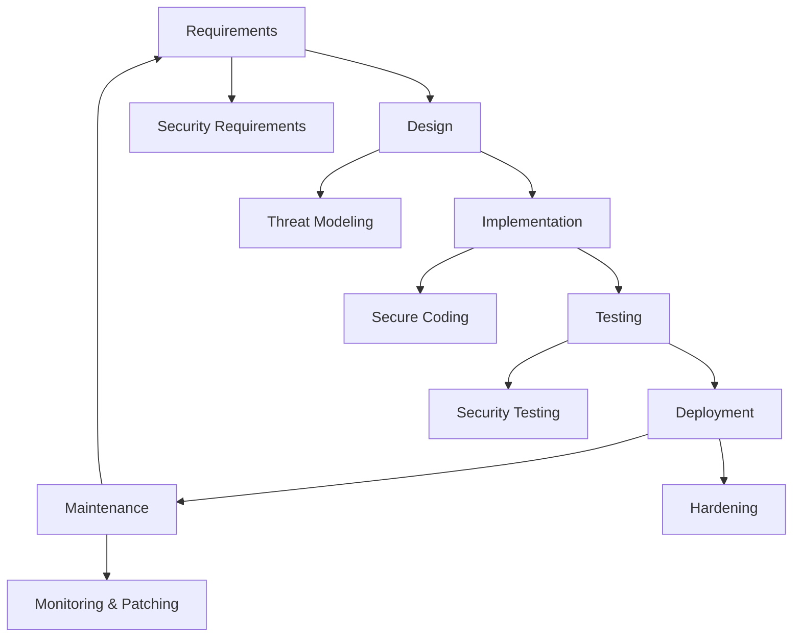
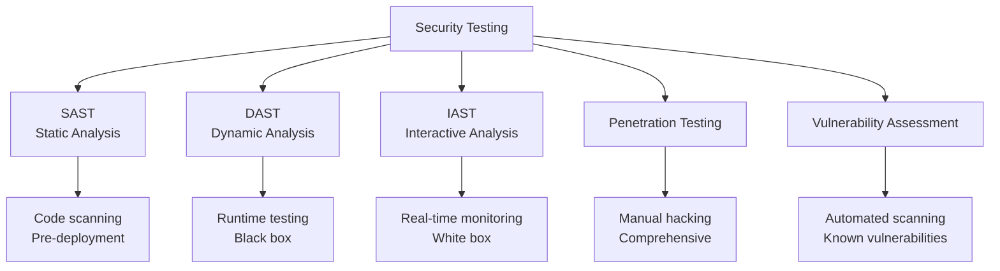
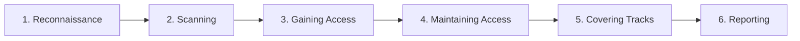
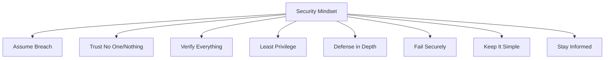

# Application Security Fundamentals Guide - Part 7  
## Best Practices & Security Glossary

> [!NOTE]
> This is Part 7 (Final) of a comprehensive 7-part guide on application security. This section provides best practices, a complete glossary, and additional resources.

---

## Table of Contents
1. [Secure Development Lifecycle](#secure-development-lifecycle)
2. [Security Testing](#security-testing)
3. [Compliance & Regulations](#compliance--regulations)
4. [Comprehensive Security Glossary](#comprehensive-security-glossary)
5. [Security Tools & Resources](#security-tools--resources)

---

## Secure Development Lifecycle

### Security-First Approach



### Code Review Checklist

**Security-focused code review:**

```csharp
// ✅ Security Code Review Checklist

// 1. Input Validation
// - All inputs validated?
// - Whitelisting instead of blacklisting?
// - Length limits enforced?

// 2. Authentication & Authorization
// - Authentication required?
// - Authorization checked?
// - Session management secure?

// 3. Data Protection
// - Sensitive data encrypted?
// - Passwords properly hashed?
// - No secrets in code?

// 4. Error Handling
// - No sensitive data in errors?
// - Proper error logging?
// - Generic errors to users?

// 5. Dependencies
// - All dependencies necessary?
// - Versions up to date?
// - No known vulnerabilities?
```

---

## Security Testing

### Types of Security Testing



### 1. SAST (Static Application Security Testing)

**Tests code without executing it**

```yaml
# Example: GitHub Actions workflow
name: Security Scan

on: [push, pull_request]

jobs:
  sast:
    runs-on: ubuntu-latest
    steps:
      - uses: actions/checkout@v3
      
      # CodeQL (SAST for multiple languages)
      - name: Initialize CodeQL
        uses: github/codeql-action/init@v2
        with:
          languages: csharp, javascript
      
      - name: Build
        run: dotnet build
      
      - name: Perform CodeQL Analysis
        uses: github/codeql-action/analyze@v2
      
      # SonarQube
      - name: SonarQube Scan
        uses: sonarsource/sonarqube-scan-action@master
        env:
          SONAR_TOKEN: ${{ secrets.SONAR_TOKEN }}
```

### 2. DAST (Dynamic Application Security Testing)

**Tests running application**

```bash
# OWASP ZAP (Zed Attack Proxy)
docker run -t owasp/zap2docker-stable zap-baseline.py \
    -t https://myapp.com

# Burp Suite
# Manual proxy-based testing tool

# Nikto web scanner
nikto -h https://myapp.com
```

### 3. Penetration Testing Methodology

**Phases:**



**Automated Vulnerability Scanning:**

```bash
# Nmap (network scanning)
nmap -sV -sC myapp.com

# sqlmap (SQL injection testing)
sqlmap -u "https://myapp.com/product?id=1" --batch

# XSStrike (XSS testing)
python xsstrike.py -u "https://myapp.com/search?q=test"
```

### 4. Security Testing in CI/CD

```yaml
# Comprehensive security pipeline
name: Security Pipeline

on: [push]

jobs:
  security:
    runs-on: ubuntu-latest
    steps:
      # Secret scanning
      - name: TruffleHog Secret Scan
        uses: trufflesecurity/trufflehog@main
      
      # Dependency scanning
      - name: Dependency Check
        run: |
          npm audit --audit-level=high
          dotnet list package --vulnerable
      
      # SAST
      - name: CodeQL Analysis
        uses: github/codeql-action/analyze@v2
      
      # Container scanning
      - name: Trivy Container Scan
        uses: aquasecurity/trivy-action@master
        with:
          image-ref: myapp:latest
      
      # License compliance
      - name: License Check
        run: npx license-checker --production --onlyAllow 'MIT;Apache-2.0;BSD'
      
      # DAST (if deployed to staging)
      - name: ZAP Scan
        if: github.ref == 'refs/heads/staging'
        run: |
          docker run -t owasp/zap2docker-stable \
            zap-baseline.py -t https://staging.myapp.com
```

---

## Compliance & Regulations

### Common Standards

| Standard | Description | Applies To |
|----------|-------------|------------|
| **GDPR** | EU data protection | EU citizens' data |
| **HIPAA** | Healthcare data security | US healthcare |
| **PCI-DSS** | Credit card data security | Payment processing |
| **SOC 2** | Service organization controls | SaaS providers |
| **ISO 27001** | Information security management | Any organization |
| **CCPA** | California Consumer Privacy Act | California residents' data |

### GDPR Requirements

```csharp
// Example: GDPR compliance features
public class GdprComplianceService
{
    // Right to Access
    public async Task<UserDataExport> ExportUserData(int userId)
    {
        var export = new UserDataExport
        {
            PersonalInfo  = await _db.Users.FindAsync(userId),
            Orders = await _db.Orders.Where(o => o.UserId == userId).ToListAsync(),
            Activities = await _db.Activities.Where(a => a.UserId == userId).ToListAsync()
        };
        
        _auditLog.Log($"Data export for user {userId}");
        return export;
    }
    
    // Right to Erasure ("Right to be Forgotten")
    public async Task DeleteUserData(int userId)
    {
        var user = await _db.Users.FindAsync(userId);
        
        // Anonymize data that must be kept for legal reasons
        user.Email = $"deleted_user_{userId}@example.com";
        user.Name = "Deleted User";
        user.Phone = null;
        user.Address = null;
        user.IsDeleted = true;
        user.DeletedAt = DateTime.UtcNow;
        
        // Delete non-essential data
        _db.UserActivities.RemoveRange(
            _db.UserActivities.Where(a => a.UserId == userId));
        
        await _db.SaveChangesAsync();
        _auditLog.Log($"User {userId} data deleted");
    }
    
    // Consent Management
    public async Task RecordConsent(int userId, string purpose)
    {
        await _db.Consents.AddAsync(new Consent
        {
            UserId = userId,
            Purpose = purpose,
            ConsentedAt = DateTime.UtcNow,
            IpAddress = _httpContext.Connection.RemoteIpAddress.ToString()
        });
        await _db.SaveChangesAsync();
    }
    
    // Data Breach Notification (must notify within 72 hours)
    public async Task NotifyDataBreach(DataBreach breach)
    {
        // Notify supervisory authority
        await _notificationService.NotifyDataProtectionAuthority(breach);
        
        // Notify affected users
        var affectedUsers = await GetAffectedUsers(breach);
        foreach (var user in affectedUsers)
        {
            await _emailService.SendBreachNotification(user, breach);
        }
        
        _auditLog.Log($"Data breach notification sent: {breach.Id}");
    }
}
```

### PCI-DSS Requirements

**If handling credit cards:**

```csharp
// ❌ NEVER store these:
// - Full magnetic stripe data
// - CVV/CVC codes
// - PIN numbers

// ✅ If you must store card data:
public class PciCompliantCardStorage
{
    // Only store last 4 digits
    public string GetMaskedCardNumber(string fullCardNumber)
    {
        if (fullCardNumber.Length < 4)
            return "****";
        
        return $"************{fullCardNumber.Substring(fullCardNumber.Length - 4)}";
    }
    
    // Use tokenization
    public async Task<string> TokenizeCard(string cardNumber)
    {
        // Use payment processor's tokenization
        var token = await _paymentProcessor.CreateToken(cardNumber);
        // Store token instead of actual card number
        return token;
    }
}

// ✅ BEST: Use payment processor (Stripe, PayPal)
// Let them handle PCI compliance!
```

---

## Comprehensive Security Glossary

### A

**Authentication**  
Process of verifying identity (who you are)

**Authorization**  
Process of verifying permissions (what you can do)

**AES (Advanced Encryption Standard)**  
Symmetric encryption algorithm, industry standard

**API (Application Programming Interface)**  
Interface for applications to communicate

**Attack Surface**  
All possible points where an attacker could exploit

**Asymmetric Encryption**  
Encryption using public/private key pairs (e.g., RSA)

### B

**Backdoor**  
Hidden method of bypassing authentication

**Bcrypt**  
Password hashing algorithm, resistant to brute force

**Botnet**  
Network of compromised computers controlled by attacker

**Brute Force Attack**  
Trying all possible passwords/keys

### C

**Certificate Authority (CA)**  
Trusted entity that issues digital certificates

**CIA Triad**  
Confidentiality, Integrity, Availability

**Clickjacking**  
Tricking users into clicking hidden elements

**Credential Stuffing**  
Using leaked credentials from one site on another

**CSRF (Cross-Site Request Forgery)**  
Forcing users to perform unintended actions

**CSP (Content Security Policy)**  
HTTP header to prevent XSS and other attacks

**CVE (Common Vulnerabilities and Exposures)**  
Standard identifier for known vulnerabilities

### D

**DDoS (Distributed Denial of Service)**  
Overwhelming a service with traffic from many sources

**Defense in Depth**  
Multiple layers of security controls

**Deserialization**  
Converting serialized data back to objects (can be dangerous)

### E

**Encoding**  
Converting data to different format (not for security)

**Encryption**  
Converting data to unreadable format for confidentiality

**Exploit**  
Code/technique that takes advantage of vulnerability

### F

**Firewall**  
Network security system that monitors/controls traffic

**Fuzzing**  
Automated testing with random/invalid inputs

### G

**GDPR (General Data Protection Regulation)**  
EU data protection law

### H

**Hashing**  
One-way function for data integrity

**HMAC (Hash-based Message Authentication Code)**  
Hash function with secret key for authenticity

**HSTS (HTTP Strict Transport Security)**  
Forces browsers to use HTTPS

**HTTP (Hypertext Transfer Protocol)**  
Application protocol for web (insecure)

**HTTPS (HTTP Secure)**  
HTTP over TLS/SSL (encrypted)

### I

**Injection**  
Inserting malicious code (SQL, command, etc.)

**IDOR (Insecure Direct Object Reference)**  
Accessing resources by changing IDs

**IV (Initialization Vector)**  
Random data used with encryption

### J

**JWT (JSON Web Token)**  
Compact token for authentication

### K

**Key Management**  
Secure handling of cryptographic keys

**Keylogger**  
Malware that records keystrokes

### L

**Least Privilege**  
Give minimum necessary permissions

**Load Balancer**  
Distributes traffic across multiple servers

### M

**Malware**  
Malicious software

**Man-in-the-Middle (MITM)**  
Intercepting communication between parties

**MFA (Multi-Factor Authentication)**  
Authentication using multiple factors

### N

**Nonce**  
Number used once (prevents replay attacks)

### O

**OAuth**  
Authorization framework for delegated access

**OIDC (OpenID Connect)**  
Identity layer on top of OAuth 2.0

**OWASP**  
Open Web Application Security Project

### P

**Payload**  
Malicious code/data in an attack

**Penetration Testing**  
Authorized simulated attack on system

**Phishing**  
Fraudulent attempt to obtain sensitive information

**PII (Personally Identifiable Information)**  
Data that identifies an individual

**PKI (Public Key Infrastructure)**  
System for managing digital certificates

### R

**Rainbow Table**  
Precomputed hashes for password cracking

**Ransomware**  
Malware that encrypts data and demands payment

**Rate Limiting**  
Restricting number of requests

**RBAC (Role-Based Access Control)**  
Access control based on user roles

**RSA**  
Asymmetric encryption algorithm

### S

**Salt**  
Random data added to passwords before hashing

**SAML (Security Assertion Markup Language)**  
XML-based standard for SSO

**Sandbox**  
Isolated environment for testing

**SAST (Static Application Security Testing)**  
Testing code without executing

**Session**  
Server-side storage of user state

**Session Fixation**  
Forcing user to use attacker's session ID

**Session Hijacking**  
Stealing user's session

**Social Engineering**  
Manipulating people to divulge information

**SQL Injection**  
Injecting malicious SQL queries

**SSL/TLS**  
Protocols for secure communication

**SSO (Single Sign-On)**  
One login for multiple systems

**SSRF (Server-Side Request Forgery)**  
Tricking server into making requests

**Symmetric Encryption**  
Same key for encryption/decryption (e.g., AES)

### T

**Threat**  
Potential for harm

**Threat Modeling**  
Identifying and assessing threats

**TLS (Transport Layer Security)**  
Successor to SSL

**Token**  
Piece of data representing something else

**TOTP (Time-based One-Time Password)**  
MFA code that changes every 30 seconds

### V

**Vulnerability**  
Weakness that can be exploited

**VPN (Virtual Private Network)**  
Encrypted connection over public network

### W

**WAF (Web Application Firewall)**  
Firewall for web applications

**Whitelist**  
Allowed list (opposite of blacklist)

### X

**XSS (Cross-Site Scripting)**  
Injecting malicious scripts into web pages

### Z

**Zero-Day**  
Vulnerability unknown to vendor

**Zero Trust**  
Security model: never trust, always verify

---

## Security Tools & Resources

### Essential Tools

#### Dependency Scanning
- **npm audit** - Node.js dependency scanner
- **dotnet list package --vulnerable** - .NET scanner
- **Snyk** - Multi-language dependency scanner
- **OWASP Dependency-Check** - Java/JVM scanner

#### SAST Tools
- **SonarQube** - Code quality & security
- **CodeQL** - Semantic code analysis (GitHub)
- **Checkmarx** - Enterprise SAST
- **Semgrep** - Lightweight static analysis

#### DAST Tools
- **OWASP ZAP** - Web app scanner (free)
- **Burp Suite** - Web security testing
- **Nikto** - Web server scanner

#### Container Security
- **Trivy** - Container vulnerability scanner
- **Clair** - Static container analysis
- **Anchore** - Container security platform

#### Secret Scanning
- **TruffleHog** - Find secrets in git repos
- **GitGuardian** - Automated secret detection
- **git-secrets** - Prevent committing secrets

### Learning Resources

**Websites:**
- **OWASP.org** - Web application security
- **PortSwigger Web Security Academy** - Free training
- **HackTheBox** - Hands-on hacking practice
- **TryHackMe** - Guided security learning

**Books:**
- "The Web Application Hacker's Handbook"
- "The Tangled Web" by Michal Zalewski
- "Cryptography Engineering"

**Certifications:**
- **CompTIA Security+** - Entry level
- **CEH (Certified Ethical Hacker)** - Mid level
- **OSCP (Offensive Security Certified Professional)** - Advanced
- **CISSP** - Security management

### Security Checklists

**Pre-Deployment Security Checklist:**

- [ ] All dependencies updated and scanned
- [ ] SAST scan passed
- [ ] No secrets in code/config
- [ ] HTTPS enforced everywhere
- [ ] Security headers configured
- [ ] Authentication implemented
- [ ] Authorization verified on all endpoints
- [ ] Input validation on all inputs
- [ ] Output encoding for XSS prevention
- [ ] SQL injection protection (parameterized queries)
- [ ] CSRF protection enabled
- [ ] Rate limiting configured
- [ ] Logging and monitoring set up
- [ ] Error handling doesn't leak info
- [ ] Database encrypted at rest
- [ ] Backups configured and tested
- [ ] Incident response plan ready

---

## Final Thoughts

> [!IMPORTANT]
> **Security is a Journey, Not a Destination**
> 
> - **Stay Updated:** New vulnerabilities discovered constantly
> - **Think Like an Attacker:** How would you break your own system?
> - **Defense in Depth:** Multiple layers of security
> - **Security is Everyone's Responsibility:** Not just security team
> - **Continuous Improvement:** Regular testing and updates

### The Security Mindset



---

## Quick Reference Card

**Security Priorities:**

1. **Critical**
   - SQL Injection
   - Authentication bypass
   - Remote code execution
   - Data exposure

2. **High**
   - XSS
   - CSRF
   - Broken access control
   - Sensitive data in transit

3. **Medium**
   - Security misconfiguration
   - Vulnerable dependencies
   - Insufficient logging

4. **Low**
   - Information disclosure
   - Missing security headers

**When in Doubt:**
1. ✅ Use established libraries (don't roll your own crypto)
2. ✅ Follow principle of least privilege
3. ✅ Validate all inputs
4. ✅ Encode all outputs
5. ✅ Encrypt sensitive data
6. ✅ Use HTTPS everywhere
7. ✅ Log security events
8. ✅ Keep dependencies updated

---

## Series Index

This completes the 7-part Application Security Fundamentals Guide:

1. **[Part 1: Security Fundamentals](Part1-Security-Fundamentals.md)** - CIA triad, basic concepts
2. **[Part 2: OWASP Top 10 (Part 1)](Part2-OWASP-Top10-Part1.md)** - First 5 vulnerabilities
3. **[Part 3: OWASP Top 10 (Part 2)](Part3-OWASP-Top10-Part2.md)** - Remaining 5 vulnerabilities
4. **[Part 4: Authentication & Authorization](Part4-Authentication-Authorization.md)** - MFA, OAuth, RBAC
5. **[Part 5: Encryption & Cryptography](Part5-Encryption-Cryptography.md)** - AES, RSA, TLS
6. **[Part 6: Attack Vectors & Defense](Part6-Attack-Vectors-Defense.md)** - CSRF, DDoS, phishing
7. **[Part 7: Best Practices & Glossary](Part7-Best-Practices-Glossary.md)** - This document

---

**Thank You for Reading!**

Remember: Security is not a product but a process. Stay vigilant, keep learning, and always think about security implications in your work.

*Guide created: December 2025*  
*Part 7 of 7 - Best Practices & Security Glossary*
