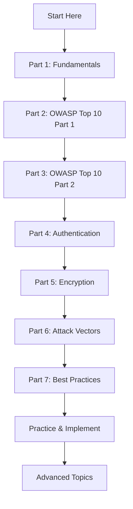

# Application Security Fundamentals Guide

A comprehensive, beginner-friendly guide to application security covering everything from basic concepts to advanced vulnerabilities and defense mechanisms.

## 📚 Complete Guide Structure

This guide is split into 7 detailed parts for easier consumption:

### [Part 1: Security Fundamentals](Part1-Security-Fundamentals.md)
**Foundation concepts you need to understand first**
- What is Application Security?
- The CIA Triad (Confidentiality, Integrity, Availability)
- Core Security Principles
- The Security Lifecycle
- Threat Modeling Basics
- Common Security Terms Explained

### [Part 2: OWASP Top 10 Vulnerabilities (Part 1)](Part2-OWASP-Top10-Part1.md)
**Most critical web application security risks (1-5)**
- A01: Broken Access Control
- A02: Cryptographic Failures
- A03: Injection (SQL, XSS, Command)
- A04: Insecure Design
- A05: Security Misconfiguration

### [Part 3: OWASP Top 10 Vulnerabilities (Part 2)](Part3-OWASP-Top10-Part2.md)
**Most critical web application security risks (6-10)**
- A06: Vulnerable and Outdated Components
- A07: Identification and Authentication Failures
- A08: Software and Data Integrity Failures
- A09: Security Logging and Monitoring Failures
- A10: Server-Side Request Forgery (SSRF)

### [Part 4: Authentication & Authorization](Part4-Authentication-Authorization.md)
**Deep dive into identity and access management**
- Authentication Mechanisms (Password, MFA, Biometric)
- Session Management Best Practices
- Token-Based Authentication (JWT)
- OAuth 2.0 & OpenID Connect
- Authorization Models (RBAC, ABAC)
- Password Security

### [Part 5: Encryption & Cryptography](Part5-Encryption-Cryptography.md)
**Understanding data protection**
- Encryption Fundamentals
- Symmetric Encryption (AES)
- Asymmetric Encryption (RSA)
- Hashing & Message Integrity
- Key Management
- TLS/SSL Deep Dive

### [Part 6: Attack Vectors & Defense Mechanisms](Part6-Attack-Vectors-Defense.md)
**Common attacks and how to defend against them**
- CSRF (Cross-Site Request Forgery)
- Clickjacking
- Man-in-the-Middle (MITM) Attacks
- DDoS Protection
- Social Engineering & Phishing
- Supply Chain Attacks

### [Part 7: Best Practices & Security Glossary](Part7-Best-Practices-Glossary.md)
**Comprehensive reference and best practices**
- Secure Development Lifecycle
- Security Testing (SAST, DAST, Penetration Testing)
- Compliance & Regulations (GDPR, HIPAA, PCI-DSS)
- Comprehensive Security Glossary (A-Z)
- Security Tools & Resources
- Checklists and Quick References

---

## 🎯 Who Is This Guide For?

- **Developers** who want to write secure code
- **Students** learning about cybersecurity
- **Product Managers** who need to understand security requirements
- **Anyone** interested in understanding application security from the ground up

## 🔑 Key Features

✅ **Beginner-Friendly** - Complex concepts explained simply  
✅ **Practical Code Examples** - Real C# code showing vulnerabilities and fixes  
✅ **Visual Diagrams** - Mermaid diagrams illustrating concepts  
✅ **Comprehensive Coverage** - From basics to advanced topics  
✅ **Real-World Examples** - Actual attack scenarios and defenses  
✅ **Hands-On** - Code you can use in your projects  

## 🚀 Quick Start

### For Complete Beginners
1. Start with [Part 1: Security Fundamentals](Part1-Security-Fundamentals.md)
2. Read [Part 2](Part2-OWASP-Top10-Part1.md) and [Part 3](Part3-OWASP-Top10-Part2.md) for common vulnerabilities
3. Continue through remaining parts as needed

### For Developers
1. Review [Part 1](Part1-Security-Fundamentals.md) for security principles
2. Focus on [Parts 2-3](Part2-OWASP-Top10-Part1.md) for OWASP Top 10
3. Deep dive into [Part 4](Part4-Authentication-Authorization.md) and [Part 5](Part5-Encryption-Cryptography.md)
4. Use [Part 7](Part7-Best-Practices-Glossary.md) as ongoing reference

### For Interview Preparation
1. Read all parts sequentially
2. Focus on understanding the "Why" not just "What"
3. Practice explaining concepts in simple terms
4. Review the glossary in [Part 7](Part7-Best-Practices-Glossary.md)

## 📋 Topics Covered

### Vulnerabilities
- SQL Injection
- Cross-Site Scripting (XSS)
- Cross-Site Request Forgery (CSRF)
- Broken Access Control
- Authentication & Session Management Issues
- Cryptographic Failures
- Injection Attacks
- Security Misconfiguration
- SSRF (Server-Side Request Forgery)
- And many more...

### Security Concepts
- CIA Triad
- Defense in Depth
- Least Privilege
- Zero Trust
- Threat Modeling
- Security by Design

### Technologies
- HTTPS/TLS
- OAuth 2.0 & OpenID Connect
- JWT (JSON Web Tokens)
- Encryption (AES, RSA)
- Hashing (SHA-256, bcrypt)
- Multi-Factor Authentication

### Compliance
- GDPR
- HIPAA
- PCI-DSS
- SOC 2
- ISO 27001

## 🛠️ Tools & Technologies Referenced

**Security Testing:**
- OWASP ZAP
- Burp Suite
- SonarQube
- Snyk
- TruffleHog

**Frameworks & Libraries:**
- ASP.NET Core
- BCrypt
- JWT
- OAuth libraries

**Cloud Security:**
- Azure Key Vault
- AWS KMS

## 💡 How to Use This Guide

### As a Learning Resource
- Read sequentially for complete understanding
- Try the code examples in your own projects
- Use the diagrams to visualize concepts
- Reference the glossary when encountering new terms

### As a Reference
- Jump to specific topics as needed
- Use the checklists before deployments
- Consult when implementing security features
- Share relevant sections with team members

### For Security Reviews
- Use as checklist during code reviews
- Reference when designing new features
- Validate implementations against best practices
- Train new team members

## 🎓 Learning Path

## ⚠️ Important Reminders

> [!CAUTION]
> **Never:**
> - Store passwords in plain text
> - Commit secrets to version control
> - Trust user input without validation
> - Use deprecated encryption algorithms (MD5, SHA1)
> - Disable security features in production

> [!IMPORTANT]
> **Always:**
> - Use HTTPS everywhere
> - Implement proper authentication
> - Validate and sanitize all inputs
> - Keep dependencies updated
> - Log security events
> - Use established security libraries

## 📖 Quick Reference

### Most Critical Vulnerabilities
1. **SQL Injection** → Use parameterized queries
2. **XSS** → Encode output, sanitize input
3. **Broken Access Control** → Verify authorization
4. **Authentication Failures** → Use MFA, strong passwords
5. **Cryptographic Failures** → Use HTTPS, hash passwords

### Security Checklist
- [ ] HTTPS enforced
- [ ] Authentication implemented
- [ ] Authorization on all endpoints
- [ ] Input validation everywhere
- [ ] Parameterized SQL queries
- [ ] CSRF protection enabled
- [ ] Security headers configured
- [ ] Dependencies updated
- [ ] Secrets not in code
- [ ] Logging configured

## 🔗 Additional Resources

**Official Documentation:**
- [OWASP](https://owasp.org) - Web Application Security Project
- [NIST](https://www.nist.gov/cybersecurity) - Cybersecurity Framework
- [CWE](https://cwe.mitre.org) - Common Weakness Enumeration

**Learning Platforms:**
- [PortSwigger Web Security Academy](https://portswigger.net/web-security) - Free
- [HackTheBox](https://www.hackthebox.com) - Hands-on practice
- [TryHackMe](https://tryhackme.com) - Guided learning

**Books:**
- "The Web Application Hacker's Handbook"
- "The Tangled Web" by Michal Zalewski
- "Cryptography Engineering"

## 🤝 Best Practices

### For Development Teams
1. **Security by Design** - Consider security from the start
2. **Code Reviews** - Include security in review checklist
3. **Automated Testing** - Integrate security scans in CI/CD
4. **Stay Updated** - Follow security advisories
5. **Training** - Regular security awareness training

### For Individual Developers
1. **Learn Continuously** - Security landscape evolves
2. **Think Like an Attacker** - How would you break it?
3. **Use Established Libraries** - Don't roll your own crypto
4. **Test Your Work** - Try to break your own code
5. **Ask Questions** - Security is complex, seek help

## 📝 Contributing & Feedback

This guide is designed to be a living document. Security best practices evolve, and new vulnerabilities are discovered regularly.

**Stay current by:**
- Following OWASP updates
- Subscribing to security mailing lists
- Reading security blogs and papers
- Practicing on security platforms
- Attending security conferences

## 🎯 Summary

Security is not a destination but a journey. This guide provides you with:
- **Foundation** - Core concepts and principles
- **Knowledge** - Common vulnerabilities and attacks
- **Skills** - Practical implementation examples
- **Resources** - Tools and references

Remember: **Security is everyone's responsibility!**

---

*Created: December 2025*  
*7-Part Comprehensive Application Security Guide*  
*From Fundamentals to Advanced Topics*

**Happy Secure Coding! 🔒**
